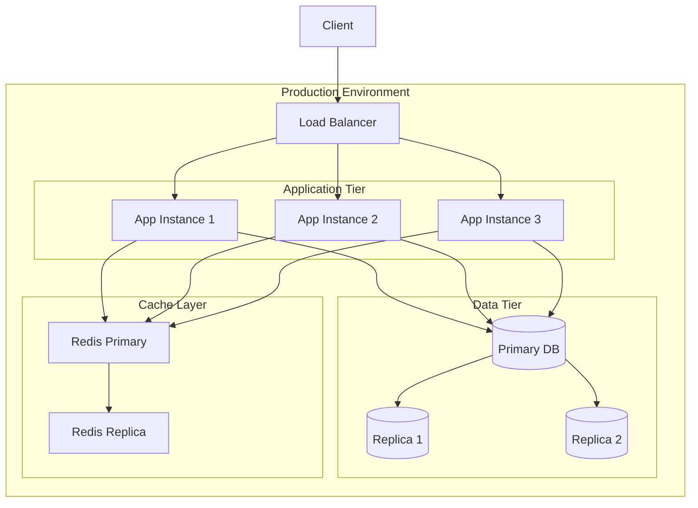

# Deployment Architecture

## Overview

Our deployment architecture implements a highly available, scalable, and resilient infrastructure designed to support our production workloads. It follows cloud-native principles with automated deployment pipelines, infrastructure as code, and comprehensive monitoring capabilities.

## Components

### 1. Load Balancing Layer
- **Load Balancer**: Traffic distribution and SSL termination
- **Health Checks**: Continuous service monitoring
- **SSL/TLS**: Certificate management and security

### 2. Application Tier
- **App Instances**: Stateless application containers
- **Auto Scaling**: Dynamic capacity management
- **Deployment Strategy**: Blue-green deployment support

### 3. Data Tier
- **Primary Database**: Write operations and consistency
- **Read Replicas**: Scalable read operations
- **Backup System**: Automated backup and recovery

### 4. Cache Layer
- **Redis Primary**: Session and cache management
- **Redis Replica**: High availability support
- **Failover System**: Automatic failover handling

## Interactions

### 1. Request Flow


### 2. Deployment Flow
1. Code pushed to repository
2. CI/CD pipeline triggered
3. Tests and quality checks run
4. Docker images built and tagged
5. Blue environment prepared
6. New version deployed
7. Health checks performed
8. Traffic switched to new version

### 3. Scaling Flow
1. Metrics collected and analyzed
2. Scaling decisions made
3. New instances provisioned
4. Health checks performed
5. Load balancer updated
6. Traffic distributed

## Implementation Details

### 1. Infrastructure as Code

```typescript
// AWS CDK Infrastructure Definition
import * as cdk from 'aws-cdk-lib';
import * as ec2 from 'aws-cdk-lib/aws-ec2';
import * as ecs from 'aws-cdk-lib/aws-ecs';
import * as rds from 'aws-cdk-lib/aws-rds';
import * as elasticache from 'aws-cdk-lib/aws-elasticache';

export class ProductionStack extends cdk.Stack {
  constructor(scope: cdk.App, id: string, props?: cdk.StackProps) {
    super(scope, id, props);

    // VPC Configuration
    const vpc = new ec2.Vpc(this, 'ProductionVPC', {
      maxAzs: 3,
      natGateways: 3,
    });

    // ECS Cluster
    const cluster = new ecs.Cluster(this, 'AppCluster', {
      vpc,
      containerInsights: true,
    });

    // RDS Instance
    const database = new rds.DatabaseCluster(this, 'Database', {
      engine: rds.DatabaseClusterEngine.auroraPostgres({
        version: rds.AuroraPostgresEngineVersion.VER_13_4,
      }),
      instances: 3,
      vpc,
      vpcSubnets: {
        subnetType: ec2.SubnetType.PRIVATE_ISOLATED,
      },
    });

    // Redis Cluster
    const redis = new elasticache.CfnCacheCluster(this, 'Redis', {
      cacheNodeType: 'cache.r6g.large',
      engine: 'redis',
      numCacheNodes: 2,
      vpcSecurityGroupIds: [/* security group ids */],
    });
  }
}
```

### 2. Deployment Configuration

```yaml
# Kubernetes Deployment Configuration
apiVersion: apps/v1
kind: Deployment
metadata:
  name: app-deployment
  namespace: production
spec:
  replicas: 3
  selector:
    matchLabels:
      app: web
  template:
    metadata:
      labels:
        app: web
    spec:
      containers:
      - name: web-app
        image: app-registry/web-app:latest
        ports:
        - containerPort: 8080
        resources:
          requests:
            memory: "256Mi"
            cpu: "500m"
          limits:
            memory: "512Mi"
            cpu: "1000m"
        readinessProbe:
          httpGet:
            path: /health
            port: 8080
          initialDelaySeconds: 5
          periodSeconds: 10
        livenessProbe:
          httpGet:
            path: /health
            port: 8080
          initialDelaySeconds: 15
          periodSeconds: 20
```

### 3. Auto-Scaling Configuration

```typescript
// Auto-scaling configuration
interface ScalingRule {
  metric: string;
  threshold: number;
  cooldown: number;
  adjustment: number;
}

const scalingRules: ScalingRule[] = [
  {
    metric: 'CPUUtilization',
    threshold: 70,
    cooldown: 300,
    adjustment: 1,
  },
  {
    metric: 'MemoryUtilization',
    threshold: 80,
    cooldown: 300,
    adjustment: 1,
  },
  {
    metric: 'RequestCount',
    threshold: 1000,
    cooldown: 180,
    adjustment: 2,
  },
];

// Auto-scaling implementation
class AutoScaler {
  async evaluateScaling(metrics: Map<string, number>): Promise<number> {
    let adjustment = 0;
    
    for (const rule of scalingRules) {
      const currentValue = metrics.get(rule.metric) || 0;
      if (currentValue > rule.threshold) {
        adjustment = Math.max(adjustment, rule.adjustment);
      }
    }
    
    return adjustment;
  }

  async scaleCluster(adjustment: number): Promise<void> {
    // Implementation for scaling the cluster
    console.log(`Scaling cluster by ${adjustment} instances`);
  }
}
```

## Best Practices

1. **Infrastructure Best Practices**
   - Use infrastructure as code
   - Implement proper security groups
   - Enable encryption at rest
   - Use proper IAM roles
   - Implement proper networking
   - Enable monitoring and logging

2. **Deployment Best Practices**
   - Use immutable infrastructure
   - Implement blue-green deployments
   - Automate rollbacks
   - Use proper health checks
   - Implement proper scaling
   - Monitor deployment metrics

3. **Security Best Practices**
   - Implement least privilege
   - Use security groups
   - Enable encryption
   - Implement proper backup
   - Monitor security events
   - Regular security updates

## Related Documentation

- [Logging Architecture](./logging.md)
- [Security Architecture](../security/security-architecture.md)
- [Monitoring Strategy](./monitoring.md)
- [Disaster Recovery](./disaster-recovery.md)
- [Performance Architecture](../system/performance.md)
