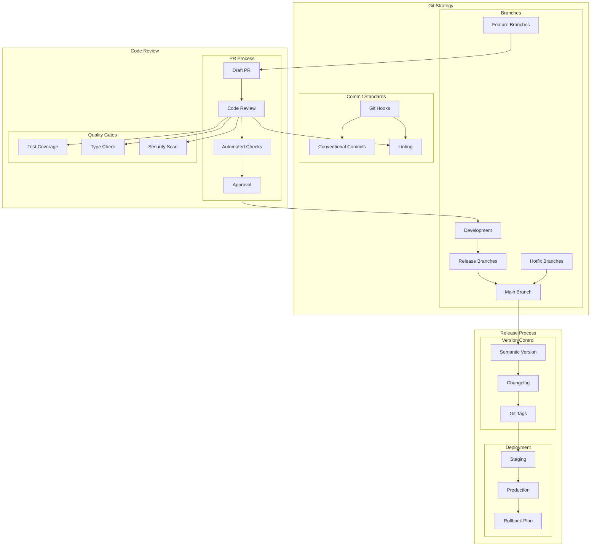
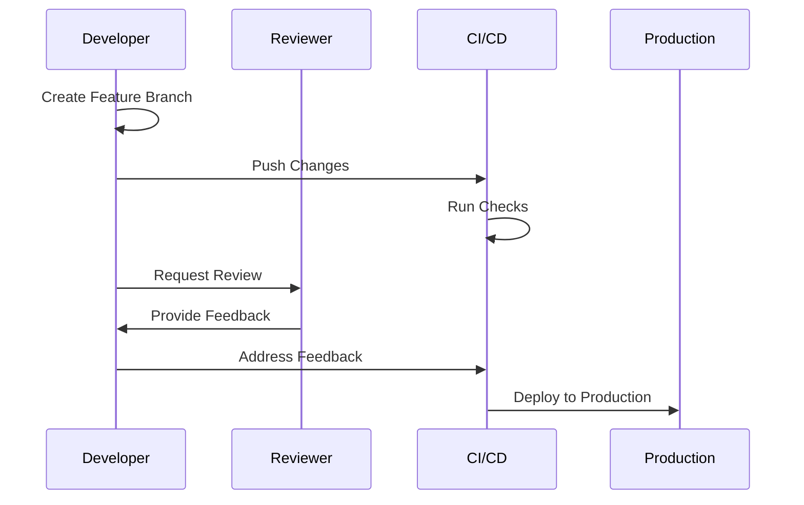

# Development Workflow Architecture

## Overview

This document outlines our development workflow architecture, including git strategy, code review process, and release management. The workflow is designed to ensure code quality, maintain project stability, and facilitate efficient collaboration among team members while adhering to industry best practices.

## Components

Our development workflow consists of three main component groups:

### Git Strategy Components
- Branch Management System
- Commit Standards Framework
- Version Control Tools

### Code Review Components
- Pull Request System
- Automated Quality Gates
- Review Management Tools

### Release Management Components
- Version Control System
- Deployment Pipeline
- Rollback Mechanisms

## Development Workflow Diagram



## Interactions

The development workflow operates through the following interaction patterns:

1. **Feature Development Flow**
   - Create feature branch from development
   - Implement changes with conventional commits
   - Submit draft pull request
   - Address review feedback
   - Merge to development

2. **Release Process Flow**
   - Create release branch
   - Run integration tests
   - Deploy to staging
   - Verify functionality
   - Deploy to production

3. **Hotfix Process Flow**
   - Create hotfix branch from main
   - Implement fix
   - Emergency review process
   - Deploy to production
   - Backport to development



## Implementation Details

### Technical Stack
- Version Control: Git
- CI/CD: GitHub Actions
- Code Review: GitHub Pull Requests
- Quality Gates: ESLint, Jest, TypeScript

### Git Strategy

#### Branch Structure
1. **Branch Structure**

   - Main branch (production)
   - Development branch
   - Feature branches
   - Release branches
   - Hotfix branches

#### Commit Standards
2. **Commit Standards**
   - Conventional commits
   - Pre-commit hooks
   - Lint staged files

### Code Review Process

#### Pull Request Workflow
- Draft PR creation
- Automated checks
- Manual review
- Final approval

#### Quality Gates
```yaml
# Example quality gate configuration
quality_gates:
  test_coverage:
    minimum: 80%
  type_check:
    strict: true
  security_scan:
    severity: high
```

### Release Management

#### Version Control
```bash
# Version bump script
#!/bin/bash
npm version minor
git push --follow-tags
```

#### Deployment Process
```yaml
# Deployment configuration
stages:
  - staging
  - production
rollback:
  enabled: true
  max_versions: 3
```

## Component Description

### Git Strategy

1. **Branch Structure**

   - Main branch (production)
   - Development branch
   - Feature branches
   - Release branches
   - Hotfix branches

2. **Commit Standards**
   - Conventional commits
   - Pre-commit hooks
   - Lint staged files

### Code Review

1. **PR Process**

   - Draft PRs
   - Review requirements
   - Automated checks
   - Approval flow

2. **Quality Gates**
   - Test coverage
   - Code style
   - Type safety
   - Security checks

### Release Process

1. **Version Management**

   - Semantic versioning
   - Changelog generation
   - Git tagging

2. **Deployment Steps**
   - Staging deployment
   - Production release
   - Rollback strategy

## Implementation Guidelines

1. **Branch Management**

   - Branch naming
   - Branch protection
   - Merge strategy
   - Clean-up policy

2. **Code Review Standards**

   - Review checklist
   - Documentation requirements
   - Performance considerations
   - Security review

3. **Release Workflow**

   - Version bumping
   - Release notes
   - Deployment verification
   - Monitoring period

4. **Best Practices**

   - Regular updates
   - Clean commits
   - Clear documentation
   - Quick feedback

5. **Automation**

   - CI/CD integration
   - Automated tests
   - Code quality checks
   - Security scans

6. **Documentation**
   - Process guidelines
   - Review templates
   - Release procedures
   - Troubleshooting guides
