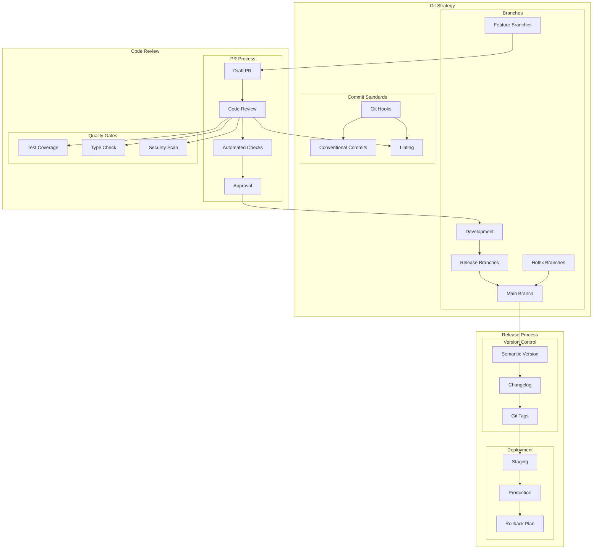

# Development Workflow Architecture

This diagram illustrates our development workflow, including git strategy, code review process, and release management.

## Development Workflow Diagram

## Component Description

### Git Strategy

1. **Branch Structure**

   - Main branch (production)
   - Development branch
   - Feature branches
   - Release branches
   - Hotfix branches

2. **Commit Standards**
   - Conventional commits
   - Pre-commit hooks
   - Lint staged files

### Code Review

1. **PR Process**

   - Draft PRs
   - Review requirements
   - Automated checks
   - Approval flow

2. **Quality Gates**
   - Test coverage
   - Code style
   - Type safety
   - Security checks

### Release Process

1. **Version Management**

   - Semantic versioning
   - Changelog generation
   - Git tagging

2. **Deployment Steps**
   - Staging deployment
   - Production release
   - Rollback strategy

## Implementation Guidelines

1. **Branch Management**

   - Branch naming
   - Branch protection
   - Merge strategy
   - Clean-up policy

2. **Code Review Standards**

   - Review checklist
   - Documentation requirements
   - Performance considerations
   - Security review

3. **Release Workflow**

   - Version bumping
   - Release notes
   - Deployment verification
   - Monitoring period

4. **Best Practices**

   - Regular updates
   - Clean commits
   - Clear documentation
   - Quick feedback

5. **Automation**

   - CI/CD integration
   - Automated tests
   - Code quality checks
   - Security scans

6. **Documentation**
   - Process guidelines
   - Review templates
   - Release procedures
   - Troubleshooting guides
