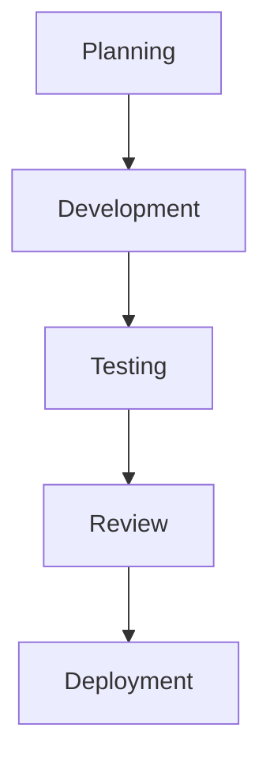
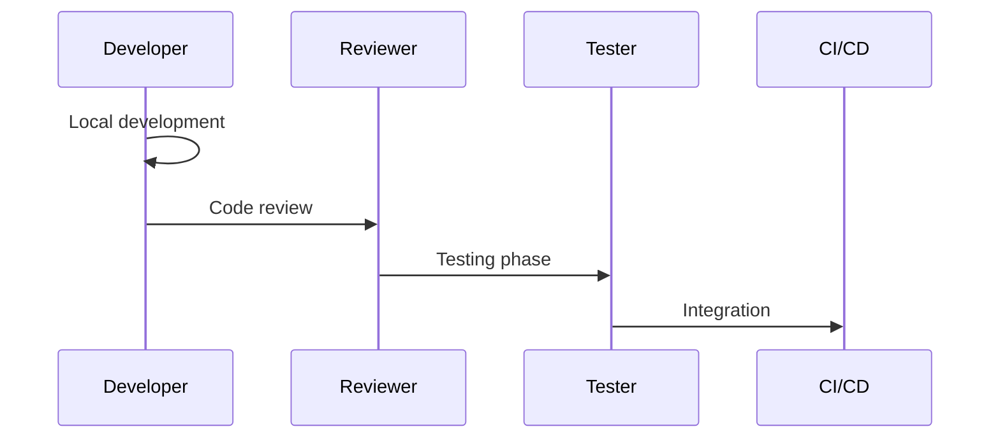

# Development Workflow Architecture

## Overview

This document outlines our development workflow architecture, establishing standardized processes and practices for efficient software development lifecycle management.

## Components

### Development Workflow Stack


### Key Components
1. Planning Phase
   - Requirements gathering
   - Task breakdown
   - Sprint planning
   - Resource allocation

2. Development Phase
   - Coding standards
   - Branch management
   - Local development
   - Integration practices

3. Testing Phase
   - Unit testing
   - Integration testing
   - E2E testing
   - Performance testing

4. Review Process
   - Code review
   - Documentation review
   - Security review
   - Architecture review

## Interactions

### Development Flow


## Implementation Details

### Workflow Configuration
```typescript
interface WorkflowConfig {
  planning: PlanningConfig;
  development: DevelopmentConfig;
  testing: TestingConfig;
  review: ReviewConfig;
}

interface DevelopmentConfig {
  standards: CodingStandard[];
  branches: BranchStrategy[];
  environments: Environment[];
  tools: DevelopmentTool[];
}
```

### Process Rules
```typescript
interface ProcessRule {
  phase: WorkflowPhase;
  requirements: Requirement[];
  validation: ValidationMethod;
  gates: QualityGate[];
}
```

### Workflow Standards
- Development practices
- Testing requirements
- Review processes
- Deployment procedures
- Quality gates

## Related Documentation
- [Testing Strategy](../system/testing-strategy.md)
- [Git Workflow](./git-workflow.md)
- [Code Review](./code-review.md)
- [Release Process](./release-process.md)
