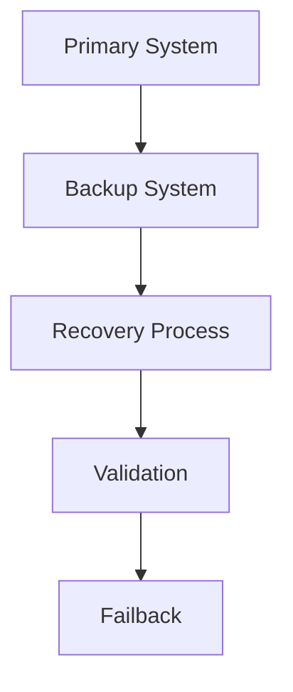
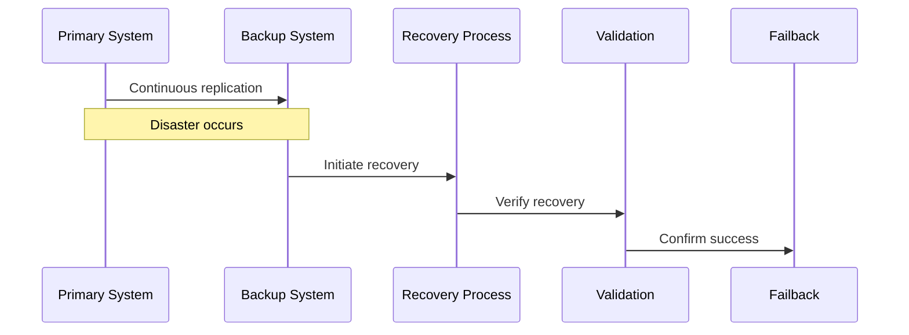

# Disaster Recovery Architecture

## Overview

This document outlines our disaster recovery architecture, designed to ensure business continuity and minimize data loss in case of system failures or catastrophic events.

## Components

### Recovery Systems


### Key Components
1. Backup Systems
   - Data backups
   - System snapshots
   - Configuration backups
   - State replication

2. Recovery Processes
   - Failover procedures
   - Data restoration
   - Service recovery
   - Network reconfiguration

3. Validation Systems
   - Health checks
   - Data integrity
   - Service verification
   - Performance validation

## Interactions

### Recovery Flow


## Implementation Details

### Recovery Configuration
```typescript
interface RecoveryConfig {
  rpo: number; // Recovery Point Objective in minutes
  rto: number; // Recovery Time Objective in minutes
  priority: 'critical' | 'high' | 'medium' | 'low';
  dependencies: string[];
  validation: ValidationStep[];
}

interface ValidationStep {
  name: string;
  checks: HealthCheck[];
  threshold: number;
  timeout: number;
}
```

### Backup Strategy
```typescript
interface BackupStrategy {
  type: 'full' | 'incremental' | 'differential';
  schedule: CronExpression;
  retention: RetentionPolicy;
  encryption: EncryptionConfig;
}
```

### Recovery Procedures
- System recovery steps
- Data restoration process
- Network recovery
- Service restoration
- Validation checks

## Related Documentation
- [Backup Architecture](./backup-recovery.md)
- [Infrastructure Monitoring](./monitoring.md)
- [Security Architecture](../security/security-architecture.md)
- [Incident Response](../system/incident-response.md)
