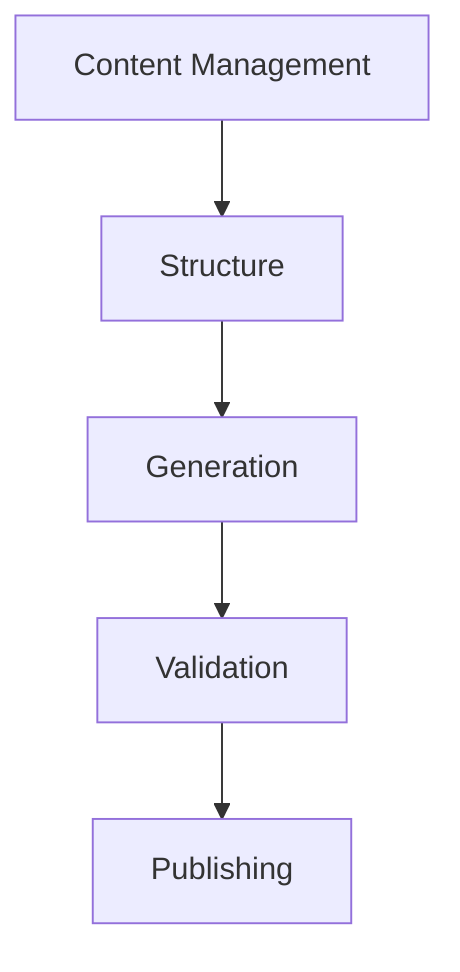
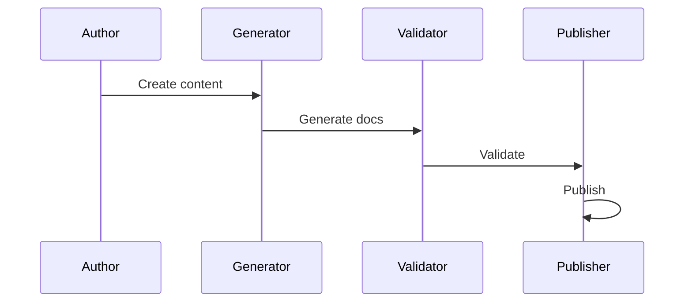

# Documentation Architecture

## Overview

This document outlines our documentation architecture, establishing standards and practices for creating and maintaining comprehensive system documentation.

## Components

### Documentation Stack


### Key Components
1. Content Management
   - Documentation types
   - Content organization
   - Version control
   - Change tracking

2. Documentation Structure
   - File organization
   - Cross-references
   - Templates
   - Style guides

3. Documentation Generation
   - Auto-generation
   - API docs
   - Code docs
   - Diagrams

4. Documentation Validation
   - Link checking
   - Style checking
   - Format validation
   - Reference validation

## Interactions

### Documentation Flow


## Implementation Details

### Documentation Configuration
```typescript
interface DocumentationConfig {
  content: ContentConfig;
  structure: StructureConfig;
  generation: GenerationConfig;
  validation: ValidationConfig;
}

interface ContentConfig {
  types: DocType[];
  organization: OrgConfig;
  versioning: VersionConfig;
  tracking: TrackingConfig;
}
```

### Validation Rules
```typescript
interface ValidationRule {
  type: ValidationType;
  criteria: Criterion[];
  action: ValidationAction;
  severity: Severity;
}
```

### Documentation Standards
- Content requirements
- Structure patterns
- Generation rules
- Validation criteria
- Publishing processes

## Related Documentation
- [API Documentation](../system/api.md)
- [Code Quality](../system/code-quality.md)
- [Standards](../system/standards.md)
- [Development Workflow](./development-workflow.md)
