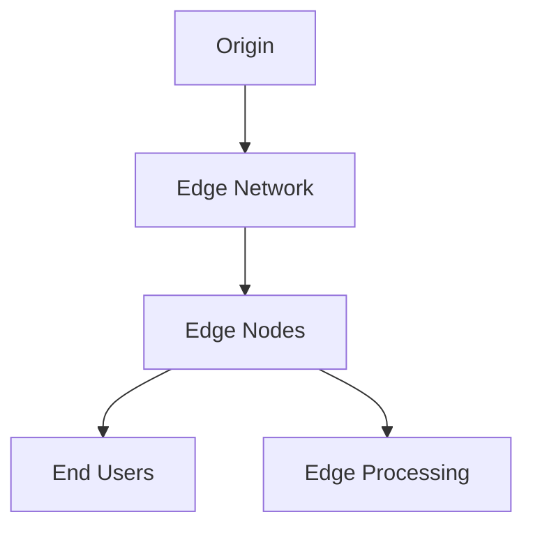
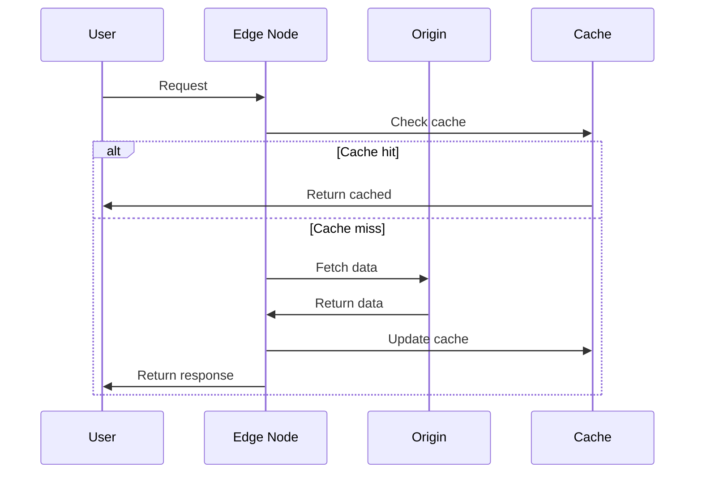

# Edge Computing Architecture

## Overview

This document outlines our edge computing architecture, designed to process data and serve content closer to end users for improved performance and reduced latency.

## Components

### Edge Infrastructure


### Key Components
1. Edge Network
   - Global distribution
   - Load balancing
   - Traffic routing
   - Health monitoring

2. Edge Nodes
   - Content caching
   - Request processing
   - Security filtering
   - Data optimization

3. Edge Processing
   - Request handling
   - Data transformation
   - Business logic
   - Analytics

4. Origin Integration
   - Data synchronization
   - Configuration management
   - Health checks
   - Failover handling

## Interactions

### Request Flow


## Implementation Details

### Edge Configuration
```typescript
interface EdgeConfig {
  region: string;
  services: EdgeService[];
  caching: CacheConfig;
  security: SecurityConfig;
}

interface EdgeService {
  name: string;
  type: 'static' | 'dynamic' | 'api';
  routes: Route[];
  processing: ProcessingRule[];
}
```

### Processing Rules
```typescript
interface ProcessingRule {
  type: 'transform' | 'filter' | 'route';
  priority: number;
  conditions: Condition[];
  actions: Action[];
}
```

### Edge Standards
- Deployment practices
- Caching strategies
- Security policies
- Monitoring requirements
- Performance targets

## Related Documentation
- [Content Delivery](./content-delivery.md)
- [Performance Optimization](./performance.md)
- [Caching Strategy](../data-flow/caching.md)
- [Security Architecture](../security/security-architecture.md)
