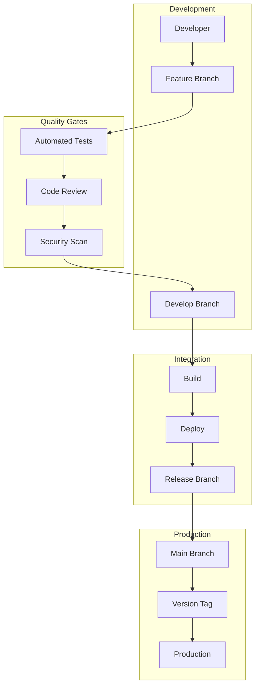

# Development Workflow and Git Strategy

This diagram illustrates our development workflow, branching strategy, and code review process.

## Git Workflow Diagram

```mermaid
graph TB
    subgraph "Branch Strategy"
        subgraph "Main Branches"
            Main[main]
            Dev[development]
            Stage[staging]
        end

        subgraph "Feature Branches"
            Feature[feature/*]
            Bugfix[bugfix/*]
            Hotfix[hotfix/*]
        end

        subgraph "Release"
            Release[release/*]
            Tag[tags]
            Version[versions]
        end
    end

    subgraph "Workflow"
        subgraph "Development"
            Create[Create Branch]
            Develop[Development]
            Commit[Commit Changes]
        end

        subgraph "Quality"
            Lint[Lint Check]
            Test[Run Tests]
            Build[Build Check]
        end

        subgraph "Review"
            PR[Pull Request]
            CodeReview[Code Review]
            Feedback[Review Feedback]
        end
    end

    subgraph "CI/CD"
        subgraph "Checks"
            PreCommit[Pre-commit]
            PrePush[Pre-push]
            PostMerge[Post-merge]
        end

        subgraph "Automation"
            Format[Auto Format]
            Validate[Validation]
            Deploy[Deployment]
        end

        subgraph "Gates"
            Coverage[Test Coverage]
            Quality[Code Quality]
            Security[Security Scan]
        end
    end

    subgraph "Standards"
        subgraph "Code"
            Style[Style Guide]
            Convention[Conventions]
            Patterns[Patterns]
        end

        subgraph "Process"
            Template[PR Template]
            Checklist[Review Checklist]
            Labels[PR Labels]
        end

        subgraph "Documentation"
            Commit[Commit Style]
            Change[Changelog]
            Release[Release Notes]
        end
    end

    %% Branch Flow
    Main --> Release
    Dev --> Feature
    Stage --> Hotfix

    Feature --> Create
    Bugfix --> Develop
    Hotfix --> Commit

    %% Workflow Flow
    Create --> Lint
    Develop --> Test
    Commit --> Build

    Lint --> PR
    Test --> CodeReview
    Build --> Feedback

    %% CI/CD Flow
    PreCommit --> Format
    PrePush --> Validate
    PostMerge --> Deploy

    Format --> Coverage
    Validate --> Quality
    Deploy --> Security

    %% Standards Flow
    Style --> Template
    Convention --> Checklist
    Patterns --> Labels

    Template --> Commit
    Checklist --> Change
    Labels --> Release
```

## Component Description

### Branch Strategy

1. **Main Branches**

   - Main branch
   - Development
   - Staging

2. **Feature Branches**

   - Feature branches
   - Bugfix branches
   - Hotfix branches

3. **Release Management**
   - Release branches
   - Version tags
   - Release process

### Workflow

1. **Development Process**

   - Branch creation
   - Development work
   - Commit strategy

2. **Quality Gates**

   - Linting
   - Testing
   - Build validation

3. **Review Process**
   - Pull requests
   - Code review
   - Feedback cycle

## Implementation Guidelines

1. **Branch Management**

   - Naming convention
   - Branch lifecycle
   - Merge strategy
   - Conflict resolution

2. **Code Quality**

   - Style guide
   - Code conventions
   - Best practices
   - Review standards

3. **CI/CD Integration**

   - Pre-commit hooks
   - Automated checks
   - Deploy process
   - Environment promotion

4. **Best Practices**

   - Commit messages
   - PR description
   - Review process
   - Documentation

5. **Automation**

   - Code formatting
   - Test automation
   - Deploy automation
   - Quality checks

6. **Documentation**
   - Process guides
   - Templates
   - Standards
   - Release notes

## Git Workflow Architecture

### Overview

Our Git workflow architecture implements a trunk-based development model with feature branches and automated CI/CD pipelines. It is designed to support rapid development cycles while maintaining code quality and stability. The workflow emphasizes short-lived feature branches, automated testing, and continuous integration to ensure smooth collaboration across teams.

### Components

#### 1. Branch Structure
- **Main Branches**
  - `main` (production-ready code)
  - `develop` (integration branch)
  - `release/*` (release candidates)
- **Supporting Branches**
  - `feature/*` (new features)
  - `bugfix/*` (bug fixes)
  - `hotfix/*` (production fixes)
  - `experiment/*` (A/B tests)
- **CI/CD Branches**
  - `ci/*` (CI/CD configurations)
  - `docs/*` (documentation updates)

#### 2. Protection Rules
- **Branch Protection**
  - Required reviews
  - Status checks
  - Merge restrictions
- **Automated Checks**
  - Code linting
  - Unit tests
  - Integration tests
  - Security scans
- **Review Process**
  - Pull request templates
  - Code owners
  - Review assignments

#### 3. Integration Points
- **Merge Strategies**
  - Squash and merge
  - Rebase and merge
  - Create merge commit
- **Automation Hooks**
  - Pre-commit hooks
  - Pre-push hooks
  - Post-merge hooks
- **Release Process**
  - Version tagging
  - Release notes
  - Deployment triggers

#### 4. Quality Gates
- **Code Quality**
  - Style enforcement
  - Complexity checks
  - Coverage requirements
- **Security Gates**
  - Dependency scanning
  - SAST/DAST
  - License compliance
- **Performance Gates**
  - Bundle size limits
  - Performance budgets
  - Load test results

## Interactions

### 1. Git Workflow Flow


### 2. Feature Development Flow
1. Create feature branch
2. Implement changes
3. Run local tests
4. Create pull request
5. Pass code review
6. Pass automated checks
7. Merge to develop

### 3. Release Flow
1. Create release branch
2. Run release tests
3. Fix release issues
4. Update version
5. Create release tag
6. Deploy to production
7. Merge to main

## Implementation Details

### 1. Branch Configuration

```typescript
// Branch protection configuration
interface BranchProtection {
  branch: string;
  rules: ProtectionRules;
  reviewers: ReviewConfig;
  checks: CheckConfig;
}

interface ProtectionRules {
  requiredReviews: number;
  requireStatusChecks: boolean;
  enforceAdmins: boolean;
  restrictMerge: boolean;
}

// Branch protection implementation
class BranchManager {
  private config: BranchProtection;
  private checks: Map<string, Check>;

  constructor(config: BranchProtection) {
    this.config = config;
    this.checks = new Map();
  }

  public async validateMerge(
    pr: PullRequest
  ): Promise<ValidationResult> {
    const checks = await this.runRequiredChecks(pr);
    const reviews = await this.validateReviews(pr);
    return this.evaluateResults(checks, reviews);
  }

  private async runRequiredChecks(
    pr: PullRequest
  ): Promise<CheckResult[]> {
    return Promise.all(
      Array.from(this.checks.values()).map(check =>
        check.run(pr)
      )
    );
  }

  private async validateReviews(
    pr: PullRequest
  ): Promise<ReviewResult> {
    const reviews = await this.getReviews(pr);
    return this.evaluateReviews(reviews);
  }
}
```

### 2. Automation Configuration

```typescript
// Git hooks configuration
interface GitHooksConfig {
  preCommit: HookConfig[];
  prePush: HookConfig[];
  postMerge: HookConfig[];
}

interface HookConfig {
  name: string;
  command: string;
  blocking: boolean;
}

// Git hooks implementation
class GitHooksManager {
  private config: GitHooksConfig;
  private hooks: Map<string, Hook>;

  constructor(config: GitHooksConfig) {
    this.config = config;
    this.hooks = new Map();
  }

  public async runPreCommitHooks(
    files: string[]
  ): Promise<HookResult[]> {
    return this.runHooks(this.config.preCommit, files);
  }

  public async runPrePushHooks(
    branch: string
  ): Promise<HookResult[]> {
    return this.runHooks(this.config.prePush, [branch]);
  }

  private async runHooks(
    hooks: HookConfig[],
    args: string[]
  ): Promise<HookResult[]> {
    return Promise.all(
      hooks.map(hook => this.runHook(hook, args))
    );
  }
}
```

### 3. Release Management

```typescript
// Release configuration
interface ReleaseConfig {
  version: VersionConfig;
  changelog: ChangelogConfig;
  deployment: DeploymentConfig;
}

interface VersionConfig {
  major: number;
  minor: number;
  patch: number;
  preRelease?: string;
}

// Release management implementation
class ReleaseManager {
  private config: ReleaseConfig;
  private changelog: ChangelogManager;

  constructor(config: ReleaseConfig) {
    this.config = config;
    this.changelog = new ChangelogManager(config.changelog);
  }

  public async createRelease(
    version: string
  ): Promise<Release> {
    const changes = await this.changelog.generateChangelog();
    const tag = await this.createTag(version);
    return this.publishRelease(tag, changes);
  }

  private async createTag(
    version: string
  ): Promise<Tag> {
    const tag = new Tag(version);
    await this.validateTag(tag);
    return this.git.createTag(tag);
  }

  private async publishRelease(
    tag: Tag,
    changes: Changes
  ): Promise<Release> {
    const release = new Release(tag, changes);
    await this.validateRelease(release);
    return this.git.publishRelease(release);
  }
}
```

## Best Practices

1. **Branch Management**
   - Keep branches short-lived
   - Regular integration to develop
   - Clean branch history
   - Meaningful commit messages
   - Regular rebasing
   - Branch naming conventions

2. **Code Review**
   - Small, focused changes
   - Clear descriptions
   - Test coverage
   - Documentation updates
   - Security considerations
   - Performance impact

3. **Release Process**
   - Semantic versioning
   - Detailed changelogs
   - Release checklists
   - Rollback procedures
   - Feature flags
   - Gradual rollouts

## Related Documentation

- [CI/CD Pipeline](./ci-cd-pipeline.md)
- [Code Review Guidelines](./code-review.md)
- [Release Process](./release-process.md)
- [Testing Strategy](../system/testing-strategy.md)
- [Security Guidelines](./security-guidelines.md)
