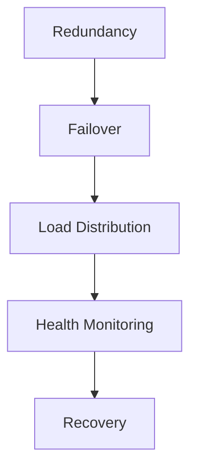
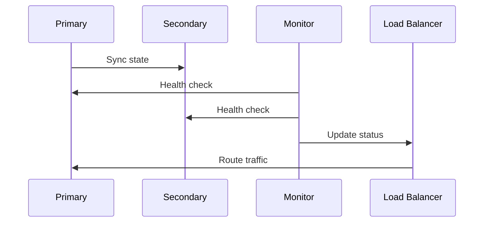

# High Availability Architecture

## Overview

This document outlines our high availability architecture, designed to ensure system reliability, fault tolerance, and continuous service operation.

## Components

### High Availability Stack


### Key Components
1. Redundancy Management
   - Component replication
   - Data mirroring
   - Backup systems
   - Geographic distribution

2. Failover Systems
   - Automatic failover
   - Manual failover
   - Failback procedures
   - State synchronization

3. Load Distribution
   - Load balancing
   - Traffic routing
   - Capacity planning
   - Resource allocation

4. Health Monitoring
   - System health checks
   - Performance metrics
   - Availability tracking
   - Alert management

## Interactions

### High Availability Flow


## Implementation Details

### HA Configuration
```typescript
interface HAConfig {
  redundancy: RedundancyConfig;
  failover: FailoverConfig;
  monitoring: MonitoringConfig;
  recovery: RecoveryConfig;
}

interface RedundancyConfig {
  mode: RedundancyMode;
  nodes: Node[];
  sync: SyncConfig;
  regions: Region[];
}
```

### Failover Rules
```typescript
interface FailoverRule {
  trigger: TriggerCondition;
  action: FailoverAction;
  timeout: number;
  retry: RetryConfig;
}
```

### Availability Standards
- Redundancy requirements
- Failover procedures
- Monitoring criteria
- Recovery processes
- Performance targets

## Related Documentation
- [Load Balancing](./load-balancing.md)
- [Disaster Recovery](./disaster-recovery.md)
- [Performance Monitoring](./performance-monitoring.md)
- [Infrastructure Monitoring](./infrastructure-monitoring.md)
