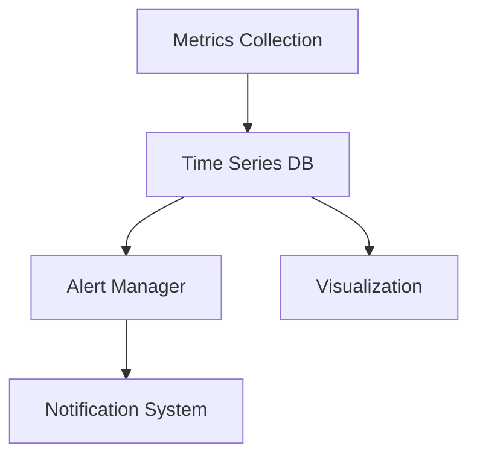
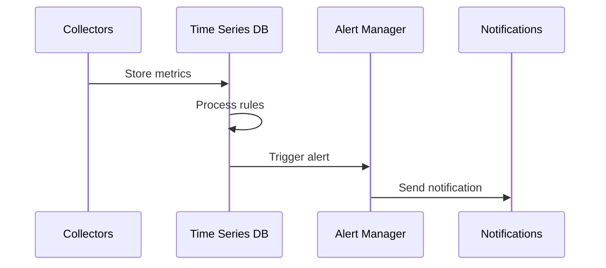

# Infrastructure Monitoring Architecture

## Overview

This document outlines our infrastructure monitoring architecture, designed to provide comprehensive visibility into system health, performance, and resource utilization.

## Components

### Monitoring Stack


### Key Components
1. Metrics Collection
   - System metrics
   - Application metrics
   - Network metrics
   - Custom metrics

2. Storage Layer
   - Time series database
   - Data retention policies
   - Query optimization
   - Data aggregation

3. Alert System
   - Alert rules
   - Alert grouping
   - Alert routing
   - Alert history

4. Visualization
   - Real-time dashboards
   - Trend analysis
   - Capacity planning
   - SLA reporting

## Interactions

### Monitoring Flow


## Implementation Details

### Monitoring Configuration
```typescript
interface MonitoringConfig {
  collectors: MetricsCollector[];
  storage: StorageConfig;
  alerting: AlertConfig;
  visualization: DashboardConfig;
}

interface MetricsCollector {
  type: 'system' | 'application' | 'network' | 'custom';
  interval: number;
  targets: string[];
  labels: Record<string, string>;
}
```

### Alert Rules
```typescript
interface AlertRule {
  name: string;
  query: string;
  duration: string;
  severity: 'critical' | 'warning' | 'info';
  labels: Record<string, string>;
  annotations: AlertAnnotations;
}
```

### Dashboard Templates
- System overview
- Application health
- Resource utilization
- Performance metrics
- Error rates

## Related Documentation
- [Logging Architecture](../system/logging-architecture.md)
- [Performance Monitoring](./performance-monitoring.md)
- [Security Monitoring](../security/security-monitoring.md)
- [Alert Management](../system/monitoring-architecture.md)
