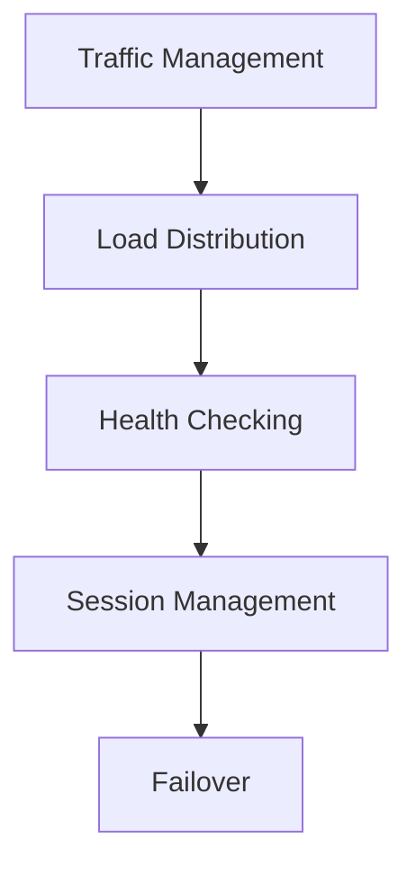
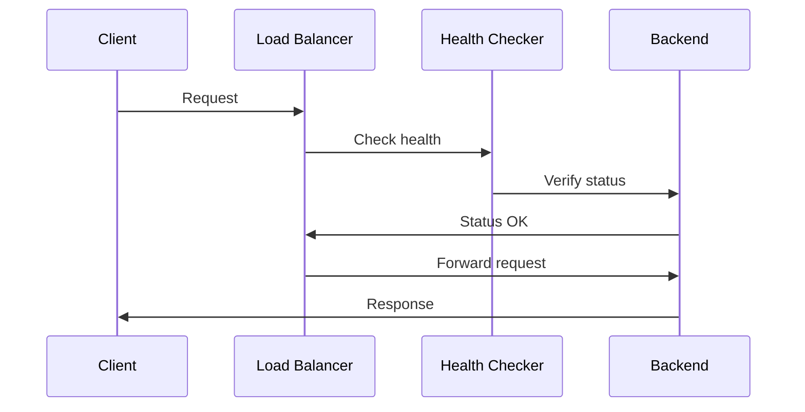

# Load Balancing Architecture

## Overview

This document outlines our load balancing architecture, designed to distribute workloads efficiently across multiple resources while ensuring high availability and performance.

## Components

### Load Balancing Stack


### Key Components
1. Traffic Management
   - Request routing
   - Protocol handling
   - SSL termination
   - Rate limiting

2. Load Distribution
   - Balancing algorithms
   - Backend pools
   - Affinity rules
   - Weight management

3. Health Monitoring
   - Health checks
   - Performance metrics
   - Availability tracking
   - Failure detection

4. Session Handling
   - Session persistence
   - Sticky sessions
   - Session distribution
   - Failover handling

## Interactions

### Load Balancing Flow


## Implementation Details

### Load Balancer Configuration
```typescript
interface LoadBalancerConfig {
  algorithm: Algorithm;
  backends: Backend[];
  health: HealthConfig;
  session: SessionConfig;
}

interface Backend {
  host: string;
  port: number;
  weight: number;
  maxConnections: number;
}
```

### Health Check Rules
```typescript
interface HealthCheck {
  type: CheckType;
  interval: number;
  timeout: number;
  threshold: number;
  path: string;
}
```

### Balancing Standards
- Algorithm selection
- Health check criteria
- Session management
- Failover procedures
- Monitoring requirements

## Related Documentation
- [Scaling Architecture](./scaling.md)
- [High Availability](./high-availability.md)
- [Performance Monitoring](./performance-monitoring.md)
- [Traffic Management](./traffic-management.md)
