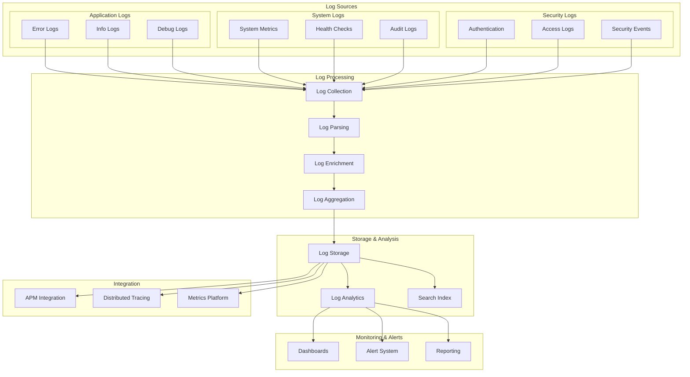

# Logging and Monitoring Architecture

## Overview

Our logging and monitoring architecture provides comprehensive observability across the entire application stack. It implements a centralized logging system that collects, processes, and analyzes logs from multiple sources while supporting real-time monitoring, alerting, and distributed tracing capabilities.

## Components

### 1. Log Sources
- **Application Logs**: Error tracking, info logging, and debug information
- **System Logs**: Performance metrics, health checks, and audit trails
- **Security Logs**: Authentication, access logs, and security events

### 2. Log Processing Pipeline
- **Collection**: Centralized log aggregation
- **Parsing**: Structured log formatting
- **Enrichment**: Context addition and correlation
- **Aggregation**: Log consolidation and summarization

### 3. Storage & Analysis
- **Log Storage**: Distributed log persistence
- **Analytics Engine**: Log analysis and pattern detection
- **Search Index**: Fast log querying and retrieval

### 4. Monitoring & Alerts
- **Dashboards**: Real-time visualization
- **Alert System**: Proactive notification
- **Reporting**: Scheduled insights generation

### 5. Integration Layer
- **APM Integration**: Application performance monitoring
- **Distributed Tracing**: Request flow tracking
- **Metrics Platform**: Performance metrics aggregation

## Interactions

### 1. Log Flow


### 2. Processing Flow
1. Log sources emit structured logs
2. Collection agents gather logs from all sources
3. Parser standardizes log format
4. Enrichment adds metadata and context
5. Aggregation consolidates related logs
6. Storage persists processed logs
7. Analysis generates insights
8. Monitoring triggers alerts

### 3. Alert Flow
1. System detects anomaly or threshold breach
2. Alert rules evaluate condition
3. Notification sent to relevant teams
4. Incident response initiated if needed
5. Resolution tracked and documented

## Implementation Details

### 1. Logger Implementation

```typescript
// Logger interface
interface ILogger {
  error(message: string, meta?: Record<string, unknown>): void;
  warn(message: string, meta?: Record<string, unknown>): void;
  info(message: string, meta?: Record<string, unknown>): void;
  debug(message: string, meta?: Record<string, unknown>): void;
}

// Structured logger implementation
class StructuredLogger implements ILogger {
  private context: Record<string, unknown>;

  constructor(context: Record<string, unknown>) {
    this.context = context;
  }

  private log(level: string, message: string, meta?: Record<string, unknown>) {
    const logEntry = {
      timestamp: new Date().toISOString(),
      level,
      message,
      ...this.context,
      ...meta,
    };
    console.log(JSON.stringify(logEntry));
  }

  error(message: string, meta?: Record<string, unknown>) {
    this.log('error', message, meta);
  }

  warn(message: string, meta?: Record<string, unknown>) {
    this.log('warn', message, meta);
  }

  info(message: string, meta?: Record<string, unknown>) {
    this.log('info', message, meta);
  }

  debug(message: string, meta?: Record<string, unknown>) {
    this.log('debug', message, meta);
  }
}
```

### 2. Monitoring Implementation

```typescript
// Monitoring interface
interface IMonitor {
  recordMetric(name: string, value: number, tags?: Record<string, string>): void;
  startTimer(name: string): () => void;
  recordHealthCheck(service: string, status: 'up' | 'down'): void;
}

// Monitor implementation
class Monitor implements IMonitor {
  private metrics: Map<string, number[]>;

  constructor() {
    this.metrics = new Map();
  }

  recordMetric(name: string, value: number, tags?: Record<string, string>) {
    const key = this.formatMetricKey(name, tags);
    if (!this.metrics.has(key)) {
      this.metrics.set(key, []);
    }
    this.metrics.get(key)!.push(value);
  }

  startTimer(name: string): () => void {
    const start = Date.now();
    return () => {
      const duration = Date.now() - start;
      this.recordMetric(name, duration);
    };
  }

  recordHealthCheck(service: string, status: 'up' | 'down') {
    this.recordMetric(`health.${service}`, status === 'up' ? 1 : 0);
  }

  private formatMetricKey(name: string, tags?: Record<string, string>): string {
    if (!tags) return name;
    const tagString = Object.entries(tags)
      .map(([k, v]) => `${k}=${v}`)
      .join(',');
    return `${name}{${tagString}}`;
  }
}
```

### 3. Alert Configuration

```typescript
interface AlertRule {
  name: string;
  condition: string;
  threshold: number;
  duration: string;
  severity: 'critical' | 'warning' | 'info';
  channels: string[];
}

const alertRules: AlertRule[] = [
  {
    name: 'High Error Rate',
    condition: 'error_rate > threshold',
    threshold: 0.01,
    duration: '5m',
    severity: 'critical',
    channels: ['slack', 'email'],
  },
  {
    name: 'High Latency',
    condition: 'p95_latency > threshold',
    threshold: 500,
    duration: '10m',
    severity: 'warning',
    channels: ['slack'],
  },
  {
    name: 'Low Disk Space',
    condition: 'disk_free_percent < threshold',
    threshold: 20,
    duration: '15m',
    severity: 'warning',
    channels: ['email'],
  },
];
```

## Best Practices

1. **Logging Best Practices**
   - Use structured logging format
   - Include relevant context
   - Follow consistent log levels
   - Implement log rotation
   - Secure sensitive information
   - Use correlation IDs

2. **Monitoring Best Practices**
   - Define clear SLOs/SLIs
   - Implement proper retention policies
   - Use appropriate granularity
   - Monitor system boundaries
   - Track business metrics
   - Implement proper aggregation

3. **Alert Best Practices**
   - Define clear severity levels
   - Avoid alert fatigue
   - Include actionable information
   - Implement proper routing
   - Define escalation policies
   - Document response procedures

## Related Documentation

- [Performance Monitoring](../system/performance.md)
- [Security Monitoring](../security/security-monitoring.md)
- [Error Handling](../system/error-handling.md)
- [Deployment Architecture](./deployment.md)
- [Infrastructure Monitoring](./infrastructure-monitoring.md)
