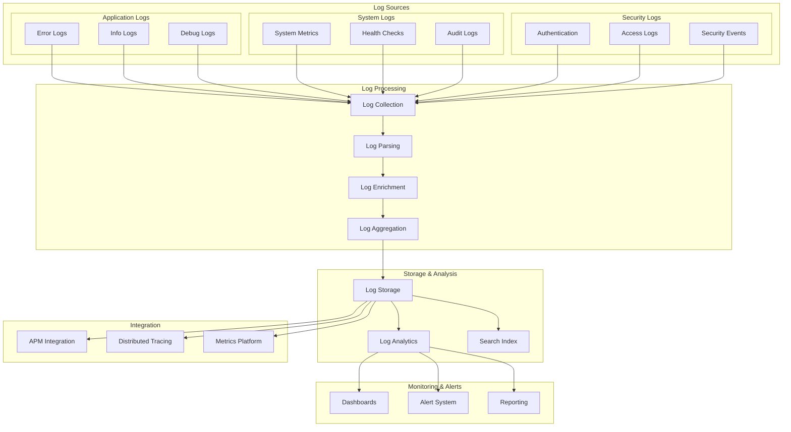

# Logging and Monitoring Architecture

This diagram illustrates our comprehensive logging and monitoring strategy across the application stack.

## Logging Architecture Diagram

## Component Description

### Log Sources

1. **Application Logs**

   - Error tracking
   - Info logging
   - Debug information

2. **System Logs**

   - Performance metrics
   - Health status
   - Audit trails

3. **Security Logs**
   - Authentication events
   - Access patterns
   - Security incidents

### Processing Pipeline

- **Collection**: Log aggregation
- **Parsing**: Log structure
- **Enrichment**: Context addition
- **Aggregation**: Data consolidation

### Storage & Analysis

- **Log Store**: Persistent storage
- **Analytics**: Data analysis
- **Search**: Query capability

### Monitoring Tools

- **Dashboards**: Visualization
- **Alerts**: Notification system
- **Reports**: Regular insights

## Implementation Guidelines

1. **Log Management**

   - Structured logging
   - Log levels
   - Retention policies
   - Privacy compliance

2. **Monitoring Strategy**

   - Real-time monitoring
   - Trend analysis
   - Anomaly detection
   - Alert thresholds

3. **Integration Setup**

   - APM configuration
   - Trace correlation
   - Metric collection
   - Tool integration

4. **Best Practices**

   - Log sanitization
   - Performance impact
   - Storage optimization
   - Access control

5. **Operational Procedures**
   - Incident response
   - Log rotation
   - Backup strategy
   - Recovery process
