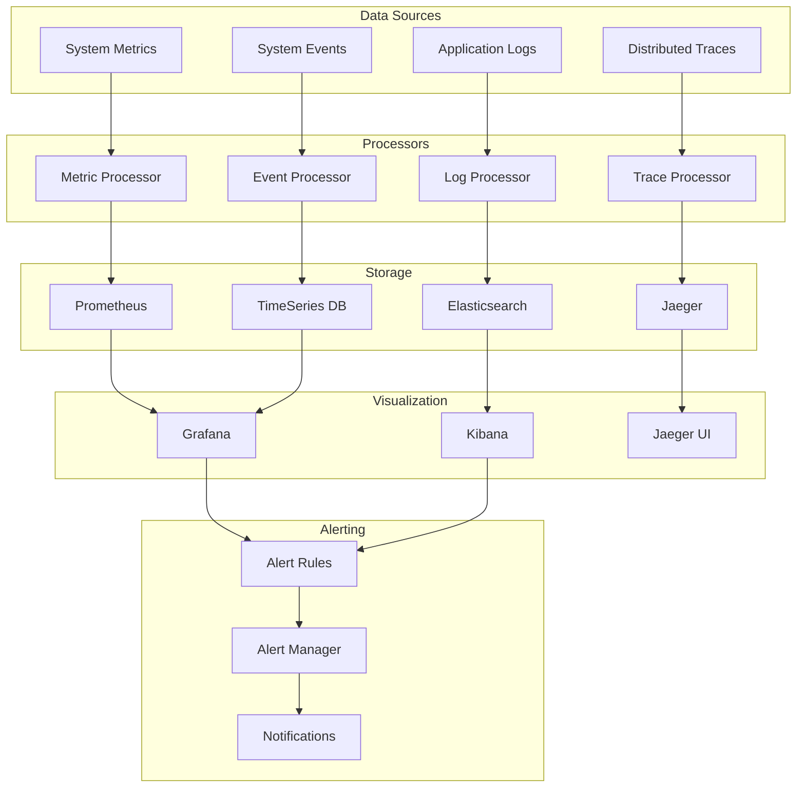
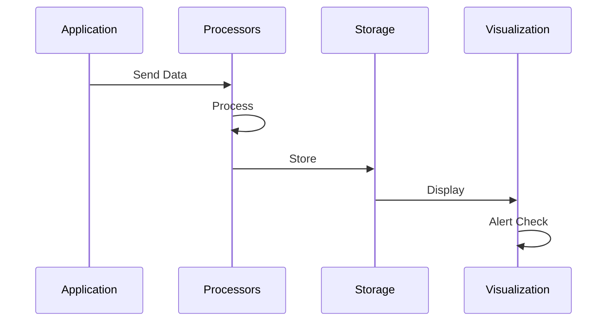

# Monitoring Architecture

## Overview

This document outlines our comprehensive monitoring architecture, including log aggregation, metrics collection, tracing, and alerting. The system provides real-time visibility into application performance, system health, and user experience while enabling proactive issue detection and resolution.

## Components

Our monitoring architecture consists of five main component groups:

### Data Sources
- Application Logs
- System Metrics
- Distributed Traces
- System Events

### Data Processors
- Log Processor
- Metric Processor
- Trace Processor
- Event Processor

### Storage Systems
- Elasticsearch for logs
- Prometheus for metrics
- Jaeger for traces
- TimeSeries DB for events

### Visualization Tools
- Kibana for log analysis
- Grafana for metrics
- Jaeger UI for traces
- Custom dashboards

### Alerting System
- Alert Rules Engine
- Alert Manager
- Notification System



## Interactions

The monitoring system operates through the following interaction patterns:

1. **Data Collection Flow**
   - Applications generate logs and metrics
   - System events are captured
   - Traces are collected across services
   - Data is forwarded to processors

2. **Processing Flow**
   - Data is validated and normalized
   - Metrics are aggregated
   - Traces are correlated
   - Events are enriched

3. **Analysis Flow**
   - Data is stored in appropriate databases
   - Dashboards display real-time metrics
   - Alerts are triggered based on rules
   - Teams receive notifications



## Implementation Details

### Technical Stack
- Logging: ELK Stack
- Metrics: Prometheus/Grafana
- Tracing: Jaeger
- Alerting: AlertManager

### Data Collection

#### Application Logs
```typescript
// Logger configuration
const logger = winston.createLogger({
  level: 'info',
  format: winston.format.json(),
  transports: [
    new winston.transports.Console(),
    new winston.transports.Elasticsearch({
      level: 'info',
      clientOpts: { node: 'http://elasticsearch:9200' }
    })
  ]
});
```

#### Metrics Collection
```typescript
// Prometheus metrics
const requestDuration = new prometheus.Histogram({
  name: 'http_request_duration_seconds',
  help: 'Duration of HTTP requests in seconds',
  labelNames: ['method', 'route', 'status']
});
```

#### Tracing Setup
```typescript
// Jaeger tracer configuration
const tracer = initJaegerTracer({
  serviceName: 'my-service',
  sampler: {
    type: 'const',
    param: 1
  },
  reporter: {
    logSpans: true,
    collectorEndpoint: 'http://jaeger-collector:14268/api/traces'
  }
});
```

### Alert Configuration
```yaml
# Alert rules
groups:
  - name: availability
    rules:
      - alert: HighErrorRate
        expr: rate(http_requests_total{status=~"5.."}[5m]) > 0.1
        for: 5m
        labels:
          severity: critical
        annotations:
          summary: High error rate detected
```

### Data Collection

- Structured logging
- Metric exporters
- Trace collectors
- Event publishers

### Data Processing

- Real-time processing
- Data enrichment
- Data correlation
- Data filtering

### Data Storage

- Data retention
- Data compression
- Data backup
- Data archival

### Visualization

- Custom dashboards
- Real-time updates
- Data exploration
- Report generation

### Alerting

- Alert thresholds
- Alert routing
- Alert history
- Alert analytics
