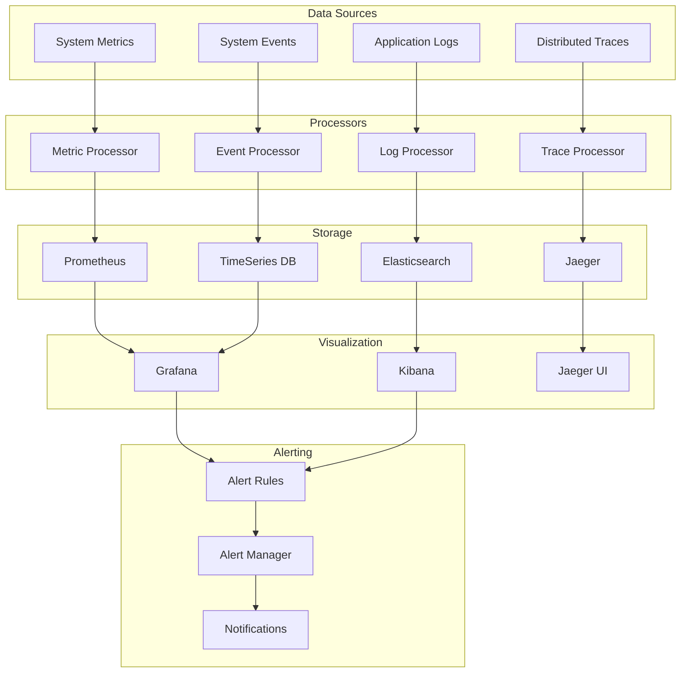

# Monitoring Architecture

This diagram illustrates our comprehensive monitoring architecture, including log aggregation, metrics collection, tracing, and alerting.

## Implementation

Our monitoring system leverages several particle components from our [Atomic Design Structure](../components/atomic-design.md#particles):

- Performance Monitor wrappers for metrics collection
- Error Boundary particles for error tracking
- Context Providers for monitoring configuration
- Event Handler particles for custom event tracking

## Components

### Data Collection

- Application logs
- System metrics
- Distributed traces
- System events

### Data Processing

- Log aggregation
- Metric aggregation
- Trace processing
- Event correlation

### Data Storage

- Elasticsearch for logs
- Prometheus for metrics
- Jaeger for traces
- TimeSeries DB for events

### Visualization

- Kibana for log analysis
- Grafana for metrics
- Jaeger UI for traces
- Custom dashboards

### Alerting

- Alert rules
- Alert management
- Notification system
- Escalation policies

## Implementation Details

### Data Collection

- Structured logging
- Metric exporters
- Trace collectors
- Event publishers

### Data Processing

- Real-time processing
- Data enrichment
- Data correlation
- Data filtering

### Data Storage

- Data retention
- Data compression
- Data backup
- Data archival

### Visualization

- Custom dashboards
- Real-time updates
- Data exploration
- Report generation

### Alerting

- Alert thresholds
- Alert routing
- Alert history
- Alert analytics
