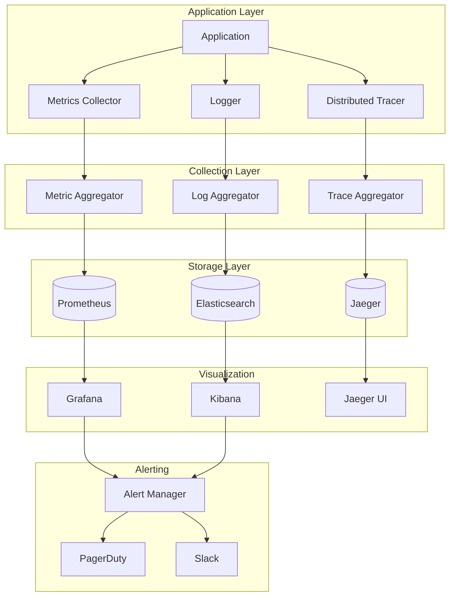
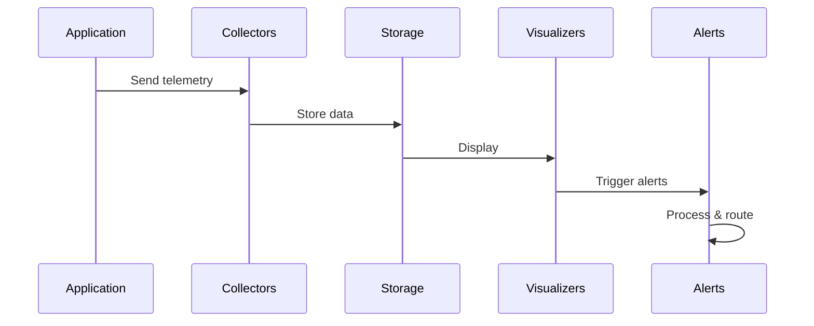

# Monitoring Architecture

## Overview

This document outlines our comprehensive monitoring and observability setup. The architecture provides end-to-end visibility into application performance, system health, and user experience through integrated logging, metrics collection, and distributed tracing.

## Components

Our monitoring architecture consists of five main component groups:

### Application Layer
- Application Core
- Logger System
- Metrics Collector
- Distributed Tracer

### Collection Layer
- Log Aggregator
- Metric Aggregator
- Trace Aggregator

### Storage Layer
- Elasticsearch
- Prometheus
- Jaeger

### Visualization Layer
- Kibana
- Grafana
- Jaeger UI

### Alerting Layer
- Alert Manager
- PagerDuty Integration
- Slack Integration



## Interactions

The monitoring system operates through the following interaction patterns:

1. **Data Collection Flow**
   - Applications emit logs, metrics, and traces
   - Aggregators collect and process data
   - Data is stored in specialized databases
   - Visualization tools display insights

2. **Alerting Flow**
   - Monitoring systems detect anomalies
   - Alert Manager processes alerts
   - Notifications sent to appropriate channels
   - Teams respond to incidents

3. **Analysis Flow**
   - Teams access dashboards
   - Investigate issues using logs
   - Analyze traces for performance
   - Generate reports and insights



## Implementation Details

### Technical Stack
- Logging: ELK Stack
- Metrics: Prometheus/Grafana
- Tracing: Jaeger
- Alerting: AlertManager/PagerDuty

### Application Instrumentation
```typescript
// OpenTelemetry setup
const tracer = new opentelemetry.NodeTracerProvider({
  resource: new Resource({
    [SemanticResourceAttributes.SERVICE_NAME]: 'my-service',
  }),
});

// Metrics setup
const meter = new opentelemetry.MeterProvider({
  resource: resource,
}).getMeter('my-service');

// Logger setup
const logger = winston.createLogger({
  format: winston.format.json(),
  defaultMeta: { service: 'my-service' },
  transports: [
    new winston.transports.Console(),
    new winston.transports.Elasticsearch()
  ]
});
```

### Alert Configuration
```yaml
# Alert Manager config
receivers:
  - name: 'team-pager'
    pagerduty_configs:
      - service_key: '<key>'
        severity: 'critical'
  - name: 'team-slack'
    slack_configs:
      - channel: '#alerts'
        title: '{{ template "slack.title" . }}'

route:
  receiver: 'team-slack'
  group_by: ['alertname', 'cluster']
  group_wait: 30s
  group_interval: 5m
  repeat_interval: 4h
```

## Description

### Application Instrumentation

Our monitoring architecture consists of several key components:

1. **Application Instrumentation**

   - Structured logging with correlation IDs
   - Custom metrics collection
   - Distributed tracing
   - Error tracking

### Data Collection

2. **Data Collection**

   - Log aggregation
   - Metric aggregation
   - Trace collection
   - Performance metrics

### Storage Solutions

3. **Storage Solutions**

   - Elasticsearch for logs
   - Prometheus for metrics
   - Jaeger for traces

### Visualization

4. **Visualization**

   - Kibana for log analysis
   - Grafana for metrics dashboards
   - Jaeger UI for trace visualization

### Alerting

5. **Alerting**
   - Alert Manager for routing
   - PagerDuty integration
   - Slack notifications
