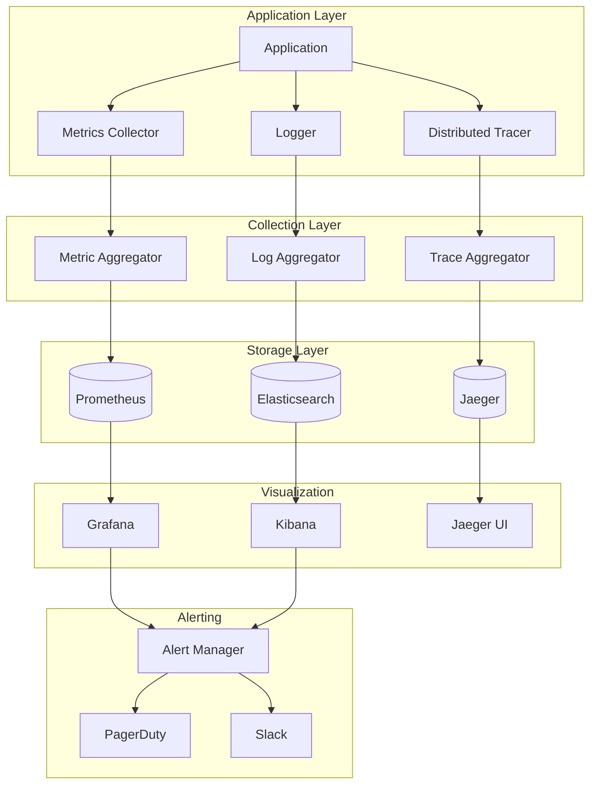

# Monitoring Architecture

This diagram illustrates our comprehensive monitoring and observability setup.

## Monitoring Flow Diagram

## Description

Our monitoring architecture consists of several key components:

1. **Application Instrumentation**

   - Structured logging with correlation IDs
   - Custom metrics collection
   - Distributed tracing
   - Error tracking

2. **Data Collection**

   - Log aggregation
   - Metric aggregation
   - Trace collection
   - Performance metrics

3. **Storage Solutions**

   - Elasticsearch for logs
   - Prometheus for metrics
   - Jaeger for traces

4. **Visualization**

   - Kibana for log analysis
   - Grafana for metrics dashboards
   - Jaeger UI for trace visualization

5. **Alerting**
   - Alert Manager for routing
   - PagerDuty integration
   - Slack notifications

## Implementation Details

- Uses OpenTelemetry for instrumentation
- Implements correlation IDs across services
- Supports custom metric collection
- Provides real-time monitoring
- Includes historical data analysis
