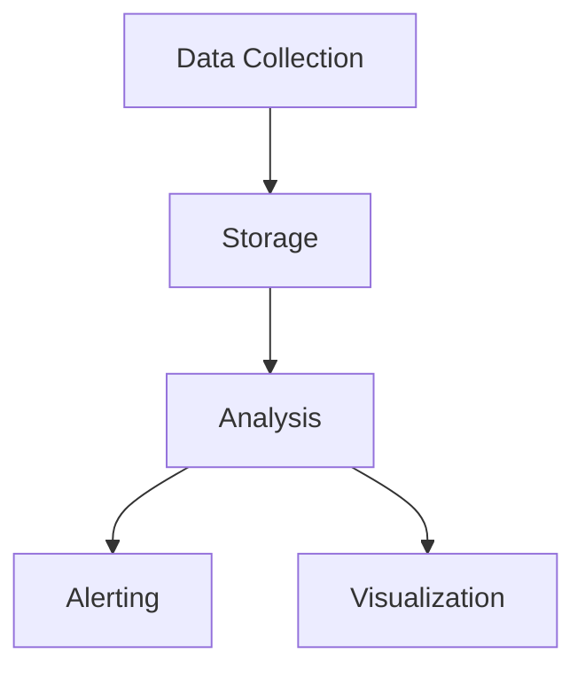
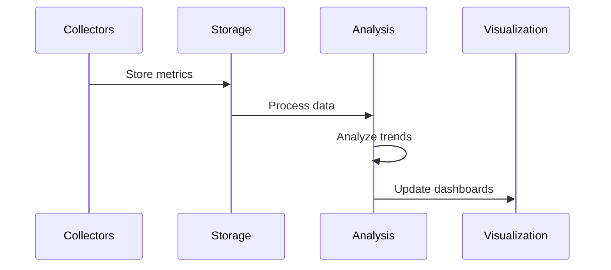

# Performance Monitoring Architecture

## Overview

This document outlines our performance monitoring architecture, designed to track, analyze, and optimize system performance across all components of our infrastructure.

## Components

### Monitoring Stack


### Key Components
1. Data Collection
   - Application metrics
   - System metrics
   - Network metrics
   - User metrics
   - Custom metrics

2. Storage System
   - Time series database
   - Data retention
   - Data aggregation
   - Query optimization

3. Analysis Engine
   - Real-time analysis
   - Trend analysis
   - Anomaly detection
   - Capacity planning

4. Visualization
   - Real-time dashboards
   - Performance reports
   - Trend visualization
   - Custom views

## Interactions

### Monitoring Flow


## Implementation Details

### Performance Metrics
```typescript
interface PerformanceMetric {
  name: string;
  type: MetricType;
  unit: string;
  threshold: Threshold;
  tags: Record<string, string>;
}

interface Threshold {
  warning: number;
  critical: number;
  baseline: number;
}
```

### Analysis Configuration
```typescript
interface AnalysisConfig {
  metrics: PerformanceMetric[];
  intervals: TimeInterval[];
  aggregations: AggregationType[];
  alerts: AlertRule[];
}
```

### Monitoring Standards
- Metric naming conventions
- Collection frequency
- Data retention policies
- Alert thresholds
- Dashboard layouts

## Related Documentation
- [Infrastructure Monitoring](./infrastructure-monitoring.md)
- [State Architecture](../data-flow/state-architecture.md)
- [Testing Strategy](../system/testing-strategy.md)
- [Capacity Planning](./capacity-planning.md)
