# Performance Monitoring Architecture

This diagram illustrates our comprehensive performance monitoring and optimization strategy across the application stack.

## Performance Architecture Diagram

```mermaid
graph TB
    subgraph "Frontend Performance"
        subgraph "Core Web Vitals"
            LCP[Largest Contentful Paint]
            FID[First Input Delay]
            CLS[Cumulative Layout Shift]
        end

        subgraph "Runtime Metrics"
            JS[JavaScript Performance]
            Render[Render Performance]
            Memory[Memory Usage]
        end

        subgraph "Asset Performance"
            Images[Image Optimization]
            Bundles[Bundle Size]
            Fonts[Font Loading]
        end
    end

    subgraph "Backend Performance"
        subgraph "API Metrics"
            Latency[API Latency]
            Throughput[Request Throughput]
            ErrorRate[Error Rate]
        end

        subgraph "Resource Usage"
            CPU[CPU Usage]
            RAM[Memory Usage]
            IO[I/O Operations]
        end

        subgraph "Database"
            QueryPerf[Query Performance]
            Connections[Connection Pool]
            Cache[Cache Hit Rate]
        end
    end

    subgraph "Monitoring Tools"
        Analytics[Web Analytics]
        APM[Application Monitoring]
        RUM[Real User Monitoring]
        Logging[Log Management]
    end

    subgraph "Optimization Actions"
        CDN[CDN Distribution]
        Caching[Caching Strategy]
        LoadBal[Load Balancing]
        AutoScale[Auto Scaling]
    end

    %% Frontend Connections
    LCP --> Analytics
    FID --> Analytics
    CLS --> Analytics

    JS --> RUM
    Render --> RUM
    Memory --> RUM

    Images --> CDN
    Bundles --> CDN
    Fonts --> CDN

    %% Backend Connections
    Latency --> APM
    Throughput --> APM
    ErrorRate --> APM

    CPU --> AutoScale
    RAM --> AutoScale
    IO --> Logging

    QueryPerf --> Caching
    Connections --> LoadBal
    Cache --> Caching
```

## Component Description

### Frontend Monitoring

1. **Core Web Vitals**

   - LCP optimization
   - FID improvement
   - CLS prevention

2. **Runtime Performance**

   - JavaScript execution
   - Render optimization
   - Memory management

3. **Asset Optimization**
   - Image compression
   - Bundle splitting
   - Font strategy

### Backend Monitoring

1. **API Performance**

   - Response times
   - Request handling
   - Error tracking

2. **Resource Metrics**

   - Server resources
   - System health
   - I/O efficiency

3. **Database Optimization**
   - Query efficiency
   - Connection management
   - Cache utilization

### Monitoring Infrastructure

- **Analytics**: User metrics
- **APM**: System metrics
- **RUM**: User experience
- **Logging**: System events

## Implementation Guidelines

1. **Performance Budgets**

   - Bundle size limits
   - Load time targets
   - API response limits
   - Resource thresholds

2. **Optimization Strategies**

   - Code splitting
   - Lazy loading
   - Caching policies
   - Database indexing

3. **Monitoring Setup**

   - Real-time alerts
   - Performance dashboards
   - Trend analysis
   - Incident response

4. **Testing Approach**

   - Load testing
   - Stress testing
   - Performance profiling
   - Synthetic monitoring

5. **Best Practices**
   - Regular audits
   - Continuous optimization
   - Automated monitoring
   - Performance culture
