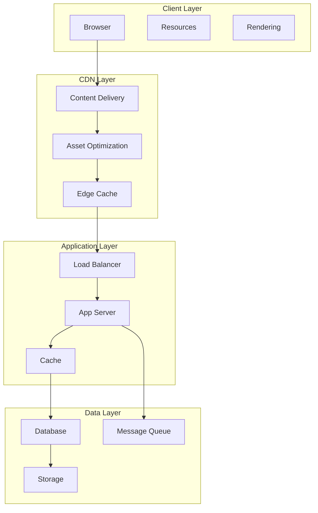

# Performance Monitoring Architecture

This diagram illustrates our comprehensive performance monitoring and optimization strategy across the application stack.

## Performance Architecture Diagram

```mermaid
graph TB
    subgraph "Frontend Performance"
        subgraph "Core Web Vitals"
            LCP[Largest Contentful Paint]
            FID[First Input Delay]
            CLS[Cumulative Layout Shift]
        end

        subgraph "Runtime Metrics"
            JS[JavaScript Performance]
            Render[Render Performance]
            Memory[Memory Usage]
        end

        subgraph "Asset Performance"
            Images[Image Optimization]
            Bundles[Bundle Size]
            Fonts[Font Loading]
        end
    end

    subgraph "Backend Performance"
        subgraph "API Metrics"
            Latency[API Latency]
            Throughput[Request Throughput]
            ErrorRate[Error Rate]
        end

        subgraph "Resource Usage"
            CPU[CPU Usage]
            RAM[Memory Usage]
            IO[I/O Operations]
        end

        subgraph "Database"
            QueryPerf[Query Performance]
            Connections[Connection Pool]
            Cache[Cache Hit Rate]
        end
    end

    subgraph "Monitoring Tools"
        Analytics[Web Analytics]
        APM[Application Monitoring]
        RUM[Real User Monitoring]
        Logging[Log Management]
    end

    subgraph "Optimization Actions"
        CDN[CDN Distribution]
        Caching[Caching Strategy]
        LoadBal[Load Balancing]
        AutoScale[Auto Scaling]
    end

    %% Frontend Connections
    LCP --> Analytics
    FID --> Analytics
    CLS --> Analytics

    JS --> RUM
    Render --> RUM
    Memory --> RUM

    Images --> CDN
    Bundles --> CDN
    Fonts --> CDN

    %% Backend Connections
    Latency --> APM
    Throughput --> APM
    ErrorRate --> APM

    CPU --> AutoScale
    RAM --> AutoScale
    IO --> Logging

    QueryPerf --> Caching
    Connections --> LoadBal
    Cache --> Caching
```



## Component Description

### Frontend Monitoring

1. **Core Web Vitals**

   - LCP optimization
   - FID improvement
   - CLS prevention

2. **Runtime Performance**

   - JavaScript execution
   - Render optimization
   - Memory management

3. **Asset Optimization**
   - Image compression
   - Bundle splitting
   - Font strategy

### Backend Monitoring

1. **API Performance**

   - Response times
   - Request handling
   - Error tracking

2. **Resource Metrics**

   - Server resources
   - System health
   - I/O efficiency

3. **Database Optimization**
   - Query efficiency
   - Connection management
   - Cache utilization

### Monitoring Infrastructure

- **Analytics**: User metrics
- **APM**: System metrics
- **RUM**: User experience
- **Logging**: System events

## Implementation Guidelines

1. **Performance Budgets**

   - Bundle size limits
   - Load time targets
   - API response limits
   - Resource thresholds

2. **Optimization Strategies**

   - Code splitting
   - Lazy loading
   - Caching policies
   - Database indexing

3. **Monitoring Setup**

   - Real-time alerts
   - Performance dashboards
   - Trend analysis
   - Incident response

4. **Testing Approach**

   - Load testing
   - Stress testing
   - Performance profiling
   - Synthetic monitoring

5. **Best Practices**
   - Regular audits
   - Continuous optimization
   - Automated monitoring
   - Performance culture

## Overview

Our performance architecture is designed to ensure optimal application responsiveness, scalability, and resource utilization across all system components. It implements a multi-layered approach to performance optimization, covering frontend rendering, backend processing, data access, and infrastructure scaling.

## Components

### 1. Frontend Performance
- **Core Web Vitals**
  - Largest Contentful Paint (LCP)
  - First Input Delay (FID)
  - Cumulative Layout Shift (CLS)
- **Resource Optimization**
  - Bundle splitting
  - Code splitting
  - Tree shaking
  - Asset optimization
- **Runtime Performance**
  - Virtual DOM optimization
  - Render cycle management
  - Memory management

### 2. Backend Performance
- **Request Processing**
  - Request queuing
  - Thread pool management
  - Connection pooling
- **Caching System**
  - In-memory cache
  - Distributed cache
  - Cache invalidation
- **Resource Management**
  - Memory allocation
  - CPU utilization
  - I/O optimization

### 3. Data Layer Performance
- **Database Optimization**
  - Query optimization
  - Index management
  - Connection pooling
- **Data Access Patterns**
  - Read/Write separation
  - Batch processing
  - Lazy loading
- **Storage Optimization**
  - Data compression
  - Partitioning
  - Sharding

### 4. Infrastructure Performance
- **Load Balancing**
  - Request distribution
  - Health checking
  - Failover management
- **Auto Scaling**
  - Horizontal scaling
  - Vertical scaling
  - Predictive scaling
- **Resource Monitoring**
  - Metrics collection
  - Performance alerts
  - Resource utilization

## Interactions

### 1. Performance Flow


### 2. Request Flow
1. Client initiates request
2. CDN processes static assets
3. Load balancer distributes request
4. Application server processes request
5. Cache layer checks for data
6. Database retrieves/stores data
7. Response returned to client

### 3. Optimization Flow
1. Static asset optimization
2. Dynamic content caching
3. Database query optimization
4. Resource scaling
5. Performance monitoring
6. Automated adjustments

## Implementation Details

### 1. Frontend Performance Implementation

```typescript
// Performance monitoring configuration
interface PerformanceConfig {
  webVitals: WebVitalsConfig;
  resources: ResourceConfig;
  monitoring: MonitoringConfig;
}

interface WebVitalsConfig {
  lcp: {
    threshold: number;
    budget: number;
  };
  fid: {
    threshold: number;
    budget: number;
  };
  cls: {
    threshold: number;
    budget: number;
  };
}

// Performance monitoring implementation
class PerformanceMonitor {
  private config: PerformanceConfig;
  private metrics: Map<string, number>;

  constructor(config: PerformanceConfig) {
    this.config = config;
    this.metrics = new Map();
  }

  public trackWebVital(metric: string, value: number): void {
    this.metrics.set(metric, value);
    this.checkThreshold(metric, value);
  }

  private checkThreshold(metric: string, value: number): void {
    const threshold = this.getThreshold(metric);
    if (value > threshold) {
      this.reportViolation(metric, value, threshold);
    }
  }

  private reportViolation(
    metric: string,
    value: number,
    threshold: number
  ): void {
    console.warn(
      `Performance violation: ${metric} value ${value} exceeds threshold ${threshold}`
    );
  }
}
```

### 2. Backend Performance Implementation

```typescript
// Backend performance configuration
interface BackendPerformanceConfig {
  cache: CacheConfig;
  database: DatabaseConfig;
  scaling: ScalingConfig;
}

interface CacheConfig {
  strategy: 'memory' | 'distributed';
  ttl: number;
  maxSize: number;
}

interface DatabaseConfig {
  poolSize: number;
  timeout: number;
  retryAttempts: number;
}

// Cache implementation
class PerformanceCache {
  private config: CacheConfig;
  private store: Map<string, CacheEntry>;

  constructor(config: CacheConfig) {
    this.config = config;
    this.store = new Map();
  }

  public async get<T>(key: string): Promise<T | null> {
    const entry = this.store.get(key);
    if (!entry) return null;
    if (this.isExpired(entry)) {
      this.store.delete(key);
      return null;
    }
    return entry.value as T;
  }

  public async set<T>(
    key: string,
    value: T,
    ttl?: number
  ): Promise<void> {
    const expiry = Date.now() + (ttl || this.config.ttl);
    this.store.set(key, { value, expiry });
    this.enforceSizeLimit();
  }

  private isExpired(entry: CacheEntry): boolean {
    return Date.now() > entry.expiry;
  }

  private enforceSizeLimit(): void {
    if (this.store.size > this.config.maxSize) {
      const oldestKey = this.store.keys().next().value;
      this.store.delete(oldestKey);
    }
  }
}
```

### 3. Infrastructure Performance Implementation

```typescript
// Infrastructure performance configuration
interface InfrastructureConfig {
  scaling: AutoScalingConfig;
  monitoring: MonitoringConfig;
  alerts: AlertConfig;
}

interface AutoScalingConfig {
  minInstances: number;
  maxInstances: number;
  targetCPU: number;
  cooldownPeriod: number;
}

// Auto-scaling implementation
class AutoScaler {
  private config: AutoScalingConfig;
  private currentInstances: number;

  constructor(config: AutoScalingConfig) {
    this.config = config;
    this.currentInstances = config.minInstances;
  }

  public async scaleBasedOnMetrics(
    metrics: ResourceMetrics
  ): Promise<void> {
    const targetInstances = this.calculateTargetInstances(metrics);
    await this.scale(targetInstances);
  }

  private calculateTargetInstances(
    metrics: ResourceMetrics
  ): number {
    const utilizationRatio = metrics.cpu / this.config.targetCPU;
    const targetInstances = Math.ceil(
      this.currentInstances * utilizationRatio
    );
    return Math.min(
      Math.max(targetInstances, this.config.minInstances),
      this.config.maxInstances
    );
  }

  private async scale(targetInstances: number): Promise<void> {
    if (targetInstances === this.currentInstances) return;
    await this.updateInstanceCount(targetInstances);
    this.currentInstances = targetInstances;
  }
}
```

## Best Practices

1. **Frontend Performance**
   - Implement lazy loading
   - Optimize bundle size
   - Use efficient rendering patterns
   - Implement proper caching
   - Monitor Core Web Vitals
   - Optimize critical rendering path

2. **Backend Performance**
   - Use connection pooling
   - Implement proper caching
   - Optimize database queries
   - Use async operations
   - Implement proper error handling
   - Monitor resource usage

3. **Infrastructure Performance**
   - Implement auto-scaling
   - Use load balancing
   - Monitor resource utilization
   - Implement proper failover
   - Use CDN for static assets
   - Implement proper logging

## Related Documentation

- [Content Delivery Architecture](./content-delivery.md)
- [Caching Strategy](./caching.md)
- [Monitoring Architecture](./monitoring.md)
- [Database Architecture](../data/database.md)
- [Frontend Architecture](../frontend/frontend.md)
