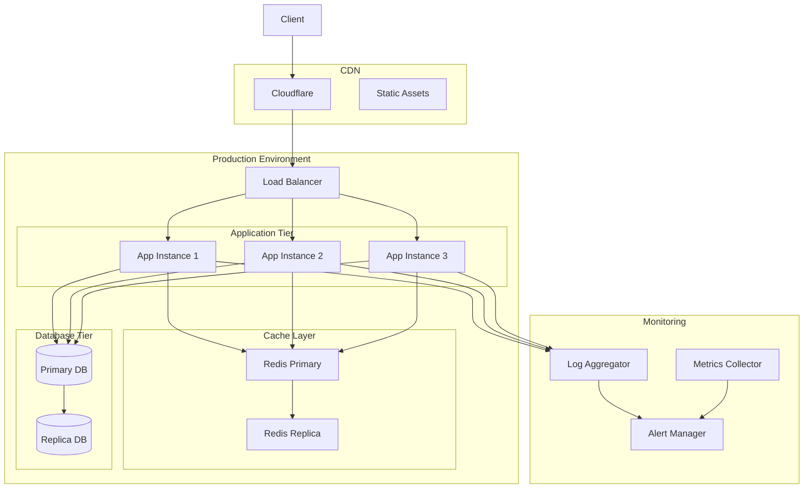

# Production Environment Architecture

This diagram illustrates the high-level architecture of our production environment, including load balancing, application tier, caching layer, database tier, CDN, and monitoring components.

## Components

### Load Balancer

- Distributes traffic across multiple application instances
- Performs health checks
- Handles SSL termination

### Application Tier

- Multiple application instances for high availability
- Horizontally scalable
- Stateless design

### Cache Layer

- Redis in primary-replica configuration
- In-memory caching for high performance
- Automatic failover

### Database Tier

- Primary-replica setup
- Automatic failover
- Regular backups

### CDN

- Cloudflare for content delivery
- Static asset caching
- DDoS protection

### Monitoring

- Centralized logging
- Metrics collection
- Alert management
