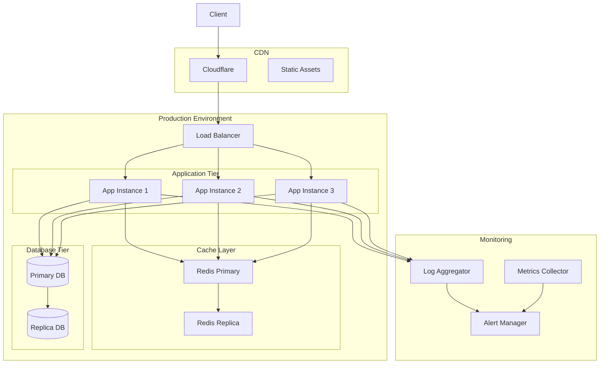
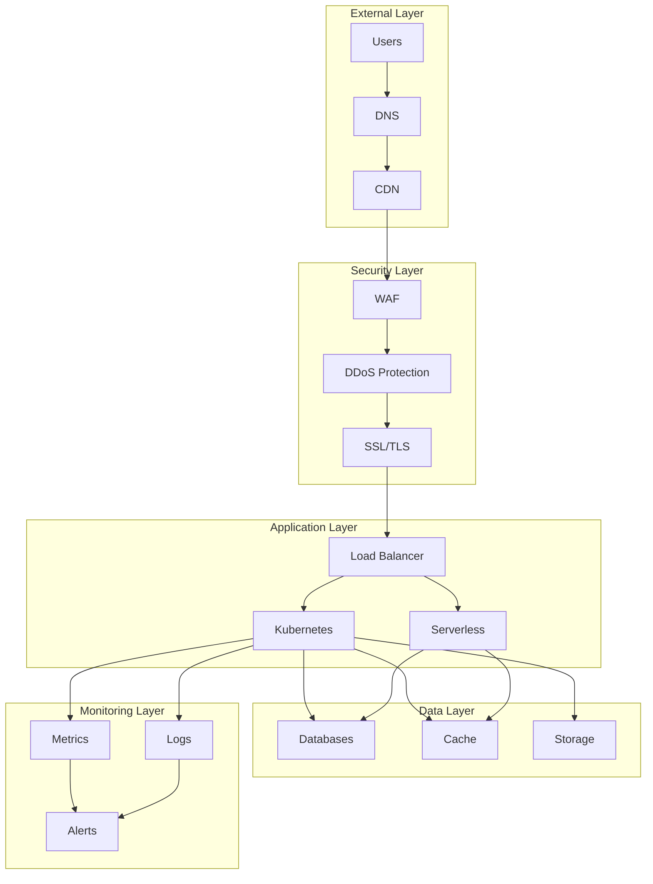

# Production Environment Architecture

This diagram illustrates the high-level architecture of our production environment, including load balancing, application tier, caching layer, database tier, CDN, and monitoring components.



## Overview

Our production environment architecture is designed to provide a highly available, scalable, and secure infrastructure for running our applications. It implements industry best practices for deployment, monitoring, and maintenance while ensuring optimal performance and reliability. The environment spans multiple availability zones and uses containerized deployments with automated scaling and failover capabilities.

## Components

### Load Balancer

- Distributes traffic across multiple application instances
- Performs health checks
- Handles SSL termination

### Application Tier

- Multiple application instances for high availability
- Horizontally scalable
- Stateless design

### Cache Layer

- Redis in primary-replica configuration
- In-memory caching for high performance
- Automatic failover

### Database Tier

- Primary-replica setup
- Automatic failover
- Regular backups

### CDN

- Cloudflare for content delivery
- Static asset caching
- DDoS protection

### Monitoring

- Centralized logging
- Metrics collection
- Alert management

## Interactions

### Production Environment Flow



### Request Flow

1. User request reaches DNS
2. Request routed through CDN
3. Security layers process request
4. Load balancer distributes traffic
5. Application processes request
6. Data layer handles storage/retrieval
7. Monitoring captures metrics/logs

### Deployment Flow

1. Code deployed to clusters
2. Health checks performed
3. Traffic gradually shifted
4. Monitoring confirms stability
5. Rollback if needed
6. Post-deployment validation

## Implementation Details

### Infrastructure Configuration

```typescript
// Infrastructure configuration
interface InfrastructureConfig {
  vpc: VPCConfig;
  loadBalancer: LoadBalancerConfig;
  security: SecurityConfig;
}

interface VPCConfig {
  region: string;
  availabilityZones: string[];
  subnets: SubnetConfig[];
  securityGroups: SecurityGroupConfig[];
}

// Load balancer implementation
class LoadBalancerManager {
  private config: LoadBalancerConfig;
  private healthChecks: Map<string, HealthCheck>;

  constructor(config: LoadBalancerConfig) {
    this.config = config;
    this.healthChecks = new Map();
  }

  public async distributeTraffic(
    request: Request
  ): Promise<Response> {
    const target = await this.selectTarget();
    const response = await this.forwardRequest(request, target);
    await this.updateMetrics(target, response);
    return response;
  }

  private async selectTarget(): Promise<Target> {
    const healthyTargets = await this.getHealthyTargets();
    return this.loadBalancingAlgorithm(healthyTargets);
  }

  private async updateMetrics(
    target: Target,
    response: Response
  ): Promise<void> {
    const latency = this.calculateLatency(response);
    await this.metrics.recordLatency(target.id, latency);
    await this.metrics.recordRequestCount(target.id);
  }
}
```

### Kubernetes Configuration

```typescript
// Kubernetes cluster configuration
interface KubernetesConfig {
  cluster: ClusterConfig;
  workloads: WorkloadConfig[];
  networking: NetworkConfig;
}

interface ClusterConfig {
  version: string;
  nodePools: NodePoolConfig[];
  autoScaling: AutoScalingConfig;
}

// Cluster management implementation
class ClusterManager {
  private config: ClusterConfig;
  private workloads: Map<string, Workload>;

  constructor(config: ClusterConfig) {
    this.config = config;
    this.workloads = new Map();
  }

  public async scaleCluster(
    metrics: ClusterMetrics
  ): Promise<void> {
    const targetSize = this.calculateTargetSize(metrics);
    await this.adjustNodePools(targetSize);
    await this.rebalanceWorkloads();
  }

  private async adjustNodePools(
    targetSize: number
  ): Promise<void> {
    const currentSize = await this.getCurrentSize();
    if (targetSize === currentSize) return;

    if (targetSize > currentSize) {
      await this.scaleUp(targetSize - currentSize);
    } else {
      await this.scaleDown(currentSize - targetSize);
    }
  }

  private async rebalanceWorkloads(): Promise<void> {
    const nodes = await this.getAvailableNodes();
    const workloads = Array.from(this.workloads.values());
    await this.optimizeWorkloadPlacement(nodes, workloads);
  }
}
```

### Monitoring Implementation

```typescript
// Monitoring configuration
interface MonitoringConfig {
  metrics: MetricsConfig;
  logging: LoggingConfig;
  alerting: AlertingConfig;
}

interface MetricsConfig {
  scrapeInterval: number;
  retentionPeriod: number;
  customMetrics: MetricDefinition[];
}

// Monitoring system implementation
class MonitoringSystem {
  private config: MonitoringConfig;
  private alertManager: AlertManager;
  private metricStore: MetricStore;

  constructor(config: MonitoringConfig) {
    this.config = config;
    this.alertManager = new AlertManager(config.alerting);
    this.metricStore = new MetricStore(config.metrics);
  }

  public async collectMetrics(): Promise<void> {
    const metrics = await this.gatherSystemMetrics();
    await this.metricStore.store(metrics);
    await this.checkAlertConditions(metrics);
  }

  private async checkAlertConditions(
    metrics: Metrics
  ): Promise<void> {
    const violations = this.evaluateAlertRules(metrics);
    for (const violation of violations) {
      await this.alertManager.handleAlert(violation);
    }
  }

  private async evaluateAlertRules(
    metrics: Metrics
  ): Promise<AlertViolation[]> {
    return this.config.alerting.rules
      .map(rule => this.evaluateRule(rule, metrics))
      .filter(violation => violation !== null);
  }
}
```

## Best Practices

1. **Infrastructure Management**
   - Use Infrastructure as Code
   - Implement proper versioning
   - Maintain documentation
   - Regular security updates
   - Automated provisioning
   - Disaster recovery planning

2. **Deployment Strategy**
   - Blue-green deployments
   - Canary releases
   - Feature flags
   - Automated rollbacks
   - Continuous monitoring
   - Performance testing

3. **Security Measures**
   - Regular security audits
   - Access control
   - Encryption at rest/transit
   - Security monitoring
   - Compliance checks
   - Vulnerability scanning

## Related Documentation

- [Deployment Architecture](./deployment.md)
- [Security Architecture](./security.md)
- [Monitoring Architecture](./monitoring.md)
- [Disaster Recovery](./disaster-recovery.md)
- [Scaling Strategy](./scaling.md)
