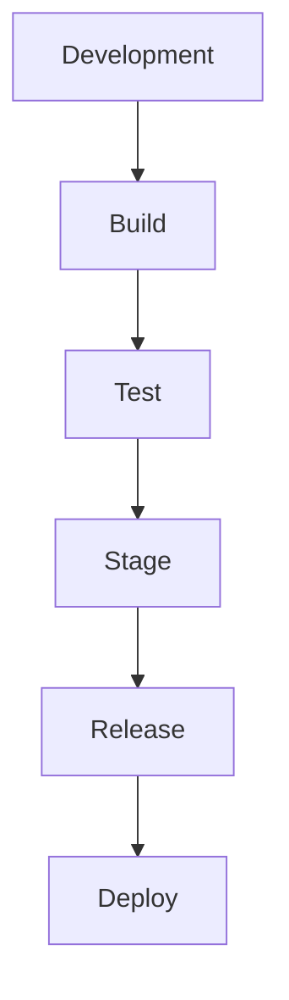
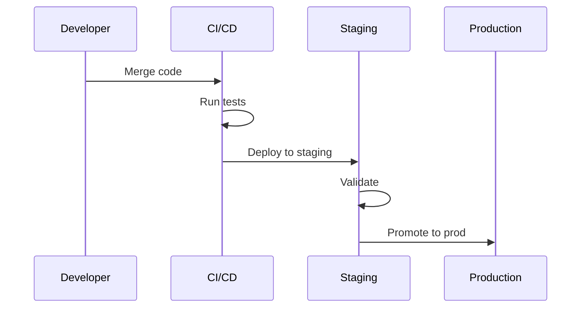

# Release Process Architecture

## Overview

This document outlines our release process architecture, designed to ensure consistent, reliable, and efficient software delivery from development to production.

## Components

### Release Pipeline


### Key Components
1. Build System
   - Source control
   - Dependency management
   - Artifact creation
   - Version control

2. Testing Framework
   - Unit tests
   - Integration tests
   - Performance tests
   - Security scans

3. Staging Environment
   - Environment parity
   - Data management
   - Configuration
   - Validation

4. Release Management
   - Version tracking
   - Change logs
   - Documentation
   - Approvals

## Interactions

### Release Flow


## Implementation Details

### Release Configuration
```typescript
interface ReleaseConfig {
  version: string;
  environment: 'dev' | 'staging' | 'prod';
  components: Component[];
  dependencies: Dependency[];
  validation: ValidationStep[];
}

interface Component {
  name: string;
  version: string;
  artifacts: string[];
  config: Record<string, unknown>;
}
```

### Release Steps
```typescript
interface ReleaseStep {
  name: string;
  type: 'build' | 'test' | 'deploy' | 'validate';
  commands: string[];
  timeout: number;
  rollback: RollbackStep[];
}
```

### Release Standards
- Version naming conventions
- Change log format
- Documentation requirements
- Testing criteria
- Approval process

## Related Documentation
- [Git Workflow](./git-workflow.md)
- [Code Review](./code-review.md)
- [Testing Strategy](../system/testing-strategy.md)
- [Deployment Architecture](./deployment.md)
