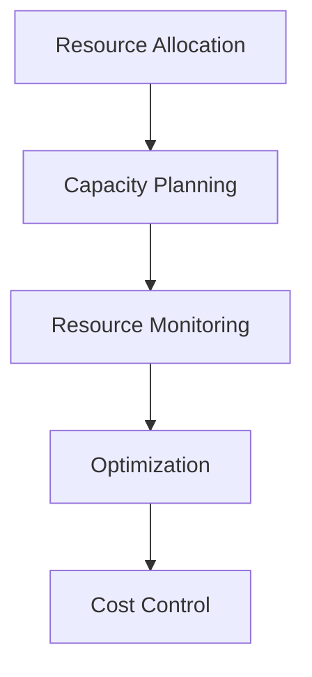
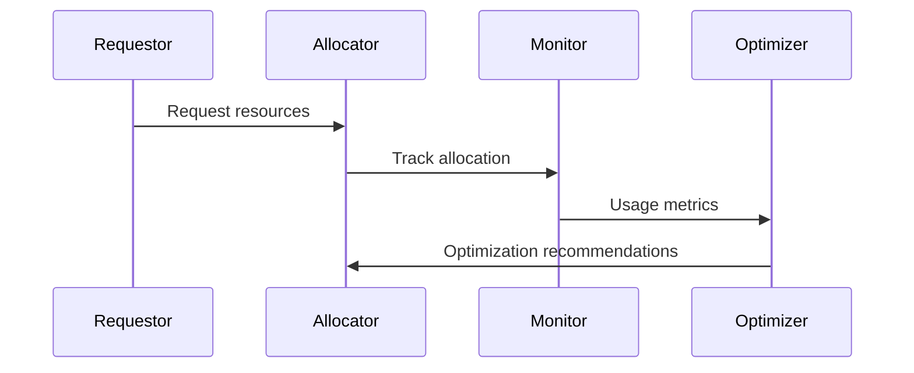

# Resource Management Architecture

## Overview

This document outlines our resource management architecture, designed to efficiently allocate, monitor, and optimize infrastructure resources across our system.

## Components

### Resource Management Stack


### Key Components
1. Resource Allocation
   - Resource provisioning
   - Resource pools
   - Quota management
   - Access control

2. Capacity Planning
   - Demand forecasting
   - Scaling strategies
   - Growth planning
   - Performance targets

3. Resource Monitoring
   - Usage tracking
   - Performance metrics
   - Health monitoring
   - Alerts management

4. Resource Optimization
   - Utilization analysis
   - Resource scaling
   - Workload balancing
   - Cost optimization

## Interactions

### Resource Flow


## Implementation Details

### Resource Configuration
```typescript
interface ResourceConfig {
  allocation: AllocationConfig;
  capacity: CapacityConfig;
  monitoring: MonitoringConfig;
  optimization: OptimizationConfig;
}

interface AllocationConfig {
  pools: ResourcePool[];
  quotas: QuotaConfig[];
  access: AccessConfig;
  policies: Policy[];
}
```

### Optimization Rules
```typescript
interface OptimizationRule {
  metric: MetricType;
  threshold: number;
  action: OptimizationAction;
  priority: number;
}
```

### Management Standards
- Allocation policies
- Capacity thresholds
- Monitoring requirements
- Optimization criteria
- Cost controls

## Related Documentation
- [Cost Management](./cost-management.md)
- [Performance Monitoring](./performance-monitoring.md)
- [Scaling](./scaling.md)
- [Infrastructure Monitoring](./infrastructure-monitoring.md)
