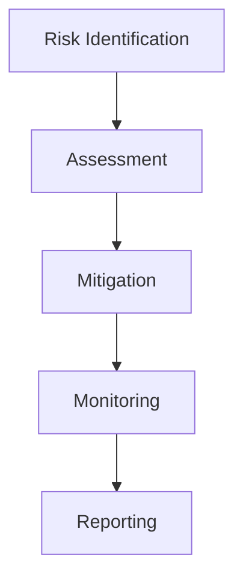
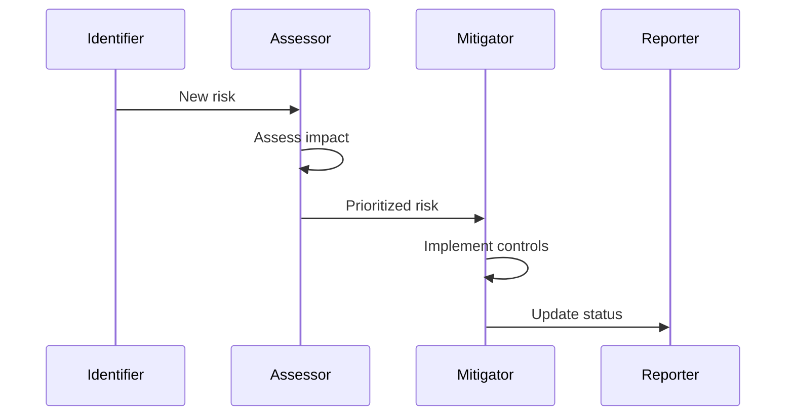

# Risk Management Architecture

## Overview

This document outlines our risk management architecture, designed to identify, assess, and mitigate risks across our infrastructure and operations.

## Components

### Risk Management Stack


### Key Components
1. Risk Identification
   - Threat modeling
   - Vulnerability scanning
   - Asset inventory
   - Risk discovery

2. Risk Assessment
   - Impact analysis
   - Probability calculation
   - Risk scoring
   - Priority assignment

3. Risk Mitigation
   - Control implementation
   - Risk treatment
   - Action planning
   - Resource allocation

4. Risk Monitoring
   - Control effectiveness
   - Risk trends
   - KRI tracking
   - Incident monitoring

## Interactions

### Risk Management Flow


## Implementation Details

### Risk Configuration
```typescript
interface RiskConfig {
  categories: RiskCategory[];
  assessment: AssessmentConfig;
  mitigation: MitigationConfig;
  monitoring: MonitoringConfig;
}

interface RiskCategory {
  name: string;
  description: string;
  impacts: Impact[];
  controls: Control[];
}
```

### Assessment Rules
```typescript
interface AssessmentRule {
  type: RiskType;
  criteria: Criterion[];
  scoring: ScoringMethod;
  thresholds: Threshold[];
}
```

### Management Standards
- Risk assessment methods
- Control frameworks
- Mitigation strategies
- Monitoring requirements
- Reporting standards

## Related Documentation
- [Compliance](./compliance.md)
- [Security Architecture](../security/security-architecture.md)
- [Audit Logging](./audit-logging.md)
- [Incident Response](../system/incident-response.md)
