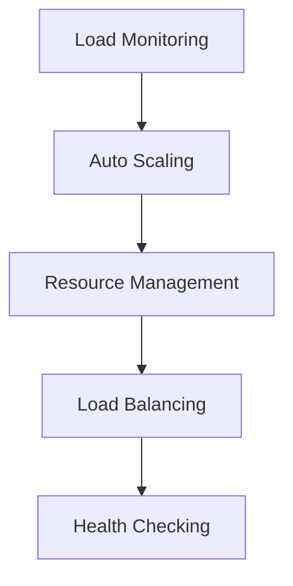
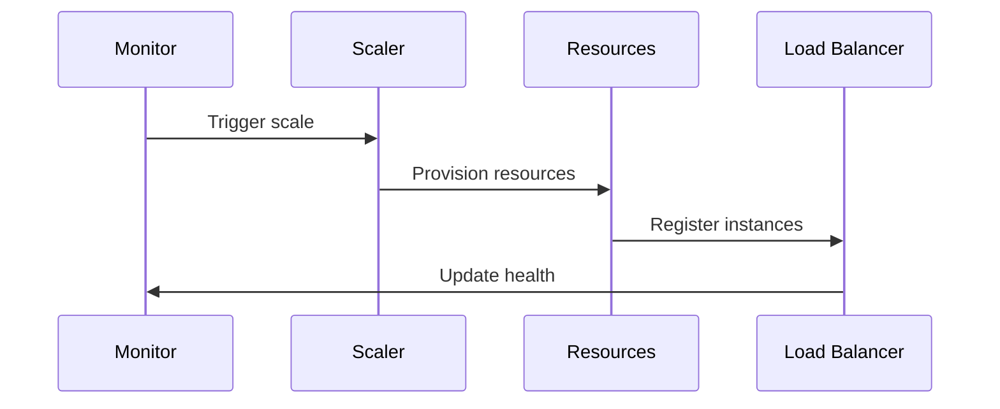

# Scaling Architecture

## Overview

This document outlines our scaling architecture, designed to handle growing workloads efficiently and maintain system performance under varying loads.

## Components

### Scaling Stack


### Key Components
1. Load Monitoring
   - Metric collection
   - Threshold monitoring
   - Trend analysis
   - Alert management

2. Auto Scaling
   - Scaling policies
   - Resource provisioning
   - Instance management
   - Cooldown periods

3. Resource Management
   - Capacity planning
   - Resource allocation
   - Cost optimization
   - Performance tuning

4. Load Distribution
   - Load balancing
   - Traffic routing
   - Health checks
   - Failover handling

## Interactions

### Scaling Flow


## Implementation Details

### Scaling Configuration
```typescript
interface ScalingConfig {
  policies: ScalingPolicy[];
  thresholds: Threshold[];
  resources: ResourceConfig[];
  monitoring: MonitoringConfig;
}

interface ScalingPolicy {
  type: 'horizontal' | 'vertical';
  trigger: TriggerCondition;
  action: ScalingAction;
  cooldown: number;
}
```

### Resource Management
```typescript
interface ResourceManager {
  type: ResourceType;
  capacity: CapacityConfig;
  scaling: ScalingConfig;
  monitoring: MonitoringConfig;
}
```

### Scaling Standards
- Scaling thresholds
- Resource limits
- Performance targets
- Cost constraints
- Monitoring requirements

## Related Documentation
- [Performance Monitoring](./performance-monitoring.md)
- [Capacity Planning](./capacity-planning.md)
- [Load Balancing](./load-balancing.md)
- [Cost Management](./cost-management.md)
