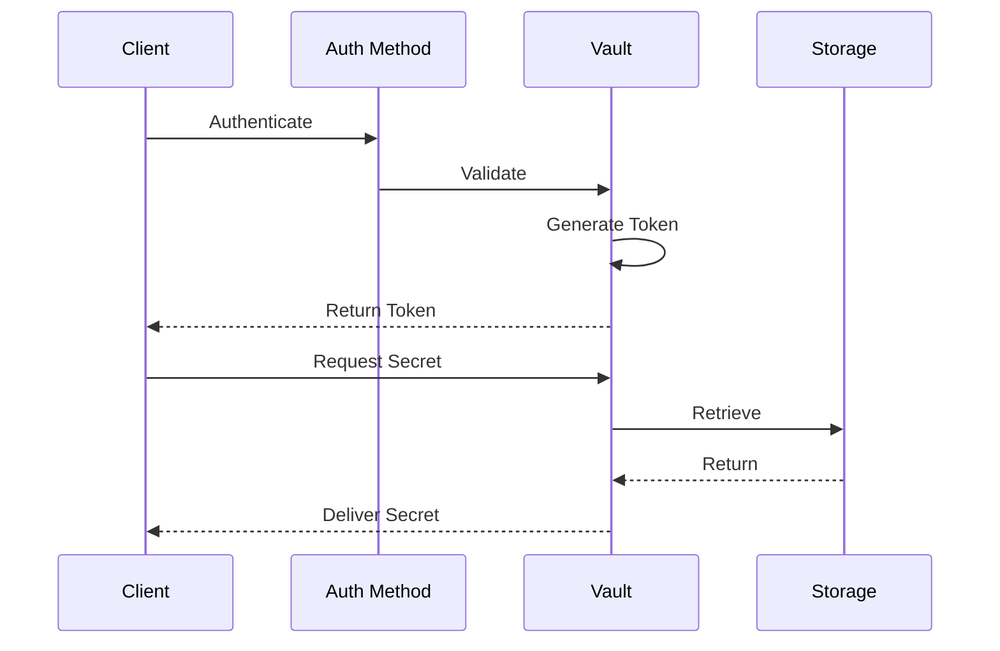

# Secrets Management Architecture

## Overview

This document outlines our secrets management infrastructure using HashiCorp Vault and related security patterns. The architecture provides a secure, scalable, and automated approach to managing sensitive information across our infrastructure while ensuring compliance with security standards and best practices.

## Components

Our secrets management architecture consists of four main component groups:

### Vault Infrastructure
- Core Components (Vault Server, Storage Backend, HSM)
- High Availability Setup (Primary/Secondary nodes)
- Authentication Methods

### Secret Types
- Static Secrets (Key-Value, PKI/Certificates, SSH Keys)
- Dynamic Secrets (Database Credentials, Cloud Credentials)
- Encryption Services (Transit Encryption, Key Rotation)

### Access Control
- Policy Management (ACL, RBAC)
- Audit Systems
- Compliance Controls

### Integration Points
- Application Integration (Kubernetes, CI/CD)
- DevOps Tools
- Security Operations

## Secrets Management Architecture Diagram

```mermaid
graph TB
    subgraph "Vault Infrastructure"
        subgraph "Core Components"
            VaultServer[Vault Server]
            Storage[Storage Backend]
            HSM[Hardware Security Module]
        end

        subgraph "High Availability"
            Primary[Primary Node]
            Secondary[Secondary Node]
            Consensus[Consensus Protocol]
        end

        subgraph "Authentication"
            AuthMethods[Auth Methods]
            TokenAuth[Token Auth]
            OIDC[OIDC Auth]
        end
    end

    subgraph "Secret Types"
        subgraph "Static Secrets"
            KV[Key-Value]
            PKI[PKI/Certificates]
            SSH[SSH Keys]
        end

        subgraph "Dynamic Secrets"
            Database[Database Creds]
            Cloud[Cloud Creds]
            API[API Keys]
        end

        subgraph "Encryption"
            Transit[Transit Encryption]
            KeyRotation[Key Rotation]
            Transform[Transform Secrets]
        end
    end

    subgraph "Access Control"
        subgraph "Policies"
            ACL[Access Policies]
            RBAC[Role-Based Access]
            Identity[Identity Groups]
        end

        subgraph "Audit"
            AuditLog[Audit Logs]
            Monitoring[Monitoring]
            Alerts[Alerts]
        end

        subgraph "Compliance Requirements"
            Rules[Compliance Rules]
            Standards[Security Standards]
            Reports[Compliance Reports]
        end
    end

    subgraph "Integration"
        subgraph "Applications"
            K8s[Kubernetes]
            CI/CD[CI/CD Pipeline]
            Apps[Applications]
        end

        subgraph "DevOps"
            IaC[Infrastructure as Code]
            Config[Configuration]
            Deploy[Deployment]
        end

        subgraph "Security"
            SecOps[Security Operations]
            Rotation[Secret Rotation]
            Revocation[Secret Revocation]
        end
    end

    %% Vault Flow
    VaultServer --> Storage
    Storage --> HSM
    HSM --> Primary

    Primary --> Secondary
    Secondary --> Consensus
    Consensus --> AuthMethods

    AuthMethods --> TokenAuth
    TokenAuth --> OIDC

    %% Secrets Flow
    KV --> Database
    PKI --> Cloud
    SSH --> API

    Database --> Transit
    Cloud --> KeyRotation
    API --> Transform

    %% Access Flow
    ACL --> AuditLog
    RBAC --> Monitoring
    Identity --> Alerts

    AuditLog --> Rules
    Monitoring --> Standards
    Alerts --> Reports

    %% Integration Flow
    K8s --> IaC
    CI/CD --> Config
    Apps --> Deploy

    IaC --> SecOps
    Config --> Rotation
    Deploy --> Revocation
```



## Interactions

The secrets management system operates through the following interaction patterns:

1. **Authentication Flow**
   - Client authenticates with Vault
   - Token is issued based on policies
   - Token is used for subsequent requests
   - Regular token rotation and renewal

2. **Secret Access Flow**
   - Request validation
   - Policy evaluation
   - Secret retrieval/generation
   - Audit log creation

3. **Management Flow**
   - Secret rotation
   - Policy updates
   - Backup and recovery
   - Compliance reporting



## Implementation Details

### Technical Stack
- Secrets Management: HashiCorp Vault
- Storage Backend: Consul
- HSM Integration: AWS CloudHSM
- Authentication: OIDC, JWT
- Monitoring: Prometheus/Grafana

### Security Controls

#### Authentication Methods
- Token-based authentication
- OIDC integration
- Certificate-based auth
- Cloud provider auth

#### Access Policies
- Path-based policies
- Role-based access control
- Identity-based policies
- Namespace isolation

#### Audit and Compliance
- Detailed audit logs
- Compliance reporting
- Security alerts
- Performance monitoring

### Integration Patterns

#### Application Integration
```hcl
# Vault Policy Example
path "secret/data/{{identity.entity.name}}/*" {
  capabilities = ["create", "read", "update", "delete"]
}

# Kubernetes Auth
path "auth/kubernetes/login" {
  capabilities = ["create", "read"]
}
```

#### DevOps Integration
```yaml
# Vault Agent Config
auto_auth {
  method "kubernetes" {
    mount_path = "auth/kubernetes"
    config = {
      role = "app-role"
    }
  }
}
```

## Component Description

### Vault Infrastructure

1. **Core Components**

   - Vault server
   - Storage backend
   - HSM integration

2. **High Availability**

   - Primary node
   - Secondary nodes
   - Consensus protocol

3. **Authentication**
   - Auth methods
   - Token auth
   - OIDC integration

### Secret Management

1. **Static Secrets**

   - Key-Value secrets
   - PKI/Certificates
   - SSH keys

2. **Dynamic Secrets**
   - Database credentials
   - Cloud credentials
   - API keys

## Implementation Guidelines

1. **Infrastructure Setup**

   - Installation
   - Configuration
   - HA setup
   - Storage config

2. **Secret Management**

   - Secret types
   - Storage paths
   - Lifecycle rules
   - Rotation policy

3. **Access Control**

   - Authentication
   - Authorization
   - Policies
   - Audit

4. **Best Practices**

   - Secret rotation
   - Access policies
   - Monitoring
   - Compliance

5. **Integration**

   - Application integration
   - CI/CD pipeline
   - Infrastructure
   - DevOps tools

6. **Documentation**
   - Architecture docs
   - Security policies
   - Integration guides
   - Runbooks
