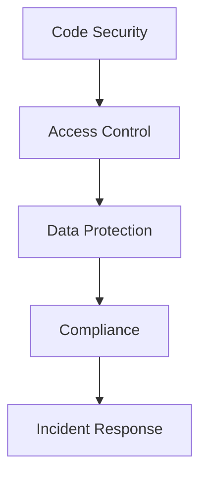
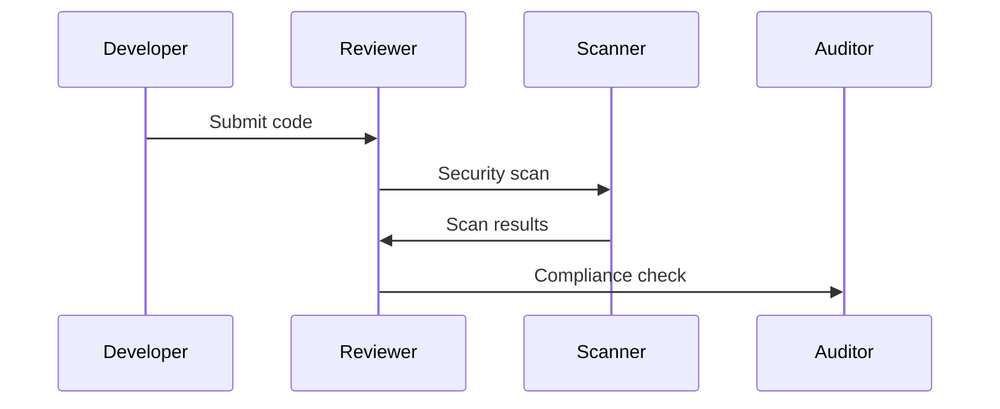

# Security Guidelines Architecture

## Overview

This document outlines our security guidelines architecture, establishing standards and best practices for maintaining security across our development and deployment processes.

## Components

### Security Guidelines Stack


### Key Components
1. Code Security
   - Secure coding practices
   - Code review standards
   - Vulnerability scanning
   - Security testing

2. Access Control
   - Authentication standards
   - Authorization policies
   - Identity management
   - Access auditing

3. Data Protection
   - Data classification
   - Encryption standards
   - Data handling
   - Privacy compliance

4. Security Compliance
   - Regulatory compliance
   - Security policies
   - Audit procedures
   - Documentation standards

## Interactions

### Security Flow


## Implementation Details

### Security Configuration
```typescript
interface SecurityConfig {
  coding: CodingStandards;
  access: AccessConfig;
  data: DataProtectionConfig;
  compliance: ComplianceConfig;
}

interface CodingStandards {
  practices: Practice[];
  reviews: ReviewStandard[];
  scanning: ScanConfig[];
  testing: TestRequirement[];
}
```

### Security Rules
```typescript
interface SecurityRule {
  category: SecurityCategory;
  requirement: string;
  validation: ValidationMethod;
  priority: number;
}
```

### Guideline Standards
- Code security requirements
- Access control policies
- Data protection standards
- Compliance requirements
- Incident response procedures

## Related Documentation
- [Git Workflow](./git-workflow.md)
- [Security Architecture](../security/security-architecture.md)
- [Code Review](./code-review.md)
- [Compliance](./compliance.md)
