# Service Mesh Architecture

This diagram illustrates our service mesh architecture using Istio for managing microservice communication.

## Service Mesh Architecture Diagram

```mermaid
graph TB
    subgraph "Control Plane"
        subgraph "Istio Components"
            Istiod[Istiod]
            Pilot[Pilot]
            Citadel[Citadel]
        end

        subgraph "Configuration"
            Gateway[Gateway]
            VirtualService[Virtual Service]
            DestRule[Destination Rules]
        end

        subgraph "Security"
            AuthPolicy[Auth Policy]
            mTLS[mTLS]
            RBAC[RBAC]
        end
    end

    subgraph "Data Plane"
        subgraph "Sidecars"
            Envoy[Envoy Proxy]
            Ingress[Ingress Proxy]
            Egress[Egress Proxy]
        end

        subgraph "Traffic Management"
            LoadBalance[Load Balancing]
            CircuitBreak[Circuit Breaking]
            Retry[Retry Logic]
        end

        subgraph "Observability"
            Metrics[Metrics]
            Tracing[Distributed Tracing]
            Logging[Access Logging]
        end
    end

    subgraph "Service Communication"
        subgraph "Routing"
            L7Routing[L7 Routing]
            TrafficSplit[Traffic Split]
            Failover[Failover]
        end

        subgraph "Resilience"
            Timeout[Timeouts]
            Bulkhead[Bulkhead]
            FaultInject[Fault Injection]
        end

        subgraph "Security Policies"
            Authentication[Authentication]
            Authorization[Authorization]
            Encryption[Encryption]
        end
    end

    subgraph "Monitoring"
        subgraph "Telemetry"
            Prometheus[Prometheus]
            Grafana[Grafana]
            Kiali[Kiali]
        end

        subgraph "Alerts"
            AlertRules[Alert Rules]
            Notification[Notifications]
            Escalation[Escalation]
        end

        subgraph "Debugging"
            ServiceGraph[Service Graph]
            TrafficFlow[Traffic Flow]
            HealthCheck[Health Check]
        end
    end

    %% Control Flow
    Istiod --> Gateway
    Pilot --> VirtualService
    Citadel --> DestRule

    Gateway --> AuthPolicy
    VirtualService --> mTLS
    DestRule --> RBAC

    %% Data Flow
    Envoy --> LoadBalance
    Ingress --> CircuitBreak
    Egress --> Retry

    LoadBalance --> Metrics
    CircuitBreak --> Tracing
    Retry --> Logging

    %% Service Flow
    L7Routing --> Timeout
    TrafficSplit --> Bulkhead
    Failover --> FaultInject

    Timeout --> Authentication
    Bulkhead --> Authorization
    FaultInject --> Encryption

    %% Monitoring Flow
    Prometheus --> AlertRules
    Grafana --> Notification
    Kiali --> Escalation

    AlertRules --> ServiceGraph
    Notification --> TrafficFlow
    Escalation --> HealthCheck
```

## Component Description

### Control Plane

1. **Istio Components**

   - Istiod controller
   - Pilot for service discovery
   - Citadel for security

2. **Configuration**

   - Gateway configuration
   - Virtual services
   - Destination rules

3. **Security Settings**
   - Authentication policies
   - mTLS configuration
   - RBAC rules

### Data Plane

1. **Proxy Components**

   - Envoy sidecars
   - Ingress proxies
   - Egress proxies

2. **Traffic Management**
   - Load balancing
   - Circuit breaking
   - Retry policies

## Implementation Guidelines

1. **Mesh Setup**

   - Installation
   - Configuration
   - Security setup
   - Monitoring

2. **Traffic Management**

   - Routing rules
   - Load balancing
   - Circuit breaking
   - Retries

3. **Security**

   - Authentication
   - Authorization
   - Encryption
   - Policies

4. **Best Practices**

   - Sidecar injection
   - Resource limits
   - Monitoring setup
   - Debugging

5. **Observability**

   - Metrics collection
   - Tracing setup
   - Logging config
   - Dashboards

6. **Documentation**
   - Architecture docs
   - Configuration guides
   - Security policies
   - Runbooks
