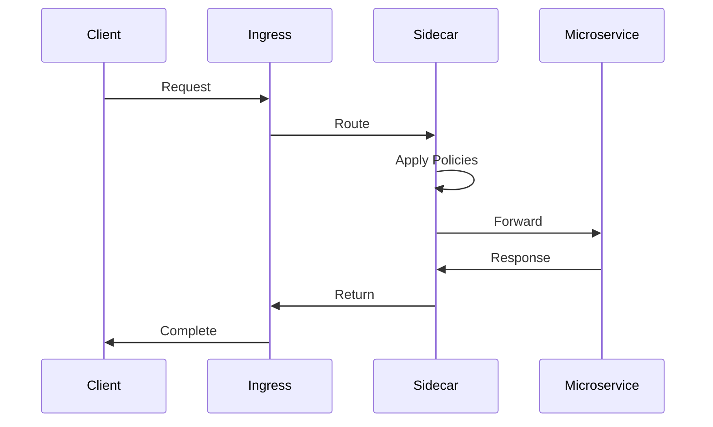

# Service Mesh Architecture

## Overview

This document outlines our service mesh architecture using Istio for managing microservice communication. The architecture provides advanced traffic management, security, and observability features while maintaining operational simplicity and reliability across our microservices ecosystem.

## Components

Our service mesh architecture consists of four main component groups:

### Control Plane Components
- Istiod (Control Plane Core)
- Pilot (Service Discovery)
- Citadel (Security)
- Configuration Management

### Data Plane Components
- Envoy Proxies (Sidecars)
- Traffic Management
- Observability Tools

### Service Communication
- Routing Mechanisms
- Resilience Patterns
- Security Policies

### Monitoring Infrastructure
- Telemetry Collection
- Alerting System
- Debugging Tools

## Service Mesh Architecture Diagram

```mermaid
graph TB
    subgraph "Control Plane"
        subgraph "Istio Components"
            Istiod[Istiod]
            Pilot[Pilot]
            Citadel[Citadel]
        end

        subgraph "Configuration"
            Gateway[Gateway]
            VirtualService[Virtual Service]
            DestRule[Destination Rules]
        end

        subgraph "Security"
            AuthPolicy[Auth Policy]
            mTLS[mTLS]
            RBAC[RBAC]
        end
    end

    subgraph "Data Plane"
        subgraph "Sidecars"
            Envoy[Envoy Proxy]
            Ingress[Ingress Proxy]
            Egress[Egress Proxy]
        end

        subgraph "Traffic Management"
            LoadBalance[Load Balancing]
            CircuitBreak[Circuit Breaking]
            Retry[Retry Logic]
        end

        subgraph "Observability"
            Metrics[Metrics]
            Tracing[Distributed Tracing]
            Logging[Access Logging]
        end
    end

    subgraph "Service Communication"
        subgraph "Routing"
            L7Routing[L7 Routing]
            TrafficSplit[Traffic Split]
            Failover[Failover]
        end

        subgraph "Resilience"
            Timeout[Timeouts]
            Bulkhead[Bulkhead]
            FaultInject[Fault Injection]
        end

        subgraph "Security Policies"
            Authentication[Authentication]
            Authorization[Authorization]
            Encryption[Encryption]
        end
    end

    subgraph "Monitoring"
        subgraph "Telemetry"
            Prometheus[Prometheus]
            Grafana[Grafana]
            Kiali[Kiali]
        end

        subgraph "Alerts"
            AlertRules[Alert Rules]
            Notification[Notifications]
            Escalation[Escalation]
        end

        subgraph "Debugging"
            ServiceGraph[Service Graph]
            TrafficFlow[Traffic Flow]
            HealthCheck[Health Check]
        end
    end

    %% Control Flow
    Istiod --> Gateway
    Pilot --> VirtualService
    Citadel --> DestRule

    Gateway --> AuthPolicy
    VirtualService --> mTLS
    DestRule --> RBAC

    %% Data Flow
    Envoy --> LoadBalance
    Ingress --> CircuitBreak
    Egress --> Retry

    LoadBalance --> Metrics
    CircuitBreak --> Tracing
    Retry --> Logging

    %% Service Flow
    L7Routing --> Timeout
    TrafficSplit --> Bulkhead
    Failover --> FaultInject

    Timeout --> Authentication
    Bulkhead --> Authorization
    FaultInject --> Encryption

    %% Monitoring Flow
    Prometheus --> AlertRules
    Grafana --> Notification
    Kiali --> Escalation

    AlertRules --> ServiceGraph
    Notification --> TrafficFlow
    Escalation --> HealthCheck
```



## Interactions

The service mesh operates through the following interaction patterns:

1. **Service Discovery Flow**
   - Services register with control plane
   - Pilot distributes configuration
   - Sidecars receive updates
   - Traffic routing updated

2. **Request Flow**
   - Request enters through ingress
   - Sidecar applies policies
   - Service processes request
   - Response flows through mesh

3. **Security Flow**
   - Certificates distributed
   - mTLS established
   - Authentication verified
   - Authorization enforced



## Implementation Details

### Technical Stack
- Service Mesh: Istio
- Proxy: Envoy
- Monitoring: Prometheus/Grafana/Kiali
- Security: Citadel/SPIFFE

### Configuration Examples

#### Virtual Service
```yaml
apiVersion: networking.istio.io/v1alpha3
kind: VirtualService
metadata:
  name: reviews-route
spec:
  hosts:
  - reviews
  http:
  - match:
    - headers:
        end-user:
          exact: jason
    route:
    - destination:
        host: reviews
        subset: v2
  - route:
    - destination:
        host: reviews
        subset: v3
```

#### Destination Rule
```yaml
apiVersion: networking.istio.io/v1alpha3
kind: DestinationRule
metadata:
  name: reviews-destination
spec:
  host: reviews
  trafficPolicy:
    loadBalancer:
      simple: RANDOM
  subsets:
  - name: v1
    labels:
      version: v1
  - name: v2
    labels:
      version: v2
```

#### Security Policy
```yaml
apiVersion: security.istio.io/v1beta1
kind: AuthorizationPolicy
metadata:
  name: httpbin-policy
spec:
  selector:
    matchLabels:
      app: httpbin
  rules:
  - from:
    - source:
        principals: ["cluster.local/ns/default/sa/sleep"]
    to:
    - operation:
        methods: ["GET"]
        paths: ["/info*"]
```

### Monitoring Setup
```yaml
# Prometheus configuration
apiVersion: monitoring.coreos.com/v1
kind: ServiceMonitor
metadata:
  name: istio-mesh
spec:
  selector:
    matchLabels:
      istio: mixer
  endpoints:
  - port: prometheus
    interval: 15s
```

## Component Description

### Control Plane

1. **Istio Components**

   - Istiod controller
   - Pilot for service discovery
   - Citadel for security

2. **Configuration**

   - Gateway configuration
   - Virtual services
   - Destination rules

3. **Security Settings**
   - Authentication policies
   - mTLS configuration
   - RBAC rules

### Data Plane

1. **Proxy Components**

   - Envoy sidecars
   - Ingress proxies
   - Egress proxies

2. **Traffic Management**
   - Load balancing
   - Circuit breaking
   - Retry policies

## Implementation Guidelines

1. **Mesh Setup**

   - Installation
   - Configuration
   - Security setup
   - Monitoring

2. **Traffic Management**

   - Routing rules
   - Load balancing
   - Circuit breaking
   - Retries

3. **Security**

   - Authentication
   - Authorization
   - Encryption
   - Policies

4. **Best Practices**

   - Sidecar injection
   - Resource limits
   - Monitoring setup
   - Debugging

5. **Observability**

   - Metrics collection
   - Tracing setup
   - Logging config
   - Dashboards

6. **Documentation**
   - Architecture docs
   - Configuration guides
   - Security policies
   - Runbooks
