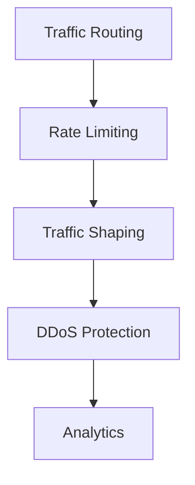
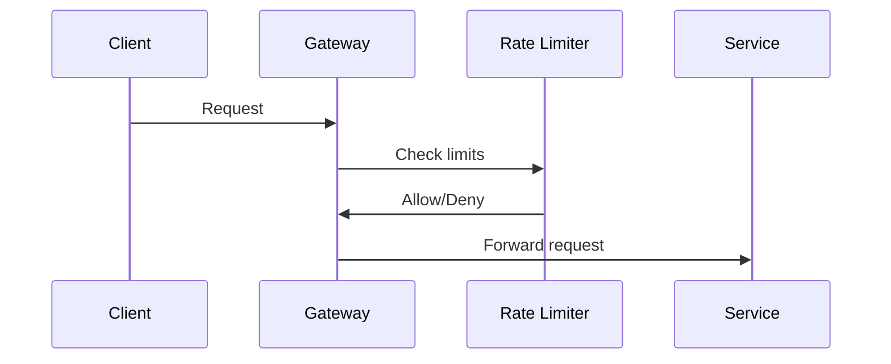

# Traffic Management Architecture

## Overview

This document outlines our traffic management architecture, designed to control, optimize, and secure network traffic across our infrastructure.

## Components

### Traffic Management Stack


### Key Components
1. Traffic Routing
   - Request routing
   - Protocol handling
   - Path management
   - Service discovery

2. Rate Limiting
   - Request throttling
   - Quota management
   - Burst handling
   - Client identification

3. Traffic Shaping
   - Bandwidth allocation
   - Priority queuing
   - QoS policies
   - Traffic optimization

4. Protection Systems
   - DDoS mitigation
   - Traffic filtering
   - Anomaly detection
   - Blacklist management

## Interactions

### Traffic Flow


## Implementation Details

### Traffic Configuration
```typescript
interface TrafficConfig {
  routing: RoutingConfig;
  rateLimit: RateLimitConfig;
  shaping: ShapingConfig;
  protection: ProtectionConfig;
}

interface RoutingConfig {
  rules: Rule[];
  protocols: Protocol[];
  paths: PathConfig[];
  discovery: DiscoveryConfig;
}
```

### Rate Limit Rules
```typescript
interface RateLimitRule {
  type: LimitType;
  threshold: number;
  window: number;
  action: LimitAction;
}
```

### Management Standards
- Routing policies
- Rate limit thresholds
- Traffic priorities
- Protection measures
- Monitoring requirements

## Related Documentation
- [Load Balancing](./load-balancing.md)
- [Edge Computing](./edge-computing.md)
- [Performance Monitoring](./performance-monitoring.md)
- [Security Architecture](../security/security-architecture.md)
