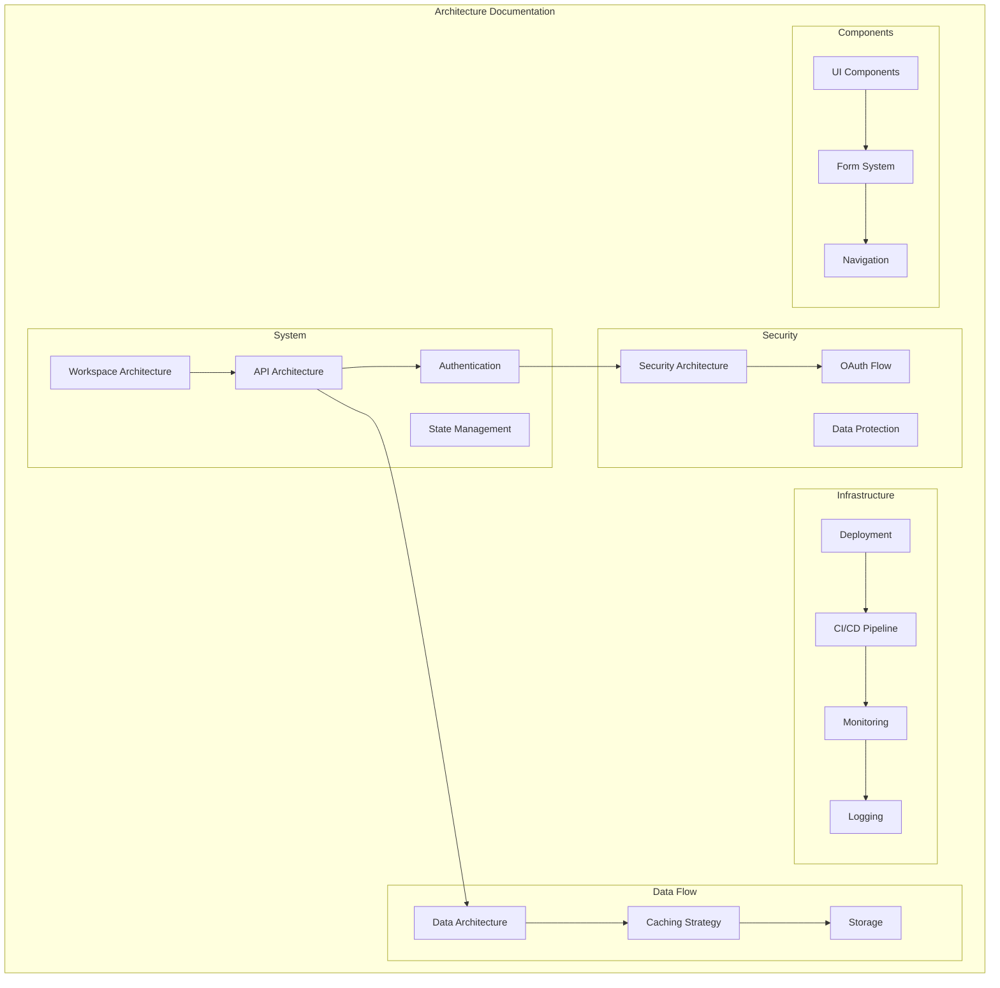
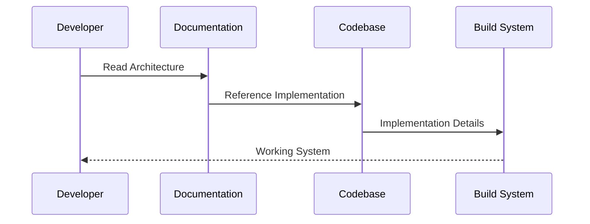

# Architecture Diagrams Index

This document provides an index of all architecture diagrams in the project.

## Components

### [Accessibility (A11y) Architecture](components/accessibility-architecture.md)

This diagram illustrates our comprehensive accessibility implementation strategy across the application.

### [Animation Architecture](components/animation-architecture.md)

This diagram illustrates our animation implementation strategy using Framer Motion and CSS animations.

### [Atomic Design Structure](components/atomic-design.md)

This diagram illustrates our implementation of Atomic Design principles, extended with Particles for non-visual components.

### [Component Interactions](components/interactions.md)

This diagram illustrates how components communicate and interact within our application.

### [Component Library Architecture](components/component-library.md)

This diagram illustrates our component library architecture using shadcn/ui and Atomic Design principles, showing how components are organized and composed.

### [Component State Patterns](components/state-patterns.md)

This document outlines our component state management patterns and best practices.

### [Form Handling Architecture](components/form-architecture.md)

This diagram illustrates our form management strategy using React Hook Form, Zod, and related patterns.

## Data-flow

### [Caching Strategy](data-flow/caching.md)

This document outlines our multi-level caching architecture and implementation patterns.

### [Data Flow Architecture](data-flow/data-flow.md)

This document outlines our data flow patterns and implementation.

### [Data Processing Architecture](data-flow/processing.md)

This document outlines our data processing pipelines and transformation patterns.

### [Data Protection Architecture](data-flow/data-protection.md)

This document outlines our data protection implementation and security measures.

### [Database Schema Architecture](data-flow/database-schema.md)

This diagram illustrates our database schema and relationships.

### [State Management Architecture](data-flow/state-architecture.md)

This diagram illustrates our state management approach using Zustand and React Query, showing how different types of state are handled across the application.

### [State Management Architecture](data-flow/state-management.md)

This diagram illustrates our state management patterns and data flow architecture.

## Infrastructure

### [Backup and Recovery Architecture](infrastructure/backup-recovery.md)

This diagram illustrates our comprehensive backup and disaster recovery strategy.

### [Build and Dependency Management Architecture](infrastructure/build-optimization.md)

This diagram illustrates our build optimization strategy and dependency management approach across the monorepo.

### [CI/CD Pipeline Architecture](infrastructure/ci-cd.md)

This diagram illustrates our continuous integration and deployment pipeline using GitHub Actions, showing the workflow from code commit to production deployment.

### [CI/CD Pipeline Architecture](infrastructure/ci-cd-pipeline.md)

This diagram illustrates our continuous integration and continuous deployment pipeline, including testing, security scanning, and deployment stages.

### [Content Delivery Architecture](infrastructure/content-delivery.md)

This diagram illustrates our content delivery infrastructure using CDN and edge computing capabilities.

### [Deployment Architecture](infrastructure/deployment.md)

This diagram shows our production deployment architecture and scaling strategy.

### [Development Workflow and Git Strategy](infrastructure/git-workflow.md)

This diagram illustrates our development workflow, branching strategy, and code review process.

### [Development Workflow Architecture](infrastructure/dev-workflow.md)

This diagram illustrates our development workflow, including git strategy, code review process, and release management.

### [Logging and Monitoring Architecture](infrastructure/logging.md)

This diagram illustrates our comprehensive logging and monitoring strategy across the application stack.

### [Monitoring Architecture](infrastructure/monitoring-architecture.md)

This diagram illustrates our comprehensive monitoring architecture, including log aggregation, metrics collection, tracing, and alerting.

### [Monitoring Architecture](infrastructure/monitoring.md)

This diagram illustrates our comprehensive monitoring and observability setup.

### [Performance Monitoring Architecture](infrastructure/performance.md)

This diagram illustrates our comprehensive performance monitoring and optimization strategy across the application stack.

### [Production Environment Architecture](infrastructure/production-environment.md)

This diagram illustrates the high-level architecture of our production environment, including load balancing, application tier, caching layer, database tier, CDN, and monitoring components.

### [Secrets Management Architecture](infrastructure/secrets-management.md)

This diagram illustrates our secrets management infrastructure using HashiCorp Vault and related security patterns.

### [Service Mesh Architecture](infrastructure/service-mesh.md)

This diagram illustrates our service mesh architecture using Istio for managing microservice communication.

## Security

### [Authentication Architecture](security/authentication.md)

This document outlines our authentication implementation and security patterns.

### [Authentication Flow](security/auth-flow.md)

This diagram illustrates our authentication and authorization flow.

### [Authorization Model](security/authorization.md)

This document outlines our Role-Based Access Control (RBAC) and authorization patterns.

### [OAuth2 Authentication Flow](security/oauth2-flow.md)

This diagram illustrates the OAuth2 authentication flow with Google integration and JWT token management.

### [Security Architecture](security/security-layers.md)

This diagram illustrates our comprehensive security architecture, including authentication, authorization, encryption, and security tooling.

## System

### [API Architecture](system/api-architecture.md)

This diagram illustrates our API architecture and request flow.

### [API Architecture and Versioning](system/api-versioning.md)

This diagram illustrates our API architecture and versioning strategy, including REST, GraphQL, and tRPC implementations.

### [Authentication and Authorization Architecture](system/auth-architecture.md)

This diagram illustrates our comprehensive auth system including OAuth2, RBAC, and security measures.

### [Caching Architecture](system/caching-strategy.md)

This diagram illustrates our multi-level caching strategy across the application.

### [CMS Integration Architecture](system/cms-integration.md)

This diagram illustrates the integration of Payload CMS with our system, including the admin dashboard and content delivery architecture.

### [Code Generation Architecture](system/code-generation.md)

This diagram illustrates our code generation pipeline, showing how we generate type-safe code from various schema definitions.

### [Data Access Layer Architecture](system/data-access.md)

This diagram illustrates the comprehensive data access layer architecture, including API integration, caching, and database access patterns.

### [Database and Data Modeling Architecture](system/database-architecture.md)

This diagram illustrates our database architecture using PostgreSQL, MongoDB, Redis, and our data modeling approach.

### [Database Sharding Architecture](system/sharding.md)

This diagram illustrates our database sharding strategy, including the shard router, individual shards, and metadata management.

### [Error Handling Architecture](system/error-handling.md)

This diagram illustrates our comprehensive error handling and recovery strategy.

### [Error Handling Flow](system/error-flow.md)

This diagram illustrates our error handling strategy, including error detection, logging, monitoring, and client response handling.

### [Event Sourcing Architecture](system/event-sourcing.md)

This diagram illustrates our event sourcing architecture, including command handling, event processing, and read model updates.

### [Event-Driven Architecture](system/event-driven.md)

This diagram illustrates our event-driven architecture using message brokers and event handling patterns.

### [Feature Flag and Experimentation Architecture](system/feature-flags.md)

This diagram illustrates our feature flag system and A/B testing infrastructure.

### [Internationalization (i18n) Architecture](system/i18n-architecture.md)

This diagram illustrates our comprehensive internationalization and localization strategy across the application.

### [Media Handling Architecture](system/media-architecture.md)

This diagram illustrates our media processing and delivery infrastructure using cloud storage and CDN.

### [Navigation Patterns](system/navigation.md)

This document outlines our navigation implementation patterns and best practices.

### [Notification System Architecture](system/notifications.md)

This diagram illustrates the notification system architecture, including email, in-app, and push notification capabilities.

### [Nx Workspace Architecture](system/workspace-architecture.md)

This diagram illustrates the structure and organization of our Nx monorepo workspace, showing the relationships between different applications, libraries, and tools.

### [Performance Architecture](system/performance.md)

This diagram illustrates our performance optimization strategies and implementation patterns.

### [Real-Time Communication Architecture](system/realtime-architecture.md)

This diagram illustrates our real-time communication strategy using WebSocket, SSE, and related patterns.

### [Routing Architecture](system/routing-architecture.md)

This diagram illustrates our routing implementation using Next.js App Router and related patterns.

### [Search and Indexing Architecture](system/search-architecture.md)

This diagram illustrates our search infrastructure using Elasticsearch and related search optimization patterns.

### [Security Architecture](system/security.md)

This document outlines our comprehensive security implementation and best practices.

### [SEO and Web Vitals Architecture](system/seo-optimization.md)

This diagram illustrates our comprehensive SEO strategy and Core Web Vitals optimization approach.

### [Service Discovery Architecture](system/service-discovery.md)

This diagram illustrates our service discovery architecture, including service registry, health checking, and load balancing components.

### [State Management Architecture](system/state-management.md)

This diagram illustrates our comprehensive state management strategy using Zustand, React Query, and other state management patterns.

### [System Layers Architecture](system/layers.md)

This diagram illustrates the main architectural layers of the system and their interactions.

### [System Workflow Architecture](system/workflow.md)

This diagram illustrates the high-level workflow and interaction between different system components.

### [Testing Architecture](system/testing-architecture.md)

This diagram illustrates our comprehensive testing strategy across different layers of the application, incorporating Playwright, Vitest, and other testing tools.

### [Testing Strategy Architecture](system/testing-strategy.md)

This diagram illustrates our comprehensive testing approach using Vitest, Playwright, and Testing Library.

### [Third-Party Integration Architecture](system/third-party.md)

This diagram illustrates our strategy for integrating third-party services and libraries using the Strategy pattern.

## Architecture Documentation

This directory contains comprehensive architectural documentation for our system, including detailed diagrams and technical specifications for all major components.

### Overview

Our architecture documentation is organized into several key areas, each focusing on specific aspects of the system. The documentation follows a consistent structure with detailed diagrams, component descriptions, and implementation details.

### Components

The documentation is organized into the following main sections:

- **System Architecture**: Core system design and components
- **Infrastructure**: Deployment and operational architecture
- **Security**: Security measures and protocols
- **Data Flow**: Data management and processing
- **Components**: Reusable system components



### Interactions

Our documentation components interact through:

1. Cross-referencing between related topics
2. Shared architectural principles
3. Common implementation patterns
4. Standardized documentation format



### Implementation Details

#### Technical Documentation Standards

- Markdown format with Mermaid diagrams
- Consistent section structure
- Clear component relationships
- Practical implementation examples

#### Documentation Structure

```typescript
// Standard document structure
interface ArchitectureDoc {
  title: string;
  overview: string;
  components: Component[];
  interactions: Interaction[];
  implementation: {
    stack: string[];
    configuration: object;
    errorHandling: string[];
    performance: string[];
  };
  relatedDocs: string[];
}
```

#### Error Handling

- Clear error documentation
- Troubleshooting guides
- Common pitfalls
- Resolution strategies

#### Performance Considerations

- Documentation searchability
- Quick navigation
- Clear organization
- Regular updates

### Related Documentation

- [Contributing Guidelines](../../../contributing.md)
- [Development Workflow](./infrastructure/dev-workflow.md)
- [Architecture Standards](./system/standards.md)
