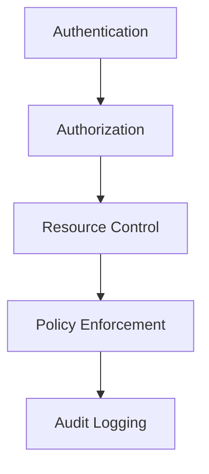
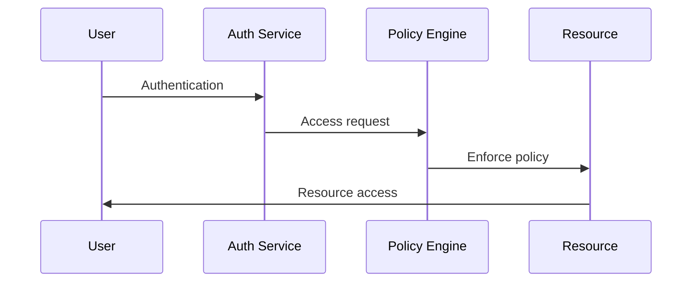

# Access Control Architecture

## Overview

This document outlines our access control architecture, establishing comprehensive security measures for managing and enforcing access to system resources.

## Components

### Access Control Stack


### Key Components
1. Authentication Layer
   - Identity verification
   - Credential validation
   - Session management
   - Token handling

2. Authorization Layer
   - Permission management
   - Role management
   - Policy evaluation
   - Access decisions

3. Resource Control
   - Resource protection
   - Access boundaries
   - Resource isolation
   - Access patterns

4. Policy Enforcement
   - Policy application
   - Rule enforcement
   - Context evaluation
   - Decision points

## Interactions

### Access Control Flow


## Implementation Details

### Access Configuration
```typescript
interface AccessConfig {
  authentication: AuthConfig;
  authorization: AuthzConfig;
  resources: ResourceConfig;
  policies: PolicyConfig;
}

interface ResourceConfig {
  types: ResourceType[];
  boundaries: Boundary[];
  protections: Protection[];
  patterns: AccessPattern[];
}
```

### Control Rules
```typescript
interface ControlRule {
  type: ControlType;
  scope: AccessScope;
  requirements: Requirement[];
  enforcement: EnforcementMethod;
}
```

### Access Standards
- Authentication methods
- Authorization models
- Resource protection
- Policy enforcement
- Audit requirements

## Related Documentation
- [Authentication](../system/authentication.md)
- [Authorization](../system/authorization.md)
- [Security Architecture](./security-architecture.md)
- [Audit Logging](../infrastructure/audit-logging.md)
