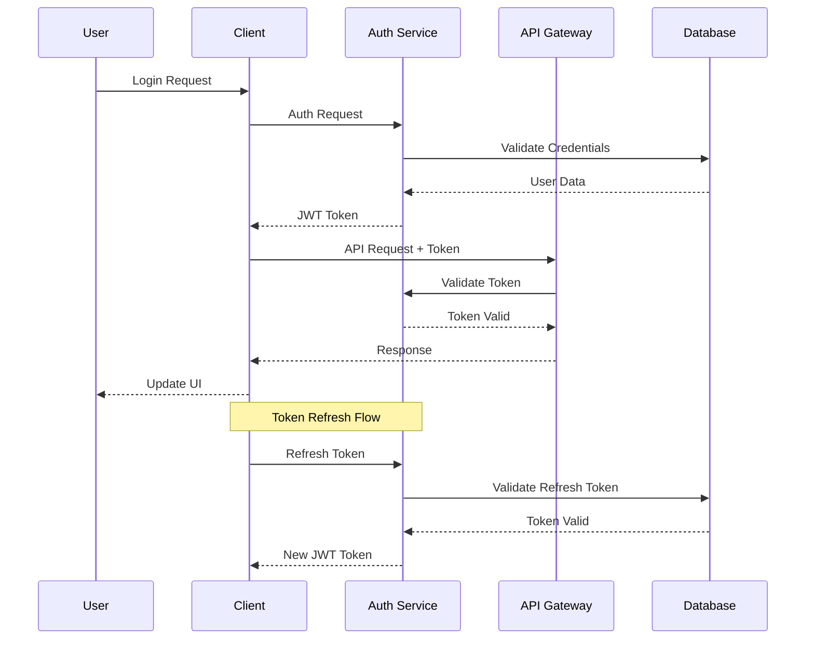

# Authentication Flow

This diagram illustrates our authentication and authorization flow.

## Auth Flow Diagram

## Description

Our authentication system implements:

1. **User Authentication**

   - Username/password
   - OAuth providers
   - Magic links

2. **Token Management**

   - JWT tokens
   - Refresh tokens
   - Token rotation

3. **Authorization**
   - Role-based access control
   - Permission-based access
   - Resource-level permissions

## Security Features

- Secure password hashing
- Rate limiting
- CSRF protection
- XSS prevention
- Session management
- Audit logging
