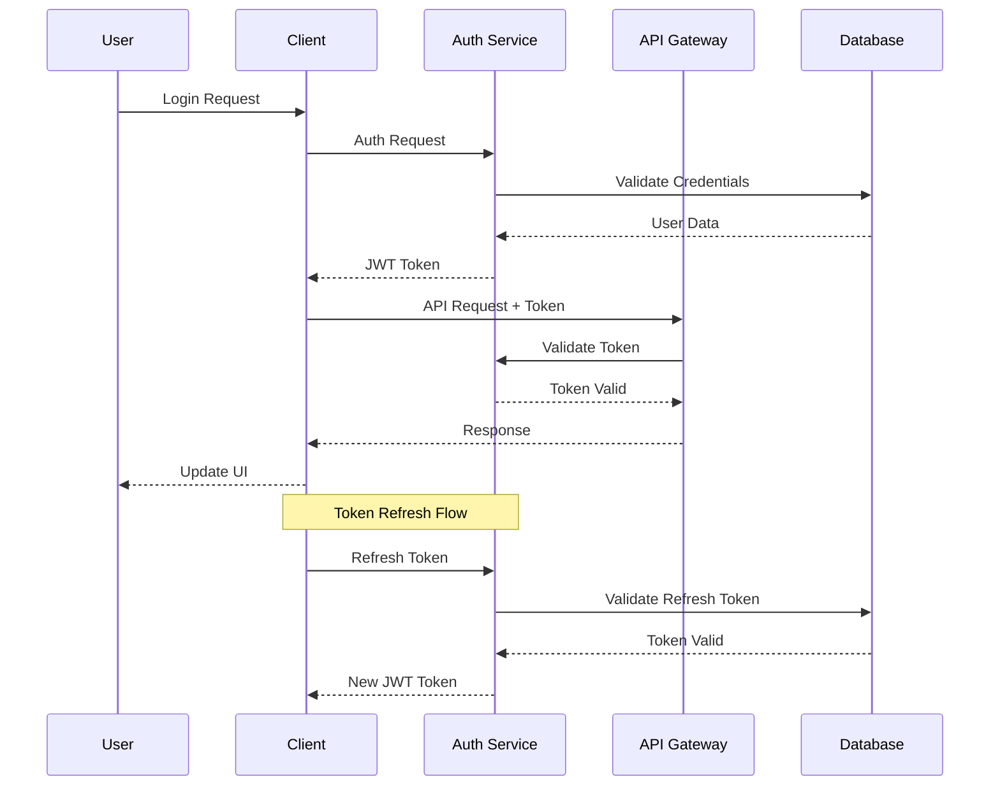

# Authentication Flow

## Overview

This document outlines our comprehensive authentication and authorization system. Our implementation follows industry best practices for secure user authentication, utilizing JWT tokens for stateless authentication and implementing proper security measures such as rate limiting, CSRF protection, and secure password handling.

## Components

Our authentication system consists of several key components:

### 1. Client Layer
- Login UI components
- Token management
- Session handling
- Error handling

### 2. Auth Service
- User authentication
- Token generation
- Token validation
- Refresh token handling

### 3. API Gateway
- Token validation
- Request authorization
- Rate limiting
- Security headers

### 4. Database
- User credentials
- Session data
- Refresh tokens
- Audit logs

## Auth Flow Diagram



## Interactions

Our authentication system follows these interaction patterns:

### 1. Authentication Flow
1. User submits credentials
2. Auth service validates credentials
3. JWT token generated and returned
4. Client stores token securely
5. Token used for subsequent requests

### 2. Token Refresh Flow
1. Original token expires
2. Client sends refresh token
3. Auth service validates refresh token
4. New JWT token generated
5. Client updates stored token

### 3. Authorization Flow
1. Client sends request with token
2. API Gateway validates token
3. Permissions checked
4. Request processed if authorized
5. Error returned if unauthorized

## Implementation Details

### 1. Authentication Service

```typescript
interface AuthService {
  // User authentication
  async login(credentials: Credentials): Promise<AuthResponse>;
  async logout(userId: string): Promise<void>;
  async refreshToken(token: string): Promise<AuthResponse>;

  // Token management
  async validateToken(token: string): Promise<TokenValidation>;
  async revokeToken(token: string): Promise<void>;
  async rotateToken(userId: string): Promise<AuthResponse>;
}

// Implementation
class JWTAuthService implements AuthService {
  private readonly jwtSecret: string;
  private readonly tokenExpiry: number;
  
  constructor(config: AuthConfig) {
    this.jwtSecret = config.jwtSecret;
    this.tokenExpiry = config.tokenExpiry;
  }

  async login(credentials: Credentials): Promise<AuthResponse> {
    // 1. Validate credentials
    const user = await this.validateCredentials(credentials);
    
    // 2. Generate tokens
    const accessToken = this.generateAccessToken(user);
    const refreshToken = this.generateRefreshToken(user);
    
    // 3. Store refresh token
    await this.storeRefreshToken(user.id, refreshToken);
    
    return {
      accessToken,
      refreshToken,
      user: this.sanitizeUser(user)
    };
  }

  async validateToken(token: string): Promise<TokenValidation> {
    try {
      // 1. Verify token signature
      const decoded = jwt.verify(token, this.jwtSecret);
      
      // 2. Check if token is blacklisted
      const isBlacklisted = await this.checkBlacklist(token);
      if (isBlacklisted) {
        throw new Error('Token is blacklisted');
      }
      
      // 3. Return validation result
      return {
        valid: true,
        payload: decoded
      };
    } catch (error) {
      return {
        valid: false,
        error: error.message
      };
    }
  }
}
```

### 2. Client-side Implementation

```typescript
// Auth Context
interface AuthContext {
  user: User | null;
  isAuthenticated: boolean;
  login: (credentials: Credentials) => Promise<void>;
  logout: () => Promise<void>;
  refreshToken: () => Promise<void>;
}

// Auth Provider
const AuthProvider: React.FC = ({ children }) => {
  const [user, setUser] = useState<User | null>(null);
  const [tokens, setTokens] = useState<Tokens | null>(null);

  const login = async (credentials: Credentials) => {
    try {
      // 1. Authenticate user
      const response = await authService.login(credentials);
      
      // 2. Store tokens securely
      await tokenStorage.setTokens(response.tokens);
      
      // 3. Update state
      setTokens(response.tokens);
      setUser(response.user);
    } catch (error) {
      throw new AuthError('Login failed', error);
    }
  };

  const refreshToken = async () => {
    try {
      // 1. Get stored refresh token
      const refreshToken = await tokenStorage.getRefreshToken();
      
      // 2. Request new access token
      const response = await authService.refreshToken(refreshToken);
      
      // 3. Update stored tokens
      await tokenStorage.setTokens(response.tokens);
      
      // 4. Update state
      setTokens(response.tokens);
    } catch (error) {
      // Handle token refresh failure
      await logout();
    }
  };
};

## Security Features

- Secure password hashing
- Rate limiting
- CSRF protection
- XSS prevention
- Session management
- Audit logging

## Best Practices

1. **Security Measures**
   - Implement proper password hashing (bcrypt)
   - Use secure session management
   - Implement rate limiting
   - Enable CSRF protection
   - Prevent XSS attacks
   - Maintain security headers

2. **Token Management**
   - Use short-lived JWT tokens
   - Implement proper token rotation
   - Secure token storage
   - Handle token revocation
   - Monitor token usage

3. **Error Handling**
   - Implement proper error responses
   - Log security events
   - Monitor failed attempts
   - Implement account lockout
   - Handle edge cases

4. **Performance**
   - Optimize token validation
   - Implement caching where appropriate
   - Monitor auth service performance
   - Handle high concurrency
   - Implement proper timeouts
