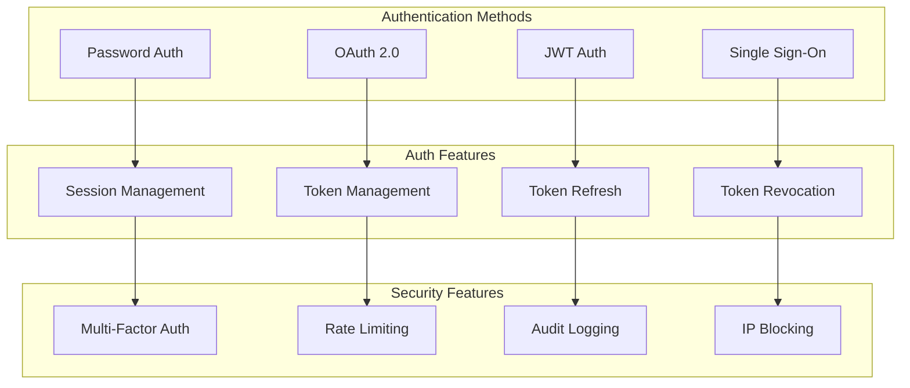

# Authentication Architecture

This document outlines our authentication implementation and security patterns.

## Implementation

Our authentication system utilizes several particle components from our [Atomic Design Structure](../../components/atomic-design.md#particles):

- Auth Context Providers for authentication state
- Error Boundary particles for auth errors
- Event Handler particles for auth events
- Performance Optimizers for token management

## Authentication Flow Diagram



## Authentication Types

### 1. Password Authentication

- Secure password hashing
- Password policies
- Reset workflows
- Account recovery

### 2. OAuth 2.0

- Multiple providers
- Scope management
- Token handling
- State validation

### 3. JWT Authentication

- Token generation
- Signature validation
- Claims management
- Expiration handling

### 4. Single Sign-On

- SAML integration
- Identity federation
- Session sync
- Cross-domain auth

## Implementation Patterns

### Auth Context

```typescript
// Auth context provider particle
const AuthProvider = ({ children }: PropsWithChildren) => {
  const [authState, setAuthState] = useState({
    isAuthenticated: false,
    user: null,
    token: null,
  });

  return <AuthContext.Provider value={authState}>{children}</AuthContext.Provider>;
};
```

### Token Management

```typescript
// Token manager particle
const TokenManager = ({ onTokenExpired, children }: TokenManagerProps) => {
  useEffect(() => {
    const checkToken = () => {
      if (isTokenExpired()) {
        onTokenExpired();
      }
    };

    const interval = setInterval(checkToken, 60000);
    return () => clearInterval(interval);
  }, [onTokenExpired]);

  return children;
};
```

### Auth Error Handling

```typescript
// Auth error boundary particle
const AuthErrorBoundary = ({ onError, children }: AuthErrorBoundaryProps) => {
  return (
    <ErrorBoundary
      fallback={<LoginRedirect />}
      onError={(error) => {
        if (isAuthError(error)) {
          onError(error);
        }
      }}
    >
      {children}
    </ErrorBoundary>
  );
};
```

## Best Practices

1. **Security**

   - Implement MFA
   - Use secure tokens
   - Rate limit requests
   - Audit auth events

2. **User Experience**

   - Smooth auth flows
   - Clear error messages
   - Remember user preferences
   - Auto-refresh tokens

3. **Performance**
   - Optimize token storage
   - Cache auth state
   - Minimize redirects
   - Background refresh

## Related Documentation

- [Authorization Model](./authorization.md)
- [Security Overview](../system/security.md)
- [API Security](../system/security.md)
