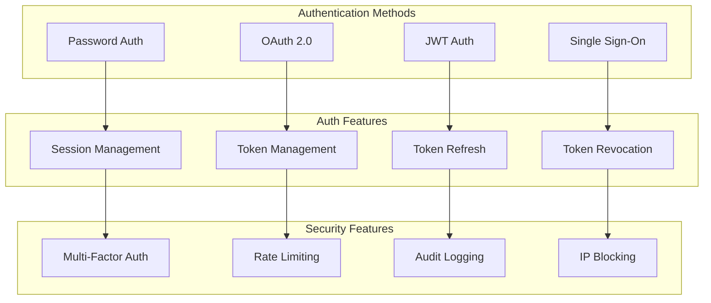

# Authentication Architecture

## Overview

This document outlines our comprehensive authentication architecture, which implements multiple authentication methods including password-based, OAuth 2.0, JWT, and Single Sign-On. Our system is designed to provide secure, scalable, and user-friendly authentication while following security best practices and maintaining high performance.

## Components

Our authentication architecture consists of several key components:

### 1. Authentication Methods
- Password Authentication: Traditional username/password
- OAuth 2.0: Third-party authentication
- JWT Authentication: Token-based auth
- Single Sign-On: Enterprise authentication

### 2. Auth Features
- Session Management: User session handling
- Token Management: JWT token lifecycle
- Token Refresh: Automatic token renewal
- Token Revocation: Security enforcement

### 3. Security Features
- Multi-Factor Auth: Additional security layer
- Rate Limiting: Prevent abuse
- Audit Logging: Security monitoring
- IP Blocking: Attack prevention



## Interactions

Our authentication system follows these interaction patterns:

### 1. Password Authentication Flow
1. User submits credentials
2. System validates password hash
3. Session created on success
4. MFA challenge if enabled
5. User redirected to app

### 2. OAuth Flow
1. User initiates OAuth login
2. Redirect to provider
3. Provider authenticates user
4. System receives callback
5. User session created

### 3. Token Management Flow
1. Token generated on auth
2. Token included in requests
3. System validates token
4. Token refreshed if needed
5. Token revoked on logout

## Implementation Details

### 1. Auth Context Management

```typescript
interface AuthState {
  isAuthenticated: boolean;
  user: User | null;
  token: string | null;
  loading: boolean;
  error: Error | null;
}

interface AuthContextValue extends AuthState {
  login: (credentials: Credentials) => Promise<void>;
  logout: () => Promise<void>;
  refreshToken: () => Promise<void>;
}

const AuthContext = createContext<AuthContextValue | null>(null);

const AuthProvider: React.FC = ({ children }) => {
  const [state, setState] = useState<AuthState>({
    isAuthenticated: false,
    user: null,
    token: null,
    loading: true,
    error: null
  });

  const login = async (credentials: Credentials) => {
    try {
      setState(prev => ({ ...prev, loading: true }));
      
      // Authenticate user
      const response = await authService.login(credentials);
      
      // Setup auth state
      setState({
        isAuthenticated: true,
        user: response.user,
        token: response.token,
        loading: false,
        error: null
      });
      
      // Initialize token refresh
      startTokenRefresh();
    } catch (error) {
      setState(prev => ({
        ...prev,
        loading: false,
        error
      }));
    }
  };

  return (
    <AuthContext.Provider
      value={{
        ...state,
        login,
        logout,
        refreshToken
      }}
    >
      {children}
    </AuthContext.Provider>
  );
};
```

### 2. Token Management

```typescript
interface TokenManagerProps {
  onTokenExpired: () => void;
  refreshInterval: number;
  children: React.ReactNode;
}

const TokenManager: React.FC<TokenManagerProps> = ({
  onTokenExpired,
  refreshInterval,
  children
}) => {
  const [refreshTimer, setRefreshTimer] = useState<NodeJS.Timeout>();

  useEffect(() => {
    const startRefreshTimer = () => {
      const timer = setInterval(async () => {
        try {
          await refreshToken();
        } catch (error) {
          onTokenExpired();
        }
      }, refreshInterval);

      setRefreshTimer(timer);
    };

    startRefreshTimer();
    return () => clearInterval(refreshTimer);
  }, [refreshInterval, onTokenExpired]);

  return <>{children}</>;
};
```

### 3. Security Implementation

```typescript
// Rate Limiting Implementation
class RateLimiter {
  private store: Map<string, number[]>;
  private windowMs: number;
  private maxRequests: number;

  constructor(windowMs: number, maxRequests: number) {
    this.store = new Map();
    this.windowMs = windowMs;
    this.maxRequests = maxRequests;
  }

  isRateLimited(key: string): boolean {
    const now = Date.now();
    const requests = this.store.get(key) || [];
    
    // Remove expired timestamps
    const validRequests = requests.filter(
      timestamp => now - timestamp < this.windowMs
    );
    
    // Check if rate limited
    if (validRequests.length >= this.maxRequests) {
      return true;
    }
    
    // Add new request timestamp
    validRequests.push(now);
    this.store.set(key, validRequests);
    
    return false;
  }
}

// Audit Logging
interface AuditLog {
  userId: string;
  action: string;
  timestamp: Date;
  ip: string;
  userAgent: string;
  success: boolean;
  details?: Record<string, unknown>;
}

class AuditLogger {
  async log(entry: AuditLog): Promise<void> {
    // 1. Sanitize sensitive data
    const sanitizedEntry = this.sanitize(entry);
    
    // 2. Add metadata
    const enrichedEntry = this.enrich(sanitizedEntry);
    
    // 3. Store log
    await this.store(enrichedEntry);
    
    // 4. Alert if suspicious
    if (this.isSuspicious(enrichedEntry)) {
      await this.alert(enrichedEntry);
    }
  }
}
```

### Best Practices

1. **Security Measures**
   - Implement proper password hashing
   - Use secure session management
   - Enable rate limiting
   - Implement MFA
   - Monitor for suspicious activity
   - Log security events

2. **Token Management**
   - Use short-lived access tokens
   - Implement proper refresh flow
   - Secure token storage
   - Handle token revocation
   - Monitor token usage

3. **Error Handling**
   - Implement proper error responses
   - Log authentication failures
   - Handle edge cases
   - Provide clear error messages
   - Implement account lockout

4. **Performance**
   - Optimize token validation
   - Implement caching
   - Monitor auth service
   - Handle high concurrency
   - Use proper timeouts

## Related Documentation

- [Authorization Model](./authorization.md)
- [Security Overview](../system/security.md)
- [API Security](../system/security.md)
