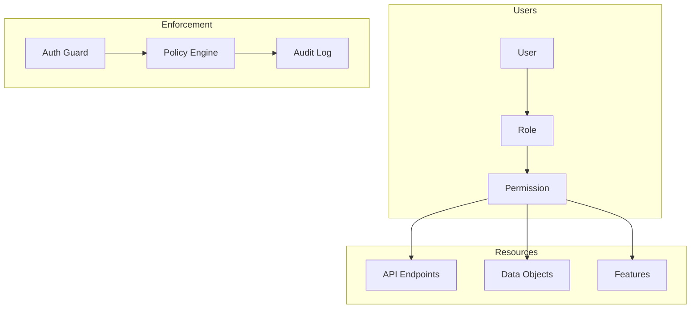
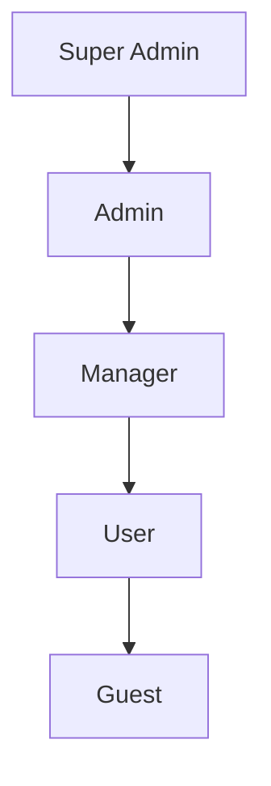

# Authorization Model

## Overview

This document outlines our Role-Based Access Control (RBAC) and authorization patterns. Our authorization system implements a hierarchical role-based model with granular permissions, policy enforcement, and comprehensive security monitoring. The system is designed to enforce the principle of least privilege while maintaining flexibility and scalability.

## Components

Our authorization system consists of several key components:

### 1. User Management
- User Roles: Define access levels
- Permissions: Granular access control
- Role Hierarchy: Inheritance structure

### 2. Resource Access
- API Endpoints: Service access
- Data Objects: Content access
- Features: Functionality access

### 3. Security Enforcement
- Auth Guards: Request validation
- Policy Engine: Access decisions
- Audit Logging: Access monitoring



### Role Hierarchy



## Interactions

Our authorization system follows these interaction patterns:

### 1. Permission Check Flow
1. User makes request
2. System loads user role
3. Permission check performed
4. Access granted/denied
5. Action logged

### 2. Role Assignment Flow
1. Admin assigns role
2. System validates hierarchy
3. Permissions inherited
4. Access updated
5. Change logged

### 3. Policy Enforcement Flow
1. Request intercepted
2. Policy loaded
3. Context evaluated
4. Decision made
5. Result enforced

## Implementation Details

### 1. Role and Permission Model

```typescript
interface Role {
  name: string;
  permissions: Permission[];
  inherits?: Role[];
}

interface Permission {
  resource: string;
  action: 'create' | 'read' | 'update' | 'delete';
  conditions?: Condition[];
}

interface Condition {
  type: 'time' | 'location' | 'ip' | 'custom';
  value: any;
  evaluate: (context: Context) => boolean;
}

class RoleManager {
  private roles: Map<string, Role>;
  
  constructor() {
    this.roles = new Map();
  }
  
  addRole(role: Role): void {
    // Validate role hierarchy
    if (role.inherits) {
      this.validateHierarchy(role);
    }
    
    // Merge inherited permissions
    const permissions = this.mergePermissions(role);
    
    // Store role
    this.roles.set(role.name, {
      ...role,
      permissions
    });
  }
  
  private validateHierarchy(role: Role): void {
    const visited = new Set<string>();
    
    const checkCycle = (r: Role) => {
      if (visited.has(r.name)) {
        throw new Error('Circular inheritance detected');
      }
      
      visited.add(r.name);
      r.inherits?.forEach(checkCycle);
      visited.delete(r.name);
    };
    
    checkCycle(role);
  }
}
```

### 2. Access Control Implementation

```typescript
@Injectable()
export class AuthGuard implements CanActivate {
  constructor(
    private readonly policyEngine: PolicyEngine,
    private readonly auditLogger: AuditLogger
  ) {}

  async canActivate(context: ExecutionContext): Promise<boolean> {
    const request = context.switchToHttp().getRequest();
    const user = request.user;
    const resource = this.getResource(context);
    const action = this.getAction(context);
    
    try {
      // 1. Load policy
      const policy = await this.policyEngine.getPolicy(resource);
      
      // 2. Evaluate access
      const allowed = await policy.evaluate(user, action);
      
      // 3. Log attempt
      await this.auditLogger.logAccess({
        user,
        resource,
        action,
        allowed,
        timestamp: new Date()
      });
      
      return allowed;
    } catch (error) {
      // Log error and deny access
      await this.auditLogger.logError(error);
      return false;
    }
  }
}
```

### 3. Policy Engine Implementation

```typescript
class PolicyEngine {
  private policies: Map<string, Policy>;
  
  constructor(private readonly roleManager: RoleManager) {
    this.policies = new Map();
  }
  
  async evaluateAccess(
    user: User,
    resource: string,
    action: string
  ): Promise<boolean> {
    // 1. Get user's role
    const role = await this.roleManager.getRole(user.role);
    if (!role) return false;
    
    // 2. Check basic permission
    const hasPermission = role.permissions.some(
      p => p.resource === resource && p.action === action
    );
    if (!hasPermission) return false;
    
    // 3. Load resource policy
    const policy = this.policies.get(resource);
    if (!policy) return true; // No specific policy = allowed if has permission
    
    // 4. Evaluate conditions
    return policy.evaluateConditions(user, action);
  }
  
  async enforcePolicy(
    context: RequestContext
  ): Promise<PolicyResult> {
    try {
      // 1. Extract context
      const { user, resource, action } = context;
      
      // 2. Check access
      const allowed = await this.evaluateAccess(
        user,
        resource,
        action
      );
      
      // 3. Return result
      return {
        allowed,
        reason: allowed ? 'GRANTED' : 'DENIED',
        context
      };
    } catch (error) {
      // Handle evaluation error
      return {
        allowed: false,
        reason: 'ERROR',
        error
      };
    }
  }
}
```

### Permission Model

```typescript
interface Role {
  name: string;
  permissions: Permission[];
  inherits?: Role[];
}

interface Permission {
  resource: string;
  action: 'create' | 'read' | 'update' | 'delete';
  conditions?: Condition[];
}

interface Condition {
  type: 'time' | 'location' | 'ip' | 'custom';
  value: any;
  evaluate: (context: Context) => boolean;
}

// Role definition
const userRole: Role = {
  name: 'user',
  permissions: [
    { resource: 'profile', action: 'read' },
    { resource: 'profile', action: 'update' },
    { resource: 'content', action: 'read' },
  ],
};

// Permission check
const hasPermission = (user: User, resource: string, action: Action): boolean => {
  const role = roles.get(user.role);
  return role.permissions.some((p) => p.resource === resource && p.action === action);
};
```

### Best Practices

1. **Role Management**
   - Define clear role hierarchies
   - Implement role inheritance
   - Regular role audits
   - Document role changes
   - Version role definitions

2. **Permission Control**
   - Use granular permissions
   - Implement conditional access
   - Regular permission reviews
   - Audit permission changes
   - Document access patterns

3. **Security Enforcement**
   - Implement defense in depth
   - Log all access attempts
   - Monitor for anomalies
   - Regular security audits
   - Document security events

4. **Performance**
   - Cache role definitions
   - Optimize permission checks
   - Monitor policy evaluation
   - Handle high concurrency
   - Document bottlenecks

## Related Documentation

- [Security Architecture](../system/security.md)
- [Authentication Flow](./authentication.md)
- [Data Protection](../data-flow/data-protection.md)
