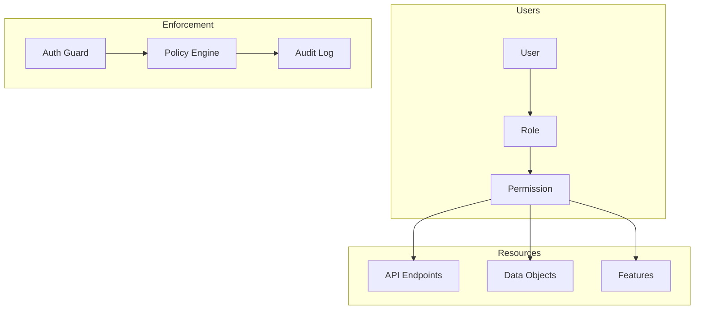
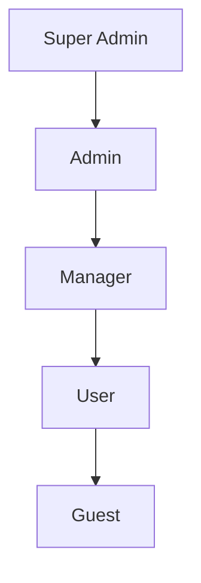

# Authorization Model

This document outlines our Role-Based Access Control (RBAC) and authorization patterns.

## Authorization Architecture



## Role Hierarchy



## Permission Model

### Role Definitions

```typescript
interface Role {
  name: string;
  permissions: Permission[];
  inherits?: Role[];
}

interface Permission {
  resource: string;
  action: 'create' | 'read' | 'update' | 'delete';
  conditions?: Condition[];
}
```

### Implementation

```typescript
// Role definition
const userRole: Role = {
  name: 'user',
  permissions: [
    { resource: 'profile', action: 'read' },
    { resource: 'profile', action: 'update' },
    { resource: 'content', action: 'read' },
  ],
};

// Permission check
const hasPermission = (user: User, resource: string, action: Action): boolean => {
  const role = roles.get(user.role);
  return role.permissions.some((p) => p.resource === resource && p.action === action);
};
```

## Access Control Patterns

### 1. Route Guards

```typescript
// Route guard
@Injectable()
export class AuthGuard implements CanActivate {
  canActivate(context: ExecutionContext): boolean | Promise<boolean> {
    const request = context.switchToHttp().getRequest();
    return this.validateRequest(request);
  }
}
```

### 2. Policy Enforcement

```typescript
// Policy enforcer
class PolicyEnforcer {
  async enforce(user: User, resource: string, action: Action): Promise<boolean> {
    const policy = await this.loadPolicy(resource);
    return policy.evaluate(user, action);
  }
}
```

### 3. Data Filtering

```typescript
// Query filter
const applySecurityFilter = (query: Query, user: User): Query => {
  const role = roles.get(user.role);
  return {
    ...query,
    where: {
      ...query.where,
      ...role.dataFilter,
    },
  };
};
```

## Security Patterns

### 1. Principle of Least Privilege

- Assign minimal required permissions
- Regular permission audits
- Time-bound elevated access
- Just-in-time access

### 2. Separation of Duties

- Role segregation
- Approval workflows
- Dual control mechanisms
- Task separation

### 3. Defense in Depth

- Multiple authorization layers
- Contextual access control
- Resource isolation
- Access monitoring

## Best Practices

1. **Role Management**

   - Clear role definitions
   - Regular role reviews
   - Role inheritance hierarchy
   - Role-based separation

2. **Permission Control**

   - Granular permissions
   - Resource-based access
   - Conditional access
   - Permission auditing

3. **Security Monitoring**
   - Access logging
   - Anomaly detection
   - Usage analytics
   - Compliance reporting

## Related Documentation

- [Security Architecture](../system/security.md)
- [Authentication Flow](./authentication.md)
- [Data Protection](../data-flow/data-protection.md)
