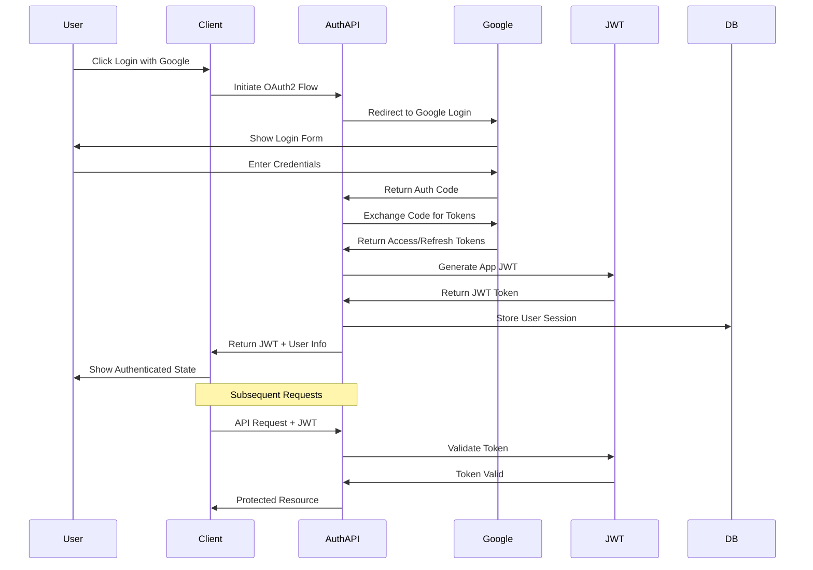

# OAuth2 Authentication Flow

## Overview

This document outlines our OAuth2 authentication implementation with Google integration and JWT token management. Our system provides a secure and seamless authentication experience while maintaining high security standards and following OAuth2 best practices.

## Components

Our OAuth2 implementation consists of several key components:

### 1. Client Components
- Login UI: OAuth provider selection
- Token Management: JWT handling
- Session Management: User state
- Error Handling: User feedback

### 2. Auth Service Components
- OAuth2 Flow: Provider integration
- Token Generation: JWT creation
- Session Management: State handling
- Security Enforcement: Protection layer

### 3. External Components
- Google OAuth2: Identity provider
- JWT Service: Token management
- Database: Session storage
- Monitoring: Security analytics

## Interactions

Our OAuth2 system follows these interaction patterns:

### 1. Initial Authentication Flow
1. User clicks "Login with Google"
2. System redirects to Google
3. User authenticates with Google
4. System receives auth code
5. Tokens exchanged and stored

### 2. Token Management Flow
1. JWT token generated
2. Token stored securely
3. Token included in requests
4. Token refreshed when needed
5. Token revoked on logout

### 3. Session Management Flow
1. Session created
2. User data stored
3. Session validated
4. Session refreshed
5. Session terminated

## Implementation Details

### 1. OAuth2 Client Implementation

```typescript
interface OAuth2Config {
  clientId: string;
  clientSecret: string;
  redirectUri: string;
  scope: string[];
}

class OAuth2Client {
  constructor(private readonly config: OAuth2Config) {}
  
  async initiateFlow(): Promise<string> {
    const params = new URLSearchParams({
      client_id: this.config.clientId,
      redirect_uri: this.config.redirectUri,
      scope: this.config.scope.join(' '),
      response_type: 'code',
      access_type: 'offline',
      state: this.generateState()
    });
    
    return `https://accounts.google.com/o/oauth2/v2/auth?${params}`;
  }
  
  async handleCallback(code: string): Promise<OAuth2Tokens> {
    const tokens = await this.exchangeCode(code);
    await this.validateTokens(tokens);
    return tokens;
  }
  
  private async exchangeCode(code: string): Promise<OAuth2Tokens> {
    const response = await fetch('https://oauth2.googleapis.com/token', {
      method: 'POST',
      headers: {
        'Content-Type': 'application/x-www-form-urlencoded'
      },
      body: new URLSearchParams({
        code,
        client_id: this.config.clientId,
        client_secret: this.config.clientSecret,
        redirect_uri: this.config.redirectUri,
        grant_type: 'authorization_code'
      })
    });
    
    if (!response.ok) {
      throw new OAuth2Error('Failed to exchange code');
    }
    
    return response.json();
  }
}
```

### 2. Token Management Implementation

```typescript
interface TokenManager {
  generateToken(user: User): Promise<string>;
  validateToken(token: string): Promise<boolean>;
  refreshToken(refreshToken: string): Promise<string>;
  revokeToken(token: string): Promise<void>;
}

class JWTTokenManager implements TokenManager {
  constructor(
    private readonly secret: string,
    private readonly expiresIn: number
  ) {}
  
  async generateToken(user: User): Promise<string> {
    const payload = {
      sub: user.id,
      email: user.email,
      scope: user.scope,
      iat: Date.now()
    };
    
    return jwt.sign(payload, this.secret, {
      expiresIn: this.expiresIn
    });
  }
  
  async validateToken(token: string): Promise<boolean> {
    try {
      const decoded = jwt.verify(token, this.secret);
      return this.isTokenValid(decoded);
    } catch (error) {
      return false;
    }
  }
  
  private isTokenValid(decoded: any): boolean {
    const now = Date.now();
    return (
      decoded.exp > now &&
      decoded.iat <= now &&
      !this.isTokenBlacklisted(decoded.jti)
    );
  }
}
```

### 3. Session Management Implementation

```typescript
interface SessionManager {
  createSession(user: User, tokens: OAuth2Tokens): Promise<Session>;
  validateSession(sessionId: string): Promise<boolean>;
  refreshSession(sessionId: string): Promise<Session>;
  revokeSession(sessionId: string): Promise<void>;
}

class RedisSessionManager implements SessionManager {
  constructor(private readonly redis: Redis) {}
  
  async createSession(
    user: User,
    tokens: OAuth2Tokens
  ): Promise<Session> {
    const session = {
      id: uuidv4(),
      userId: user.id,
      accessToken: tokens.access_token,
      refreshToken: tokens.refresh_token,
      createdAt: Date.now(),
      expiresAt: Date.now() + tokens.expires_in * 1000
    };
    
    await this.redis.set(
      `session:${session.id}`,
      JSON.stringify(session),
      'EX',
      tokens.expires_in
    );
    
    return session;
  }
  
  async validateSession(sessionId: string): Promise<boolean> {
    const session = await this.getSession(sessionId);
    if (!session) return false;
    
    return session.expiresAt > Date.now();
  }
}
```

## Diagram



## Best Practices

1. **Security Measures**
   - Use secure cookie storage
   - Implement CSRF protection
   - Enable rate limiting
   - Monitor suspicious activity
   - Validate state parameter

2. **Token Management**
   - Use short-lived access tokens
   - Secure refresh token storage
   - Implement token rotation
   - Monitor token usage
   - Handle revocation

3. **Error Handling**
   - Handle network failures
   - Validate responses
   - Retry failed requests
   - Log security events
   - Provide clear messages

4. **Performance**
   - Cache token validation
   - Optimize session storage
   - Monitor response times
   - Handle high concurrency
   - Implement timeouts

## Related Documentation

- [Authentication Architecture](./authentication.md)
- [Security Layers](./security-layers.md)
- [Session Management](../data-flow/session-management.md)
