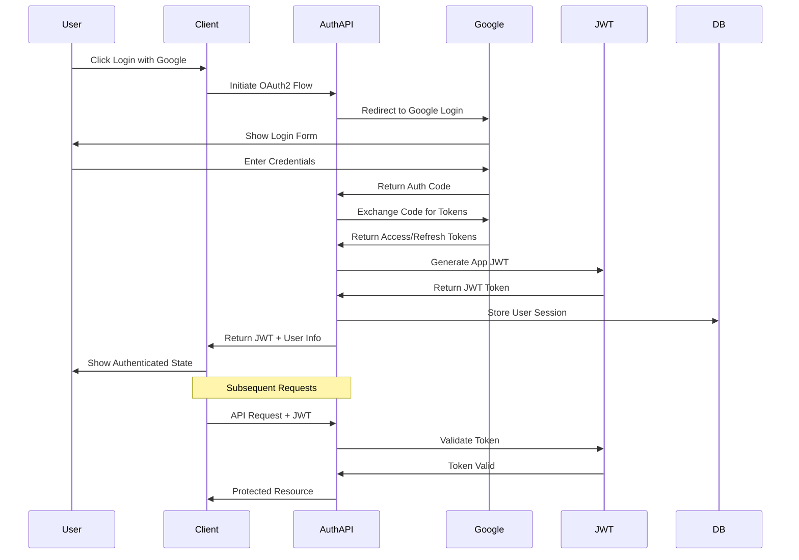

# OAuth2 Authentication Flow

This diagram illustrates the OAuth2 authentication flow with Google integration and JWT token management.

## Authentication Flow Diagram

## Component Description

### Authentication Flow

1. **Initial Login**

   - User initiates Google login
   - System redirects to Google OAuth2
   - Google returns authorization code
   - System exchanges code for tokens

2. **Token Management**

   - Generate application JWT
   - Store refresh token securely
   - Manage token expiration
   - Handle token refresh

3. **Session Management**
   - Create user session
   - Store session data
   - Handle session expiration
   - Manage concurrent sessions

## Implementation Notes

1. **Security Considerations**

   - Use secure cookie storage
   - Implement CSRF protection
   - Enable rate limiting
   - Monitor for suspicious activity

2. **Error Handling**

   - Invalid credentials
   - Network failures
   - Token expiration
   - Session conflicts

3. **User Experience**

   - Seamless login flow
   - Clear error messages
   - Auto-refresh handling
   - Remember me functionality

4. **Integration Points**

   - Google OAuth2 setup
   - JWT configuration
   - Session storage
   - User management

5. **Monitoring**
   - Login attempts
   - Success/failure rates
   - Token usage patterns
   - Session analytics
