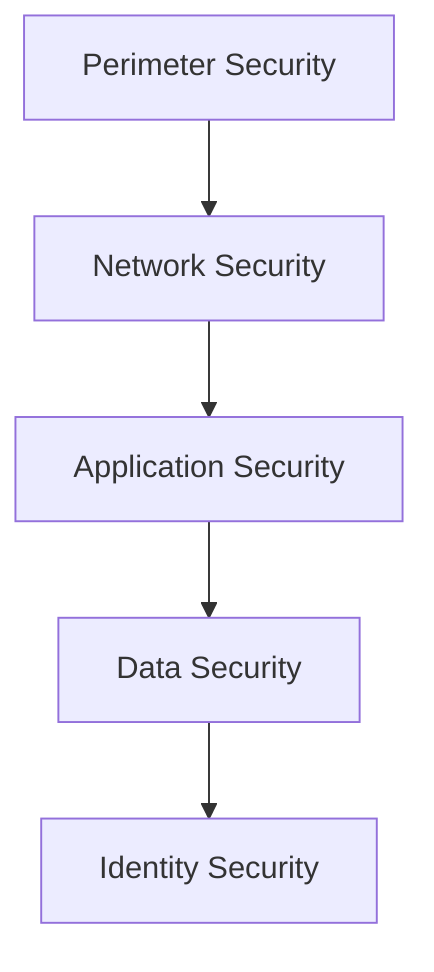
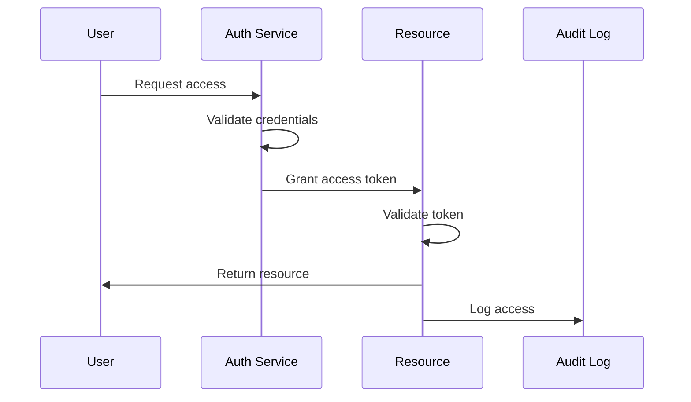

# Security Architecture

## Overview

This document outlines our comprehensive security architecture, designed to protect our systems, data, and users through multiple layers of defense.

## Components

### Security Layers


### Key Components
1. Perimeter Security
   - DDoS protection
   - WAF (Web Application Firewall)
   - Edge security

2. Network Security
   - Network segmentation
   - Firewall rules
   - VPN access
   - Traffic monitoring

3. Application Security
   - Authentication
   - Authorization
   - Input validation
   - Output encoding
   - Session management

4. Data Security
   - Encryption at rest
   - Encryption in transit
   - Key management
   - Data classification

5. Identity Security
   - Identity providers
   - Access control
   - Role management
   - Audit logging

## Interactions

### Authentication Flow


## Implementation Details

### Security Configuration
```typescript
interface SecurityConfig {
  authentication: AuthConfig;
  authorization: AuthzConfig;
  encryption: EncryptionConfig;
  monitoring: MonitoringConfig;
  compliance: ComplianceConfig;
}

interface AuthConfig {
  providers: AuthProvider[];
  mfa: MFAConfig;
  sessionManagement: SessionConfig;
}
```

### Security Policies
```typescript
interface SecurityPolicy {
  name: string;
  description: string;
  rules: SecurityRule[];
  enforcement: 'strict' | 'warning' | 'audit';
  exceptions: PolicyException[];
}
```

### Monitoring Setup
- Real-time threat detection
- Compliance monitoring
- Access pattern analysis
- Security metrics collection

## Related Documentation
- [Authentication Flow](./authentication.md)
- [Authorization System](./authorization.md)
- [Security Monitoring](./security-monitoring.md)
- [Incident Response](../system/incident-response.md)
