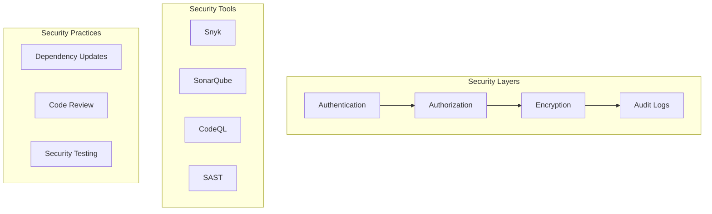

# Security Architecture

## Overview

This document outlines our comprehensive security architecture, implementing multiple layers of security including authentication, authorization, encryption, and security tooling. Our system follows industry best practices and maintains a defense-in-depth approach to security.

## Components

Our security architecture consists of several key components:

### 1. Security Layers
- Authentication: Identity verification
- Authorization: Access control
- Encryption: Data protection
- Audit Logs: Activity tracking

### 2. Security Tools
- Snyk: Dependency scanning
- SonarQube: Code quality & security
- CodeQL: Code analysis
- SAST: Static analysis

### 3. Security Practices
- Regular dependency updates
- Mandatory code review
- Continuous security testing



## Interactions

Our security system follows these interaction patterns:

### 1. Authentication Flow
1. User presents credentials
2. System verifies identity
3. MFA challenge if enabled
4. Session established
5. Access token issued

### 2. Authorization Flow
1. Request received
2. Token validated
3. Permissions checked
4. Access granted/denied
5. Action logged

### 3. Security Monitoring Flow
1. Activity logged
2. Logs analyzed
3. Alerts generated
4. Incidents investigated
5. Reports generated

## Implementation Details

### 1. Authentication Layer

```typescript
interface AuthenticationLayer {
  verifyIdentity(credentials: Credentials): Promise<AuthResult>;
  validateToken(token: string): Promise<boolean>;
  generateSession(user: User): Promise<Session>;
  enforceMultiFactor(user: User): Promise<MFAResult>;
}

class SecurityAuthLayer implements AuthenticationLayer {
  constructor(
    private readonly authService: AuthService,
    private readonly mfaService: MFAService,
    private readonly sessionService: SessionService
  ) {}

  async verifyIdentity(credentials: Credentials): Promise<AuthResult> {
    try {
      // 1. Validate credentials
      const user = await this.authService.authenticate(credentials);
      
      // 2. Check MFA requirement
      if (this.mfaService.isRequired(user)) {
        await this.enforceMultiFactor(user);
      }
      
      // 3. Generate session
      const session = await this.generateSession(user);
      
      // 4. Return result
      return {
        user,
        session,
        token: session.token
      };
    } catch (error) {
      // Log authentication failure
      await this.logAuthFailure(credentials, error);
      throw error;
    }
  }

  async validateToken(token: string): Promise<boolean> {
    return this.sessionService.validateToken(token);
  }
}
```

### 2. Authorization Layer

```typescript
interface AuthorizationLayer {
  checkAccess(user: User, resource: string, action: string): Promise<boolean>;
  enforcePolicy(context: SecurityContext): Promise<PolicyResult>;
  auditAccess(access: AccessAttempt): Promise<void>;
}

class SecurityAuthzLayer implements AuthorizationLayer {
  constructor(
    private readonly policyEngine: PolicyEngine,
    private readonly auditLogger: AuditLogger
  ) {}

  async checkAccess(
    user: User,
    resource: string,
    action: string
  ): Promise<boolean> {
    try {
      // 1. Build security context
      const context = this.buildContext(user, resource, action);
      
      // 2. Evaluate policy
      const result = await this.enforcePolicy(context);
      
      // 3. Audit access attempt
      await this.auditAccess({
        user,
        resource,
        action,
        allowed: result.allowed,
        timestamp: new Date()
      });
      
      return result.allowed;
    } catch (error) {
      // Log policy evaluation error
      await this.logPolicyError(error);
      return false;
    }
  }
}
```

### 3. Encryption Layer

```typescript
interface EncryptionLayer {
  encrypt(data: any, context: EncryptionContext): Promise<EncryptedData>;
  decrypt(data: EncryptedData, context: EncryptionContext): Promise<any>;
  rotateKeys(): Promise<void>;
  validateIntegrity(data: EncryptedData): Promise<boolean>;
}

class SecurityEncryptionLayer implements EncryptionLayer {
  constructor(
    private readonly keyManager: KeyManager,
    private readonly cryptoService: CryptoService
  ) {}

  async encrypt(
    data: any,
    context: EncryptionContext
  ): Promise<EncryptedData> {
    try {
      // 1. Get encryption key
      const key = await this.keyManager.getKey(context);
      
      // 2. Encrypt data
      const encrypted = await this.cryptoService.encrypt(data, key);
      
      // 3. Add integrity check
      const integrity = await this.generateIntegrity(encrypted);
      
      return {
        data: encrypted,
        integrity,
        keyId: key.id,
        algorithm: key.algorithm,
        timestamp: new Date()
      };
    } catch (error) {
      // Log encryption error
      await this.logEncryptionError(error);
      throw error;
    }
  }
}
```

### Best Practices

1. **Authentication Security**
   - Implement strong password policies
   - Enable multi-factor authentication
   - Use secure session management
   - Monitor login attempts
   - Handle failures gracefully

2. **Authorization Control**
   - Implement least privilege
   - Use role-based access
   - Enable resource isolation
   - Monitor access patterns
   - Regular access reviews

3. **Encryption Standards**
   - Use industry standard algorithms
   - Implement key rotation
   - Secure key storage
   - Data classification
   - Regular crypto audits

4. **Security Monitoring**
   - Comprehensive logging
   - Real-time alerting
   - Incident response
   - Regular audits
   - Compliance reporting

## Related Documentation

- [Authentication Flow](./authentication.md)
- [Authorization Model](./authorization.md)
- [OAuth2 Implementation](./oauth2-flow.md)
