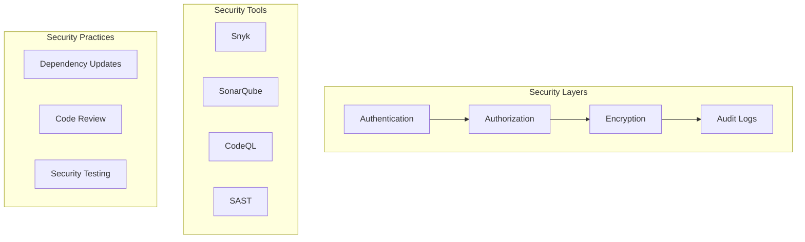

# Security Architecture

This diagram illustrates our comprehensive security architecture, including authentication, authorization, encryption, and security tooling.

## Components

### Security Layers

- Authentication: Identity verification
- Authorization: Access control
- Encryption: Data protection
- Audit Logs: Activity tracking

### Security Tools

- Snyk: Dependency scanning
- SonarQube: Code quality & security
- CodeQL: Code analysis
- SAST: Static analysis

### Security Practices

- Regular dependency updates
- Mandatory code review
- Continuous security testing

## Implementation

### Authentication

- JWT-based authentication
- OAuth2/OIDC integration
- MFA support

### Authorization

- Role-based access control
- Permission management
- Resource-level security

### Encryption

- Data at rest encryption
- TLS for data in transit
- Key management

### Audit Logging

- Comprehensive audit trails
- Secure log storage
- Log analysis
