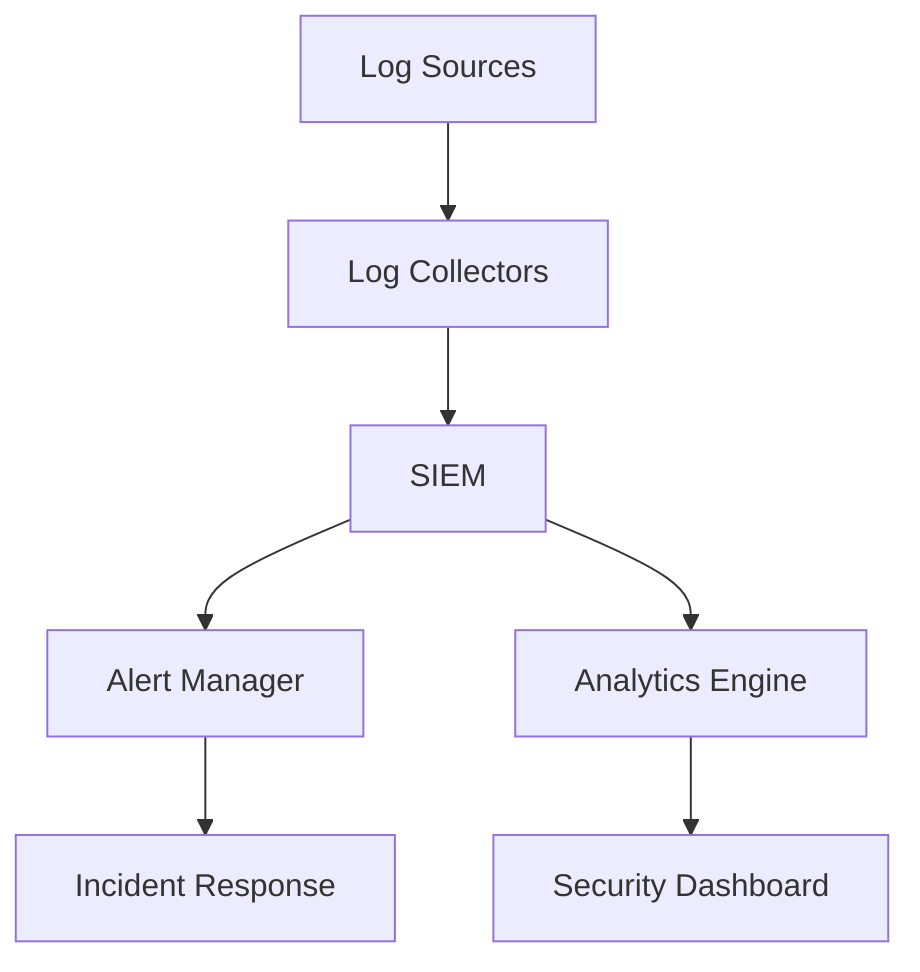
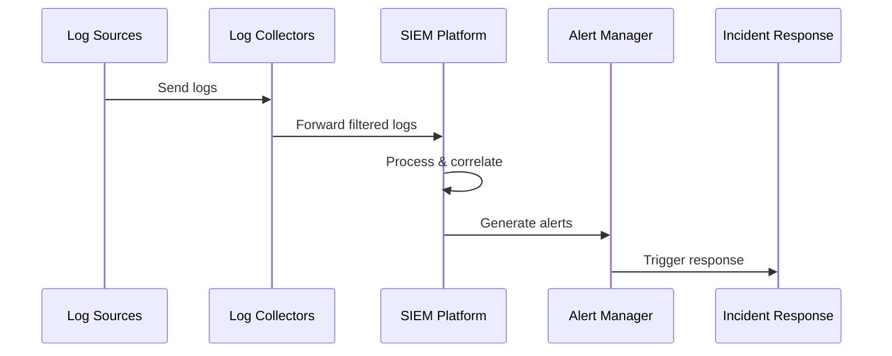

# Security Monitoring Architecture

## Overview

This document outlines our security monitoring architecture, which provides comprehensive visibility into security events, threats, and compliance across our infrastructure.

## Components

### Security Information and Event Management (SIEM)
- Log aggregation and correlation
- Real-time threat detection
- Security analytics
- Incident response automation

### Monitoring Components


### Key Components
1. Log Collectors
   - System logs
   - Application logs
   - Network logs
   - Security device logs

2. SIEM Platform
   - Event correlation
   - Threat detection rules
   - Compliance reporting
   - Forensics capabilities

3. Alert Management
   - Alert prioritization
   - Incident classification
   - Response automation
   - Escalation paths

## Interactions

### Data Flow


## Implementation Details

### Log Collection Strategy
```typescript
interface LogCollector {
  sourceType: 'system' | 'application' | 'network' | 'security';
  filters: LogFilter[];
  enrichment: EnrichmentRule[];
  destination: SIEMDestination;
}

interface LogFilter {
  field: string;
  operator: 'equals' | 'contains' | 'regex';
  value: string;
}
```

### Alert Configuration
```typescript
interface SecurityAlert {
  severity: 'critical' | 'high' | 'medium' | 'low';
  type: string;
  conditions: AlertCondition[];
  response: AutomatedResponse[];
  escalation: EscalationPath;
}
```

### Monitoring Rules
- Real-time threat detection
- Compliance violation alerts
- Performance impact monitoring
- Access pattern analysis

## Related Documentation
- [Infrastructure Monitoring](../infrastructure/monitoring.md)
- [Logging Architecture](../system/logging-architecture.md)
- [Incident Response](../system/incident-response.md)
