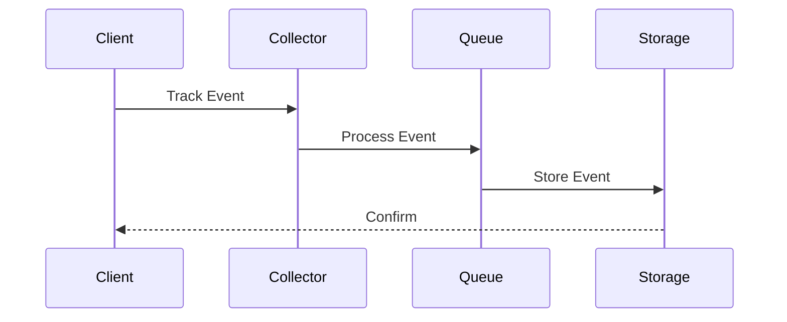
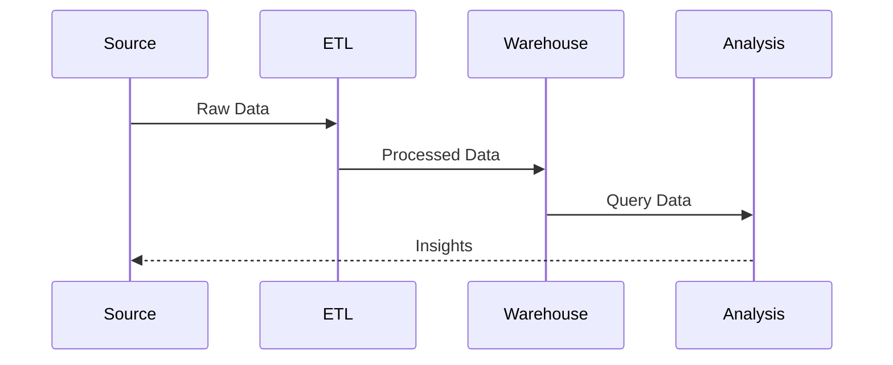
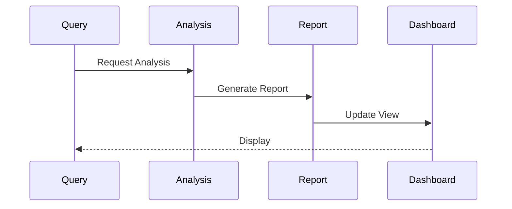
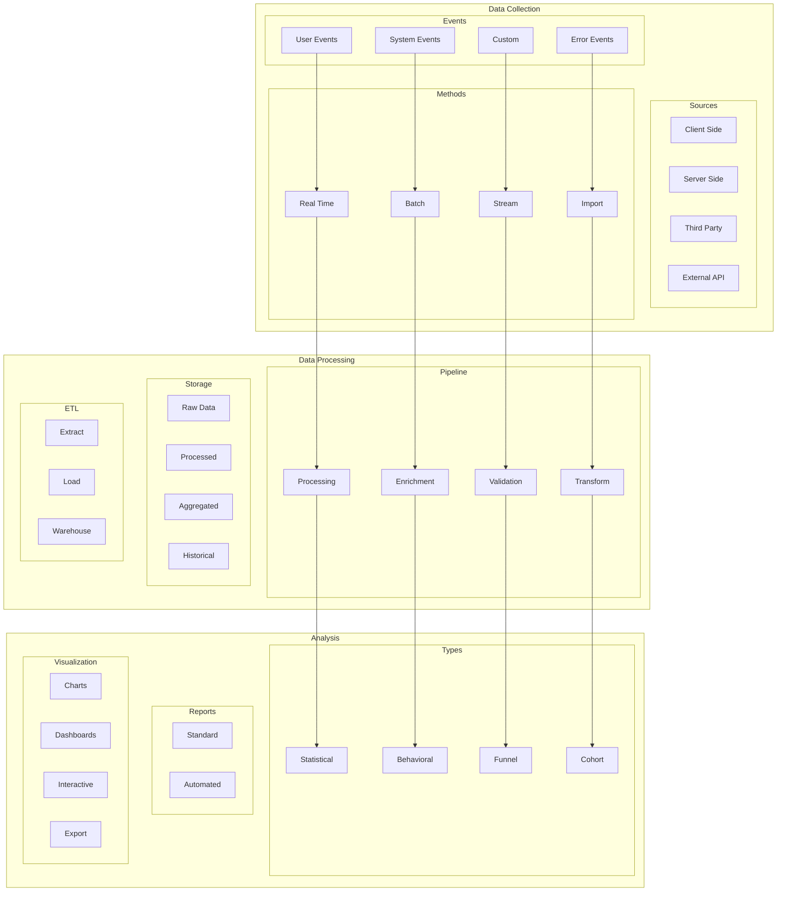

# Analytics Architecture

## Overview

The Analytics Architecture provides a comprehensive system for collecting, processing, and analyzing user behavior and system performance data. This architecture enables data-driven decision making and continuous improvement.

Key Features:
- Event tracking
- User analytics
- Performance analytics
- Business metrics
- Custom analytics

Benefits:
- User insights
- Performance optimization
- Business intelligence
- Feature validation
- Growth metrics

## Components

### Collection Layer
1. Event Collection
   - User events
   - System events
   - Custom events
   - Error events

2. Data Sources
   - Client-side
   - Server-side
   - Third-party
   - External APIs

3. Collection Methods
   - Real-time tracking
   - Batch processing
   - Stream processing
   - Import/Export

### Processing Layer
1. Data Processing
   - Event processing
   - Data enrichment
   - Data validation
   - Data transformation

2. Data Pipeline
   - Stream processing
   - Batch processing
   - ETL workflows
   - Data warehousing

3. Data Storage
   - Raw data
   - Processed data
   - Aggregated data
   - Historical data

### Analysis Layer
1. Data Analysis
   - Statistical analysis
   - Behavioral analysis
   - Funnel analysis
   - Cohort analysis

2. Reporting
   - Standard reports
   - Custom reports
   - Automated reports
   - Real-time dashboards

3. Visualization
   - Data visualization
   - Interactive charts
   - Custom dashboards
   - Export capabilities

## Interactions

The analytics system follows these key workflows:

1. Event Collection Flow


2. Data Processing Flow


3. Analysis Flow


## Implementation Details

### Analytics Manager Implementation
```typescript
interface AnalyticsConfig {
  collectors: CollectorConfig[];
  processors: ProcessorConfig[];
  storage: StorageConfig;
}

class AnalyticsManager {
  private config: AnalyticsConfig;
  private collectors: EventCollector[];
  private processors: DataProcessor[];
  
  constructor(config: AnalyticsConfig) {
    this.config = config;
    this.collectors = this.initCollectors();
    this.processors = this.initProcessors();
  }
  
  async track(
    event: AnalyticsEvent,
    options?: TrackOptions
  ): Promise<TrackResult> {
    const collected = await this.collect(
      event
    );
    
    const processed = await this.process(
      collected,
      options
    );
    
    return this.store(processed);
  }
  
  private async process(
    event: CollectedEvent,
    options?: TrackOptions
  ): Promise<ProcessedEvent> {
    for (const processor of this.processors) {
      event = await processor.process(event);
    }
    
    return event;
  }
}
```

### Analysis Engine Implementation
```typescript
interface AnalysisConfig {
  queries: QueryConfig[];
  models: ModelConfig[];
  reports: ReportConfig[];
}

class AnalysisEngine {
  private config: AnalysisConfig;
  private queries: QueryBuilder[];
  private models: AnalyticsModel[];
  
  constructor(config: AnalysisConfig) {
    this.config = config;
    this.queries = this.initQueries();
    this.models = this.initModels();
  }
  
  async analyze(
    data: AnalyticsData,
    options?: AnalyzeOptions
  ): Promise<AnalysisResult> {
    const prepared = await this.prepare(
      data
    );
    
    const analyzed = await this.runAnalysis(
      prepared,
      options
    );
    
    return this.generateReport(analyzed);
  }
  
  private async runAnalysis(
    data: PreparedData,
    options?: AnalyzeOptions
  ): Promise<AnalyzedData> {
    return this.models.analyze(
      data,
      this.config.models
    );
  }
}
```

### Report Generator Implementation
```typescript
interface ReportConfig {
  templates: TemplateConfig[];
  formats: FormatConfig[];
  delivery: DeliveryConfig[];
}

class ReportGenerator {
  private config: ReportConfig;
  private templates: ReportTemplate[];
  private formatters: ReportFormatter[];
  
  constructor(config: ReportConfig) {
    this.config = config;
    this.templates = this.initTemplates();
    this.formatters = this.initFormatters();
  }
  
  async generate(
    data: AnalyzedData,
    options?: ReportOptions
  ): Promise<Report> {
    const template = await this.selectTemplate(
      options
    );
    
    const formatted = await this.format(
      data,
      template
    );
    
    return this.deliver(formatted);
  }
  
  private async format(
    data: AnalyzedData,
    template: ReportTemplate
  ): Promise<FormattedReport> {
    return this.formatters.format(
      data,
      template
    );
  }
}
```

## Analytics Architecture Diagram


