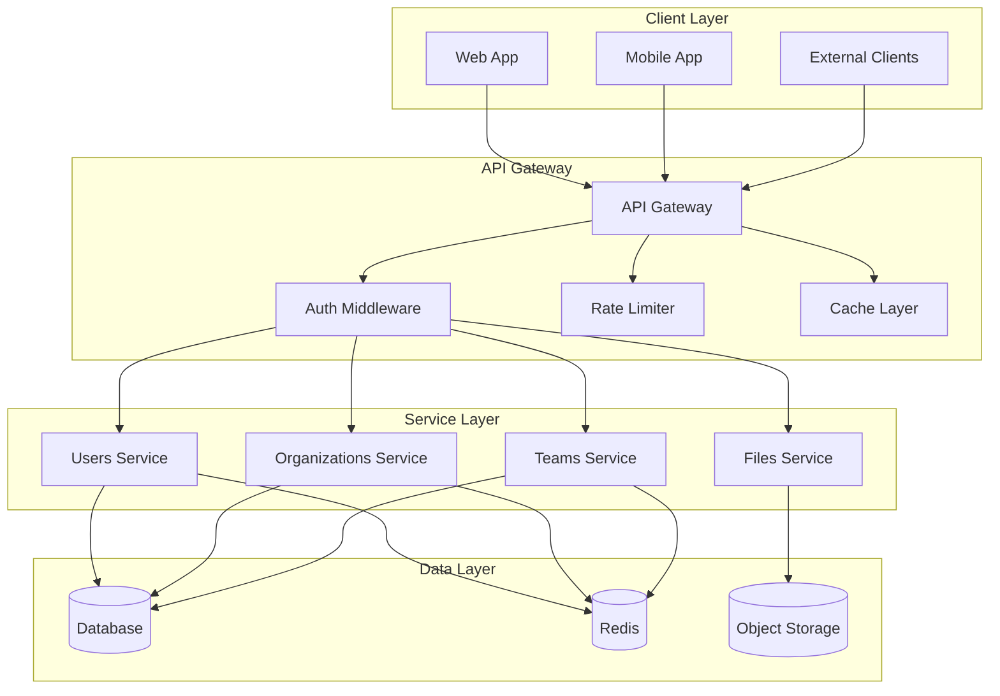

# API Architecture

This diagram illustrates our API architecture and request flow.

## API Flow Diagram

## Implementation

Our API client implementation utilizes several particle components from our [Atomic Design Structure](../components/atomic-design.md#particles):

- API Client Wrappers for consistent request handling
- Error Boundary particles for error handling
- Context Providers for API client configuration
- Performance Optimizers for request caching and batching

## Description

Our API architecture consists of several layers:

1. **Client Layer**

   - Web application
   - Mobile applications
   - External API consumers

2. **API Gateway**

   - Request routing
   - Authentication/Authorization
   - Rate limiting
   - Response caching

3. **Service Layer**

   - Microservices architecture
   - Domain-specific services
   - Independent scaling

4. **Data Layer**
   - Relational database
   - Cache storage
   - Object storage

## Implementation Details

- REST API with OpenAPI specification
- GraphQL for complex queries
- JWT-based authentication
- Rate limiting per client
- Response caching strategy
- Microservices communication
