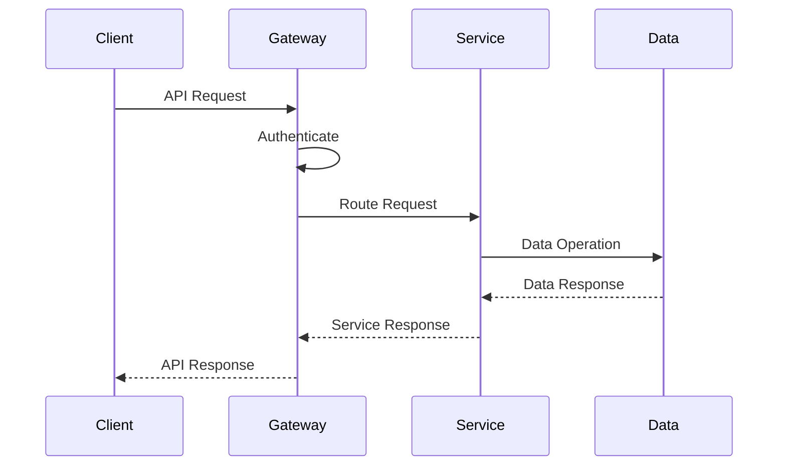
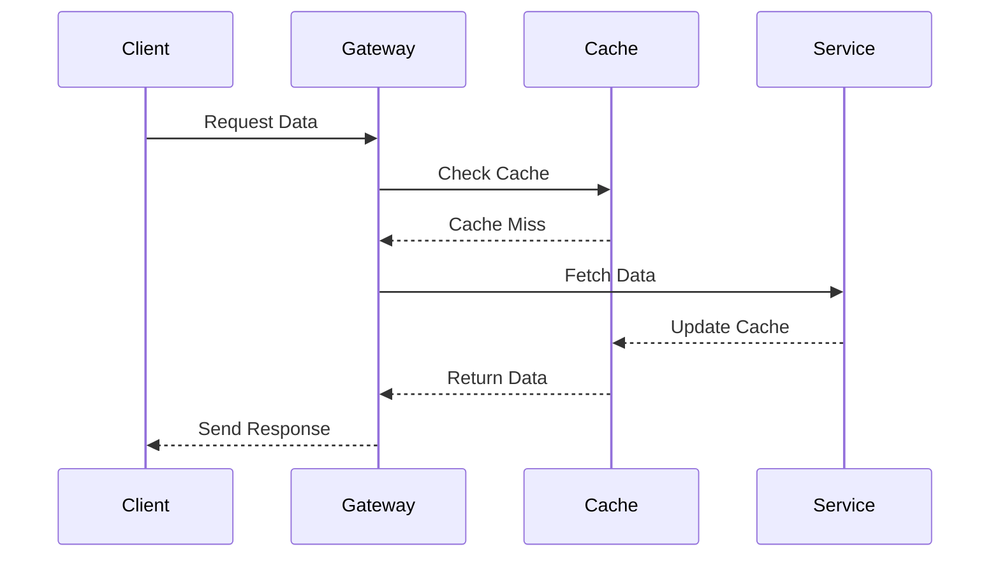
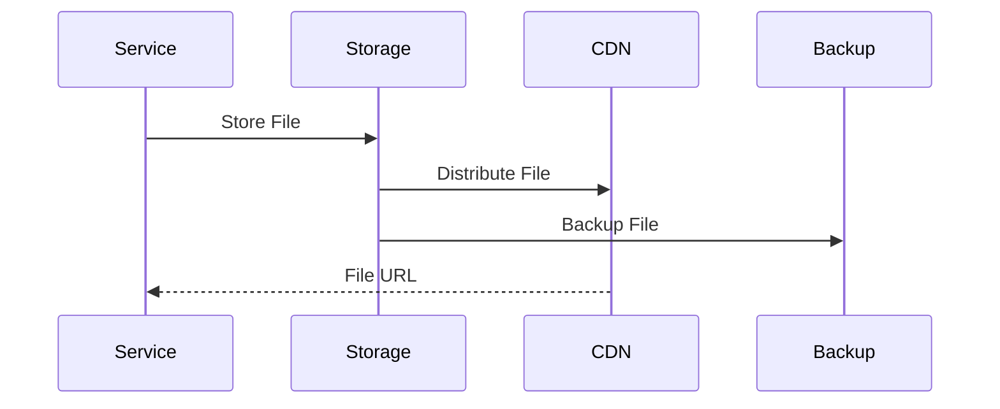
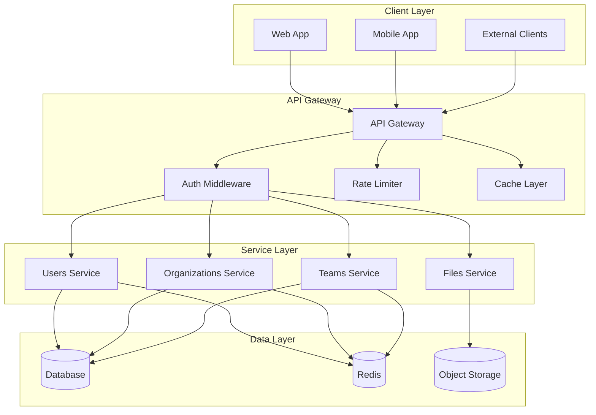

# API Architecture

## Overview

The API Architecture provides a scalable and secure system for handling client requests across multiple services. This architecture implements a layered approach with API Gateway for centralized request handling, microservices for business logic, and specialized data stores for different types of data.

Key Features:
- Gateway routing
- Authentication
- Rate limiting
- Request caching
- Microservices

Benefits:
- Scalability
- Security
- Performance
- Maintainability
- Monitoring

## Components

### Gateway Components
1. API Gateway
   - Request routing
   - Load balancing
   - Protocol translation
   - Response transformation

2. Security Layer
   - Authentication
   - Authorization
   - Rate limiting
   - Request validation

3. Performance Layer
   - Response caching
   - Request batching
   - Query optimization
   - Response compression

### Service Components
1. User Management
   - User service
   - Organization service
   - Team service
   - Permission service

2. Resource Management
   - File service
   - Storage service
   - Media service
   - Search service

3. Support Services
   - Logging service
   - Metrics service
   - Notification service
   - Analytics service

### Data Components
1. Database Systems
   - Primary database
   - Read replicas
   - Query optimization
   - Data partitioning

2. Cache Systems
   - Redis cache
   - Memory cache
   - Cache invalidation
   - Cache warming

3. Storage Systems
   - Object storage
   - File system
   - CDN integration
   - Backup storage

## Interactions

The API system follows these key workflows:

1. Request Flow

2. Cache Flow

3. Storage Flow

## API Flow Diagram

## Implementation

Our API client implementation utilizes several particle components from our [Atomic Design Structure](../components/atomic-design.md#particles):

- API Client Wrappers for consistent request handling
- Error Boundary particles for error handling
- Context Providers for API client configuration
- Performance Optimizers for request caching and batching

## Description

Our API architecture consists of several layers:

1. **Client Layer**

   - Web application
   - Mobile applications
   - External API consumers

2. **API Gateway**

   - Request routing
   - Authentication/Authorization
   - Rate limiting
   - Response caching

3. **Service Layer**

   - Microservices architecture
   - Domain-specific services
   - Independent scaling

4. **Data Layer**
   - Relational database
   - Cache storage
   - Object storage

## Implementation Details

- REST API with OpenAPI specification
- GraphQL for complex queries
- JWT-based authentication
- Rate limiting per client
- Response caching strategy
- Microservices communication
