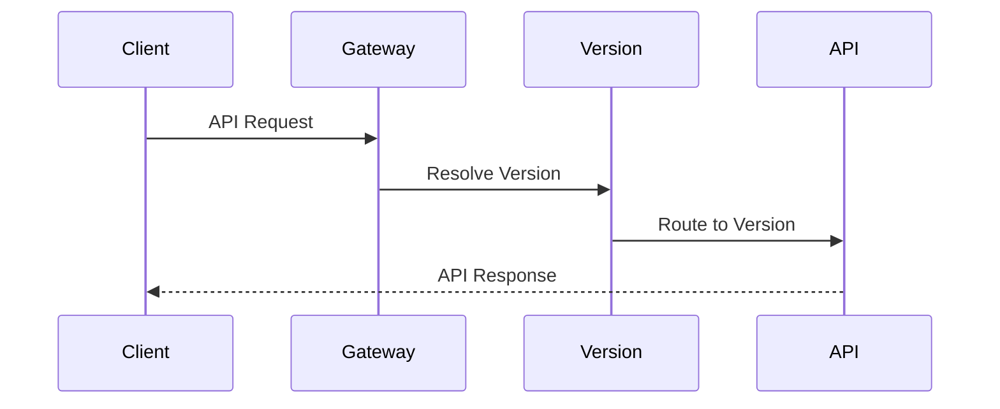
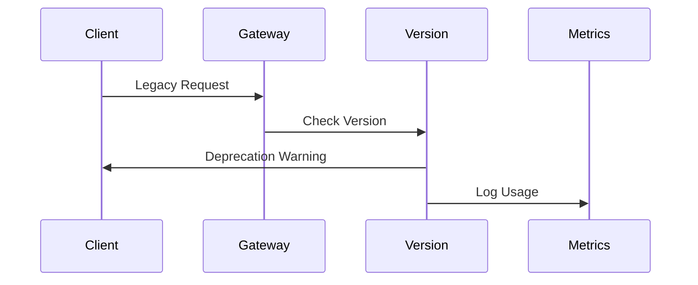
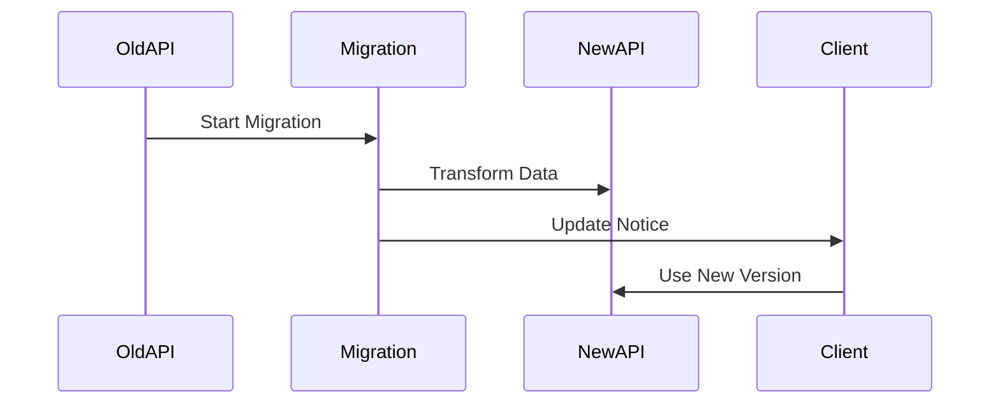
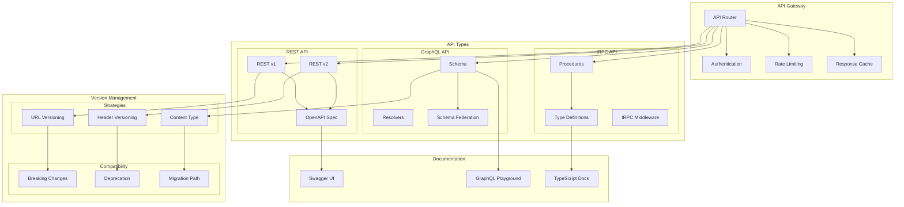

# API Architecture and Versioning

## Overview

The API Architecture and Versioning system provides a comprehensive strategy for managing multiple API types and versions while ensuring backward compatibility and smooth client transitions. This architecture supports REST, GraphQL, and tRPC implementations with standardized versioning approaches.

Key Features:
- Multi-protocol support
- Version management
- API documentation
- Backward compatibility
- Type safety

Benefits:
- API evolution
- Client compatibility
- Developer experience
- Type safety
- Documentation automation

## Components

### Gateway Components
1. API Router
   - Request routing
   - Protocol detection
   - Version routing
   - Load balancing

2. Security Layer
   - Authentication
   - Authorization
   - Rate limiting
   - Request validation

3. Performance Layer
   - Response caching
   - Request batching
   - Query optimization
   - Response compression

### API Components
1. REST API
   - OpenAPI/Swagger
   - Resource endpoints
   - HTTP methods
   - Status codes

2. GraphQL API
   - Schema definition
   - Resolvers
   - Federation
   - Subscriptions

3. tRPC API
   - Procedures
   - Type definitions
   - Middleware
   - Error handling

### Version Components
1. Version Control
   - URL versioning
   - Header versioning
   - Content negotiation
   - Version resolution

2. Compatibility
   - Breaking changes
   - Deprecation
   - Migration paths
   - Backward compatibility

3. Documentation
   - API reference
   - Version history
   - Migration guides
   - Type documentation

## Interactions

The API versioning system follows these key workflows:

1. Version Resolution Flow


2. Deprecation Flow


3. Migration Flow


## Implementation Details

### Version Manager Implementation
```typescript
interface VersionConfig {
  major: number;
  minor: number;
  patch: number;
  deprecated?: boolean;
  sunset?: Date;
}

class VersionManager {
  private versions: Map<string, VersionConfig>;
  private strategies: VersionStrategy[];
  
  constructor(config: VersionManagerConfig) {
    this.versions = new Map();
    this.strategies = config.strategies;
    this.initialize();
  }
  
  resolveVersion(
    request: APIRequest
  ): ResolvedVersion {
    for (const strategy of this.strategies) {
      const version = strategy.resolve(request);
      
      if (version) {
        return this.validateVersion(version);
      }
    }
    
    return this.getDefaultVersion();
  }
  
  private validateVersion(
    version: string
  ): ResolvedVersion {
    const config = this.versions.get(version);
    
    if (!config) {
      throw new VersionNotFoundError(version);
    }
    
    if (config.deprecated) {
      this.handleDeprecation(version);
    }
    
    return { version, config };
  }
}
```

### API Router Implementation
```typescript
interface RouteConfig {
  version: string;
  protocol: APIProtocol;
  handler: RequestHandler;
  middleware: Middleware[];
}

class APIRouter {
  private routes: Map<string, RouteConfig>;
  private versionManager: VersionManager;
  
  constructor(config: RouterConfig) {
    this.routes = new Map();
    this.versionManager = new VersionManager(
      config.versionConfig
    );
  }
  
  async route(
    request: APIRequest
  ): Promise<APIResponse> {
    const version = this.versionManager.resolveVersion(
      request
    );
    
    const route = this.matchRoute(
      request,
      version
    );
    
    return this.handleRequest(
      request,
      route
    );
  }
  
  private async handleRequest(
    request: APIRequest,
    route: RouteConfig
  ): Promise<APIResponse> {
    const context = await this.createContext(
      request,
      route
    );
    
    return route.handler(context);
  }
}
```

### Migration Manager Implementation
```typescript
interface MigrationConfig {
  fromVersion: string;
  toVersion: string;
  transforms: DataTransform[];
  validation: SchemaValidation;
}

class MigrationManager {
  private migrations: Map<string, MigrationConfig>;
  private validators: SchemaValidator[];
  
  constructor(config: MigrationManagerConfig) {
    this.migrations = new Map();
    this.validators = config.validators;
  }
  
  async migrate(
    data: APIData,
    fromVersion: string,
    toVersion: string
  ): Promise<APIData> {
    const path = this.findMigrationPath(
      fromVersion,
      toVersion
    );
    
    let result = data;
    
    for (const step of path) {
      result = await this.executeMigration(
        result,
        step
      );
    }
    
    return result;
  }
  
  private async executeMigration(
    data: APIData,
    config: MigrationConfig
  ): Promise<APIData> {
    const transformed = await this.transform(
      data,
      config.transforms
    );
    
    await this.validate(
      transformed,
      config.validation
    );
    
    return transformed;
  }
}
```

## API Architecture Diagram



## Component Description

### API Gateway

- **Router**: Request routing
- **Authentication**: Auth handling
- **Rate Limiting**: Request throttling
- **Cache**: Response caching

### API Types

1. **REST API**

   - Version management
   - OpenAPI specification
   - Resource endpoints

2. **GraphQL API**

   - Schema definition
   - Resolver implementation
   - Schema federation

3. **tRPC API**
   - Type-safe procedures
   - Type definitions
   - Middleware stack

### Version Management

1. **Strategies**

   - URL-based versioning
   - Header-based versioning
   - Content type versioning

2. **Compatibility**
   - Breaking change handling
   - Deprecation process
   - Migration guidance

## Implementation Guidelines

1. **API Design**

   - REST best practices
   - GraphQL patterns
   - tRPC procedures
   - Error handling

2. **Version Control**

   - Version strategy
   - Compatibility checks
   - Breaking changes
   - Migration support

3. **Documentation**

   - API specifications
   - Version changes
   - Migration guides
   - Examples

4. **Best Practices**

   - Consistent patterns
   - Clear versioning
   - Good documentation
   - Error standards

5. **Monitoring**

   - Usage tracking
   - Version adoption
   - Deprecation status
   - Error rates

6. **Security**
   - Authentication
   - Authorization
   - Rate limiting
   - Data validation
