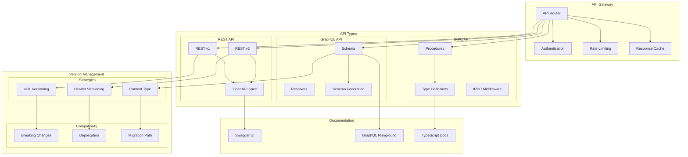

# API Architecture and Versioning

This diagram illustrates our API architecture and versioning strategy, including REST, GraphQL, and tRPC implementations.

## API Architecture Diagram

## Component Description

### API Gateway

- **Router**: Request routing
- **Authentication**: Auth handling
- **Rate Limiting**: Request throttling
- **Cache**: Response caching

### API Types

1. **REST API**

   - Version management
   - OpenAPI specification
   - Resource endpoints

2. **GraphQL API**

   - Schema definition
   - Resolver implementation
   - Schema federation

3. **tRPC API**
   - Type-safe procedures
   - Type definitions
   - Middleware stack

### Version Management

1. **Strategies**

   - URL-based versioning
   - Header-based versioning
   - Content type versioning

2. **Compatibility**
   - Breaking change handling
   - Deprecation process
   - Migration guidance

## Implementation Guidelines

1. **API Design**

   - REST best practices
   - GraphQL patterns
   - tRPC procedures
   - Error handling

2. **Version Control**

   - Version strategy
   - Compatibility checks
   - Breaking changes
   - Migration support

3. **Documentation**

   - API specifications
   - Version changes
   - Migration guides
   - Examples

4. **Best Practices**

   - Consistent patterns
   - Clear versioning
   - Good documentation
   - Error standards

5. **Monitoring**

   - Usage tracking
   - Version adoption
   - Deprecation status
   - Error rates

6. **Security**
   - Authentication
   - Authorization
   - Rate limiting
   - Data validation
